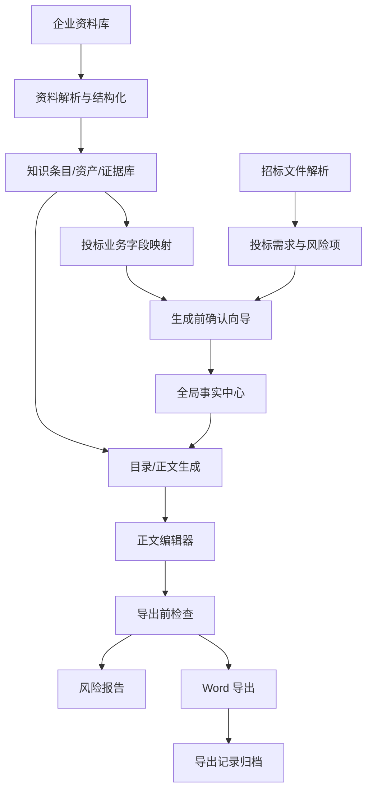

# OpenBidKit 借鉴方向与电力项目技术架构建议

## 1. 总体判断

OpenBidKit_Yibiao 对当前电力标书项目最有参考价值的不是“通用 AI 写标书流程”，而是它把标书系统拆成了几个工程能力：

- 本地/企业工作区
- 知识库资料结构化
- 全局事实约束
- 后台任务与状态恢复
- 正文生成过程分阶段落盘
- 废标项/一致性/风险检查
- Word 导出格式与进度反馈

当前电力项目不应照搬它的主流程，而应吸收这些能力，形成更适合单体企业的电力投标作业系统。

## 2. 可借鉴方向

| 方向 | 借鉴内容 | 电力项目落地方式 |
| --- | --- | --- |
| 企业工作区 | 本地化/单企业数据沉淀 | 企业资料、投标项目、生成记录、确认字段、导出记录统一归档 |
| 全局事实中心 | 正文生成前统一事实变量 | 项目名、包号、货物清单、交货期、质保期、企业名称、授权人等统一管理 |
| 知识库业务映射 | 不只存 chunk，还要映射到投标字段 | 从现有 RAG/资产库抽取“可用于哪个章节/字段/证明材料” |
| 生成前确认向导 | 用户先确认关键承诺项 | 报价、保证金、交货期、授权签章等 P0 字段必须人工确认 |
| 后台任务系统 | 长任务可恢复、有日志、有状态 | 资料解析、字段抽取、正文生成、导出检查统一任务化 |
| 废标/响应检查 | 三轮检查：分析、检查、定稿 | 改造成国网物资类响应完整性检查 |
| 导出前门禁 | 导出前发现风险 | 不自动改正文，只提示缺口和需确认项 |
| Word 导出增强 | 进度、图片、表格、格式配置 | 保持现有 DOCX 一致性契约，逐步增强版式能力 |

## 3. 推荐产品架构



## 4. 核心模块设计

### 4.1 企业资料中心

目标不是简单上传文件，而是沉淀企业可复用投标资产。

建议数据对象：

```text
企业资料
- 原始文件
- 解析文本
- 图片/证照资产
- 来源页码/段落
- 资料类型
- 适用章节
- 是否可作为正式投标事实
- 是否需人工确认
- 有效期/过期状态
```

适合覆盖：

- 营业执照
- 资质证书
- 检测报告
- 产品图片
- 生产设备
- 检验设备
- 财务材料
- 业绩合同
- 中标通知书
- 绿色低碳材料
- 售后服务材料

### 4.2 投标业务字段映射层

这是当前项目最值得补的一层。

现有 RAG 已有 chunk、metadata、资产库，但操作员真正需要的是：

| 字段 | 来源 | 状态 |
| --- | --- | --- |
| 投标人名称 | 营业执照/企业资料 | 已识别 |
| 包号 | 招标文件/货物清单 | 需确认 |
| 交货期 | 招标文件/人工填写 | 需确认 |
| 保证金 | 招标文件/人工填写 | 需确认 |
| 检测报告编号 | 检验报告 | 已识别 |
| 授权代表 | 授权材料/人工填写 | 需确认 |

这一层用于连接：

```text
RAG资料/资产 -> 投标字段 -> 前导确认页 -> 正文生成事实 -> 导出前检查
```

### 4.3 生成前确认向导

建议作为独立页面，不强行替代正文编辑。

模块分组：

1. 项目信息
2. 包件/货物清单
3. 商务报价
4. 投标承诺
5. 保证金与账户
6. 授权签章
7. 企业资质
8. 检测报告
9. 项目业绩
10. 生成前检查

字段状态建议：

```text
已识别
需人工确认
企业库带出
缺失
不适用
禁止 AI 自动补
```

### 4.4 全局事实中心

全局事实用于约束全文一致性，不等同于知识库。

建议来源：

- 招标文件解析结果
- 生成前确认向导
- 企业资料中心
- 用户人工填写

建议事实类型：

```text
project_info
goods_list
delivery_commitment
warranty_commitment
bidder_identity
authorization
inspection_report
project_performance
after_sales
commercial_commitment
```

正文生成时必须优先使用这些事实，不能各章节随机生成。

### 4.5 电力版风险检查

优先做国网物资类高风险项，不要先做泛化检查。

检查项：

- 项目名称前后不一致
- 包号/货物清单缺失
- 报价字段缺失
- 交货期未响应
- 保证金缺失
- 授权代表/签章材料缺失
- 检测报告与物料不匹配
- 业绩材料不足
- 技术偏离未响应
- 附件清单与正文描述不一致

输出形式：

```text
风险等级
问题字段
涉及章节
证据来源
处理建议
是否阻断正式导出
```

## 5. 技术架构建议

```text
前端
- 企业资料中心
- 生成前确认向导
- 全局事实编辑页
- 正文编辑器
- 导出前检查报告
- 导出记录页

后端
- 文件解析服务
- RAG 检索服务
- 企业资料结构化服务
- 投标字段抽取服务
- 全局事实服务
- 正文生成服务
- 风险检查服务
- DOCX 导出服务

数据层
- knowledge_documents
- document_chunks
- knowledge_assets
- bid_projects
- bid_prefill_fields
- bid_global_facts
- bid_sections
- bid_export_tasks
- bid_risk_findings
```

## 6. 建议实施顺序

### 第一阶段：增强现有能力

- 保留现有 RAG 和 DOCX 导出链路
- 增加投标字段映射层
- 增加生成前确认向导
- 增加全局事实表
- 增加导出前 P0 风险检查

### 第二阶段：强化企业资料复用

- 企业资料按业务类型归档
- 检测报告、业绩、证书做结构化抽取
- 建立“资料 -> 字段 -> 章节”的映射关系
- 支持资料缺口评分

### 第三阶段：正式投标门禁

- 正式导出前检查必跑
- 缺 P0 字段时提示阻断
- 输出风险报告
- 导出记录保存检查结果和用户确认记录

## 7. 不建议做的事

- 不建议重做现有知识库底层 RAG。
- 不建议把所有变量做成一个巨大表格。
- 不建议让 AI 自动补报价、保证金、授权签章等实质承诺项。
- 不建议前导确认页覆盖用户已编辑正文。
- 不建议改变当前“编辑器正文必须进入 Word 导出”的契约。
- 不建议为了借鉴 OpenBidKit 直接替换主流程。

## 8. 最终建议

电力项目应该形成自己的核心架构：

```text
企业资料证据化
+ 投标字段确认
+ 全局事实约束
+ 正文生成与编辑
+ 导出前风险门禁
+ DOCX 正式交付
```

OpenBidKit_Yibiao 可以作为能力参考，但电力项目的优势应放在电力场景专业化、企业资料复用、P0 字段确认和正式投标风险控制上。
