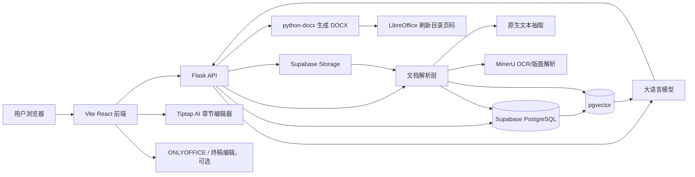

# AI 标书系统

> 面向水利工程建设企业的 AI 标书编制工作台，支持私有化部署。

招标文件上传 → OCR 解析 → 结构化解读 → 分册大纲 → 章节正文 → 合规检查 → DOCX 导出，全流程 AI 辅助，企业知识库驱动，数据本地可控。

[](https://python.org)
[](https://react.dev)
[](#license)

---

## 核心亮点

### 1. 两阶段 AI 章节大纲生成
规则版骨架秒级展示，AI 精细化版在 SSE 流内同步完成后实时刷新。大纲生成前自动检索企业知识库，根据评分项数量动态计算最小章节数（`max(25, 评分项×2)`），确保每个评分项都有对应章节响应。

→ [详细说明](docs/features/outline-generation.md)

### 2. 企业知识库驱动的正文生成
章节正文生成时自动从企业资信库、产品库、历史标书中召回相关资料，注入企业画像（7 字段）和分册写作策略（技术标/商务标/资格/报价/附件各有不同约束），生成内容贴合企业实际。

→ [章节写作计划](docs/features/section-writing.md) · [分册设计](docs/features/volume-design.md)

### 3. 全文篇幅精细控制
用户设置目标页数后，系统按章节重要性、评分项数量、风险项数量动态分配每章目标字数。首轮生成不足 75% 时自动触发补写。

→ [详细说明](docs/features/length-settings.md)

### 4. 规则 + LLM 双轨合规检查
三维度覆盖率（要求条款/评分项/风险项）实时仪表盘，下载前拦截高风险缺失项，支持 LLM 语义复核输出证据摘录和补强建议。

→ [详细说明](docs/features/compliance.md)

### 5. 企业私有 RAG 知识库
pgvector 向量检索 + DashScope Rerank 重排 + 关键词兜底，支持图片资产内联、来源引用和模型追问建议。水利行业种子库 26 份 / 558 条向量分片开箱即用。

→ [详细说明](docs/features/rag-knowledge-base.md)

### 6. AI 用量与成本透明
每次 LLM / Embedding / Rerank / OCR 调用均记录 Token 和人民币费用，按项目/阶段/模型汇总，支持多模型厂商适配。

→ [详细说明](docs/features/cost-tracking.md)

### 7. 正式 DOCX 标书导出
下载 Word 时优先使用在线工作台当前章节快照，避免数据库旧章节导致目录和正文不一致。导出目录采用正式 Word 目录样式，包含层级缩进、点线前导符和右侧页码。后端支持在导出最后一步调用 LibreOffice headless 重新保存 DOCX，自动刷新目录页码、页脚页码和总页数，用户下载的仍然是 `.docx` 文件。

→ [详细说明](docs/features/docx-export.md)

---

## 系统架构



**技术栈**：Flask · React 18 · TypeScript · Ant Design 5 · Tiptap · Supabase (PostgreSQL + pgvector + Storage) · DeepSeek / DashScope · MinerU

→ [完整架构说明](docs/architecture/overview.md)

---

## 快速开始

> ⚠️ **首次启动前必做**：在 Supabase 里执行 [9 个必需的 SQL 脚本](docs/deployment/supabase-setup.md#必须执行否则功能异常) 并创建 [5 个 Storage Bucket](docs/deployment/supabase-setup.md#storage-buckets)。跳过任一步都会在对应功能触发时报错。

```bash
# 1. 安装后端依赖
python -m venv venv && source venv/bin/activate
pip install -r requirements.txt

# 2. 安装并构建前端
cd frontend && npm install && npm run build && cd ..

# 3. 配置环境变量
cp .env.example .env
# 编辑 .env，填写 DEEPSEEK_API_KEY、DASHSCOPE_API_KEY、SUPABASE_URL、SUPABASE_SERVICE_ROLE_KEY
# 如需下载 DOCX 后目录页码直接准确，安装 LibreOffice 并确认 SOFFICE_BIN 路径

# 4. 在 Supabase SQL Editor 执行 sql/ 目录下的脚本（详见 supabase-setup.md）
# 已执行老库需补充执行：
#   sql/20260510_seed_deepseek_v4_flash_pricing.sql
#   sql/20260510_seed_deepseek_v4_pro_pricing.sql

# 5. 启动
python main.py
# 访问 http://127.0.0.1:3012
```

→ [完整部署文档](docs/deployment/quickstart.md) · [安全配置](docs/deployment/security.md) · [Supabase 初始化](docs/deployment/supabase-setup.md)

### DeepSeek 写作模型

标书系统按业务阶段使用 DeepSeek 模型，通过 OpenAI-compatible 协议访问 `https://api.deepseek.com/chat/completions`。招标解读、分册大纲和 LLM 语义合规复核默认使用 `deepseek-v4-pro`，用于结构判断、风险识别和复杂推理；章节正文、章节补写、知识库问答和追问建议默认使用 `deepseek-v4-flash`，用于降低批量生成成本和提升响应速度。知识库向量化和 Rerank 默认仍使用 DashScope，因此本地和生产环境需要同时配置：

```env
AI_PROVIDER=deepseek
DEEPSEEK_API_KEY=your_deepseek_api_key
DEEPSEEK_BASE_URL=https://api.deepseek.com
DEEPSEEK_MODEL=deepseek-v4-flash
DEEPSEEK_INTERPRETATION_MODEL=deepseek-v4-pro
DEEPSEEK_INTERPRETATION_SEGMENT_MODEL=deepseek-v4-flash
DEEPSEEK_OUTLINE_MODEL=deepseek-v4-pro
DEEPSEEK_COMPLIANCE_MODEL=deepseek-v4-pro
DEEPSEEK_SECTION_WRITING_MODEL=deepseek-v4-flash
DEEPSEEK_SECTION_SUPPLEMENT_MODEL=deepseek-v4-flash
DEEPSEEK_KNOWLEDGE_MODEL=deepseek-v4-flash
DEEPSEEK_KNOWLEDGE_FOLLOWUP_MODEL=deepseek-v4-flash
REASONING_REQUEST_TIMEOUT_SECONDS=300
INTERPRETATION_SEGMENT_MAX_CHARS=24000
INTERPRETATION_SEGMENT_MAX_GROUPS=24
DASHSCOPE_API_KEY=your_dashscope_api_key
```

系统设置 - 模型配置中会展示每个业务模块当前使用的模型；解读、大纲和语义复核等 Pro 推理阶段默认允许 300 秒服务端超时，前端对应请求允许 360 秒，避免大文件解读时前端先报 `timeout of 120000ms exceeded`。招标文件正文分片数量较多或正文超过约 8 万字时，系统会自动启用“大文件分段解读”：先用 `DEEPSEEK_INTERPRETATION_SEGMENT_MODEL` 对文档分段抽取资格、评分、风险和材料要点，再用 `DEEPSEEK_INTERPRETATION_MODEL` 做最终融合去重；分段大小和最大段数由 `INTERPRETATION_SEGMENT_MAX_CHARS`、`INTERPRETATION_SEGMENT_MAX_GROUPS` 控制。用量与成本中心会按 `provider`、`model`、`stage` 记录历史调用。DeepSeek V4 Flash 成本种子脚本按客户提供的价格口径写入：输入缓存命中 0.02 元 / 百万 tokens、输入缓存未命中 1 元 / 百万 tokens、输出 2 元 / 百万 tokens；DeepSeek V4 Pro 按输入缓存命中 0.025 元 / 百万 tokens、输入缓存未命中 3 元 / 百万 tokens、输出 6 元 / 百万 tokens 写入。当前系统按缓存未命中输入价保守估算，最终仍以 DeepSeek 账单为准。

分册大纲落库采用“同项目串行锁 + 预生成章节 UUID + 批量写入 + Supabase 写入重试”的可靠性策略。规则版大纲、AI 精修大纲和前端重复流式请求都必须通过 `replace_bid_sections_from_outline()` 统一替换 `bid_sections`，避免网络抖动或并发 SSE 连接造成章节目录写入一半、被二次删除或 Word 导出目录错乱。详细机制见 [章节大纲生成](docs/features/outline-generation.md)。

### DOCX 目录页码刷新

`python-docx` 只能写入 Word 字段，不能计算真实页码。系统导出流程已集成 LibreOffice headless：`Markdown -> python-docx DOCX -> soffice DOCX 重新保存 -> 返回 DOCX`。开启后，目录 `PAGEREF`、页脚 `PAGE/NUMPAGES` 会在服务端刷新，避免下载后目录页码全部显示为 `1`。

```env
DOCX_REFRESH_FIELDS=true
SOFFICE_BIN=/opt/homebrew/bin/soffice
DOCX_REFRESH_TIMEOUT_SECONDS=180
```

Mac M1/M2 使用 Homebrew 安装通常是 `/opt/homebrew/bin/soffice`；Linux 服务器通常是 `/usr/bin/soffice`。如果服务器未安装 LibreOffice 或刷新失败，导出任务不会阻断，系统会保留 `w:updateFields=true` 和 `w:dirty=true`，由用户打开 Word 时刷新字段，同时在导出任务 metadata 中记录 `field_refresh` 报告。

---

## 文档导航

| 分类 | 文档 | 说明 |
| --- | --- | --- |
| 架构 | [系统架构总览](docs/architecture/overview.md) | 技术栈、架构图、业务流程 |
| 架构 | [数据模型](docs/architecture/data-model.md) | 核心表、ER 图、Storage bucket |
| 功能 | [章节大纲生成](docs/features/outline-generation.md) | 两阶段流式、知识库注入、章节数量规则 |
| 功能 | [全文篇幅设置](docs/features/length-settings.md) | 字数分配、权重计算、补写机制 |
| 功能 | [章节写作计划](docs/features/section-writing.md) | writing_plan 字段、生成时机 |
| 功能 | [合规检查](docs/features/compliance.md) | 规则覆盖率、LLM 语义复核 |
| 功能 | [RAG 知识库](docs/features/rag-knowledge-base.md) | 检索链路、分片策略、种子库 |
| 功能 | [分册设计](docs/features/volume-design.md) | 分册类型、正文生成策略 |
| 功能 | [成本统计](docs/features/cost-tracking.md) | Token 用量、多模型兼容 |
| 功能 | [DOCX 导出](docs/features/docx-export.md) | 正式目录、页码域、章节快照、Word 标题层级 |
| 部署 | [快速开始](docs/deployment/quickstart.md) | 安装、配置、启动 |
| 部署 | [安全配置](docs/deployment/security.md) | CORS、认证、生产部署 |
| 部署 | [Supabase 初始化](docs/deployment/supabase-setup.md) | SQL 脚本、补充表 |
| 开发 | [API 接口参考](docs/development/api-reference.md) | 主要接口列表 |
| 开发 | [项目目录结构](docs/development/project-structure.md) | 代码组织说明 |
| 开发 | [路线图](docs/development/roadmap.md) | P0-P5 规划、已完成任务 |

---

## 当前限制

- PDF 解析质量取决于文件类型，扫描版建议走 MinerU/OCR
- 水利行业种子库适合基础 RAG，不等同于完整行业知识库
- 企业资质、人员、业绩、产品等私有资料需用户自行入库
- 当前定位为单机版 / 私有化 MVP，尚未达到公网生产部署标准

---

## License

请根据实际开源计划补充许可证。若暂未确定，建议先不要公开发布为可商用许可证。
