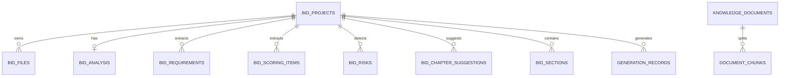

# 数据模型

> Supabase 初始化 SQL 见 [deployment/supabase-setup.md](../deployment/supabase-setup.md)

## 数据模型

核心表：

| 表 | 说明 |
| --- | --- |
| `bid_projects` | 招标项目主表 |
| `bid_files` | 招标文件元数据 |
| `bid_analysis` | 招标文件综合解析结果 |
| `bid_requirements` | 资格、商务、技术、文件要求 |
| `bid_scoring_items` | 评分项 |
| `bid_risks` | 风险项、否决项、废标项 |
| `bid_chapter_suggestions` | 建议响应章节 |
| `bid_sections` | 标书章节树与章节正文；通过 `metadata.volume_type`、`metadata.volume_name` 记录技术标、商务标、资格文件、报价文件等分册归属 |
| `knowledge_documents` | 企业知识库文档主表 |
| `document_chunks` | 文档切片、元数据与向量 |
| `generation_records` | AI 生成记录 |

ER 概览：

Storage bucket 建议：

| Bucket | 用途 | 建议权限 |
| --- | --- | --- |
| `tender-files` | 原始招标文件、补遗、答疑 | private |
| `generated-docx` | 生成的 Word / Markdown / 导出归档 | private |
| `knowledge-files` | 企业知识库资料、行业资料、历史标书 | private |
| `qualification-files` | 资质、证书、人员、财务等资料 | private |
| `product-files` | 产品手册、参数、图纸、案例材料 | private |
