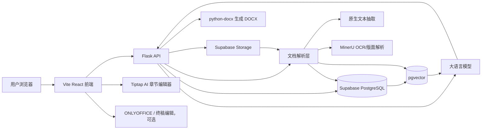
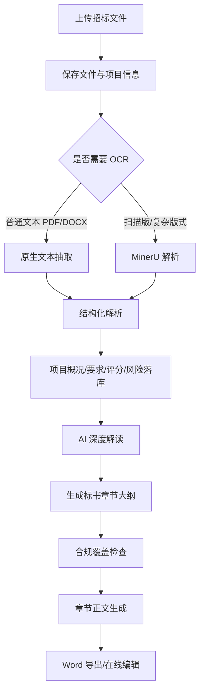

# 系统架构总览

> 详细部署说明见 [deployment/quickstart.md](../deployment/quickstart.md)

## 技术栈

### 后端

- Python 3.9+
- Flask / Flask-CORS
- Supabase Python SDK
- PostgreSQL / pgvector
- ChromaDB 本地向量库兼容层
- PyPDF2 / Mammoth / python-docx
- Pillow 图片处理，用于企业资信库和产品库缩略图生成
- MinerU API
- OpenAI-compatible SDK，用于调用通义千问等兼容模型服务

### 前端

- Vite
- React 18
- TypeScript
- Ant Design 5
- Tailwind CSS
- React Router
- TanStack Query
- Zustand
- Axios
- lucide-react
- Tiptap / ProseMirror（AI 章节编辑器）

### 存储与外部服务

- Supabase PostgreSQL：业务数据、结构化解析结果、知识库元数据
- Supabase Storage：招标文件、知识库文件、生成文档
- Supabase pgvector：RAG 向量检索
- DashScope / OpenAI-compatible LLM：文本生成、Embedding
- MinerU：复杂 PDF / OCR 解析
- ONLYOFFICE Docs：终稿在线编辑，可选（需 Docker 部署）

## 系统架构

## 核心业务流程

