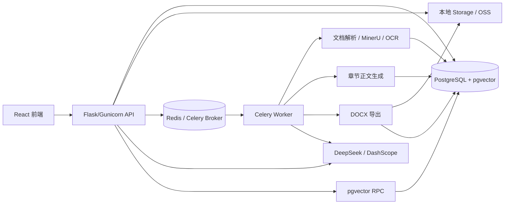
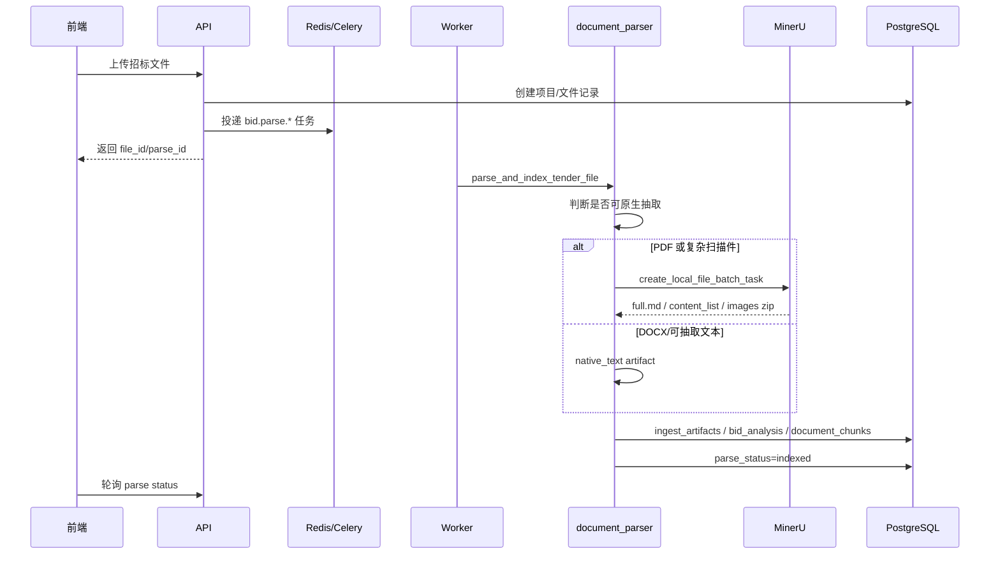
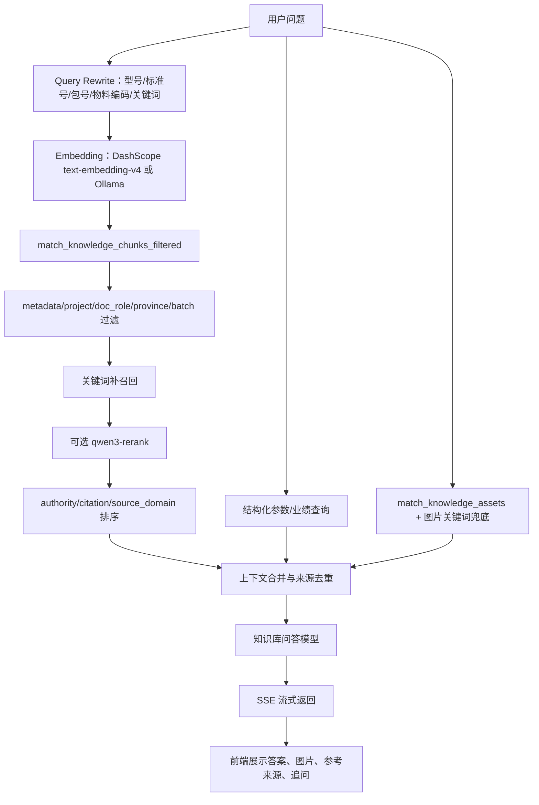
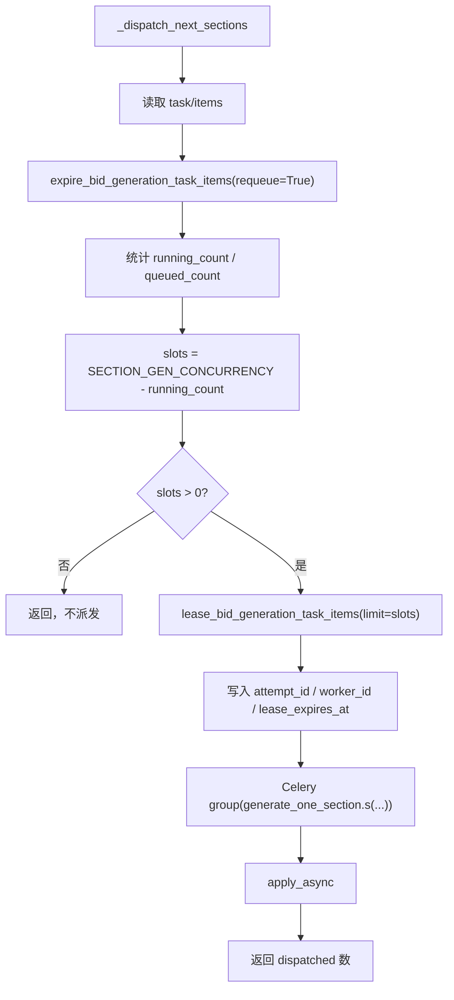
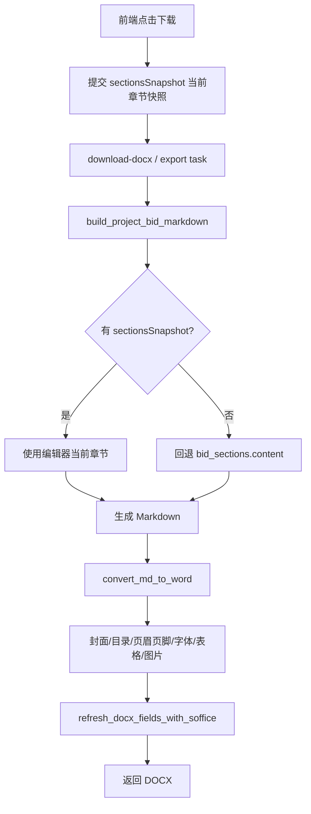

# AI 标书系统代码结构与架构讲解

> 面向对象：开发团队技术讲解、二开交接、架构评审。
> 当前重点：电网/国家电网标书场景，默认 MVP 企业主体为“河北泰昌电力器材科技有限公司”。
> 更新时间：2026-06-16。

## 1. 项目整体定位

本项目是面向电力/电网招投标场景的 AI 标书编制工作台。核心目标不是做一个通用聊天机器人，而是把“招标文件解析、招标要求解读、企业知识落库、知识问答、分册大纲、章节正文生成、合规检查、正式 DOCX 导出”串成一条可追溯、可回归、可交付的生产链路。

一句话理解：

```text
招标资料和企业资料进入系统
→ 解析/OCR/结构化抽取
→ 写入业务库、向量库、结构化 staging/行表和图片资产库
→ 通过 metadata 过滤 + 向量检索 + 关键词兜底 + rerank 提供问答与写作上下文
→ 按章节并发生成标书正文
→ 在线编辑器确认
→ 使用当前章节快照导出正式 DOCX
```

系统当前最重要的工程取向有三点：

1. **资料边界清晰**：泰昌企业事实、辽宁招标要求、河北豪乾参考稿不能混用。
2. **长任务异步化**：解析、章节正文、DOCX 导出都不应阻塞 Web 请求，统一依赖 Celery worker。
3. **真实链路回归**：RAG、问答、章节生成、DOCX 导出不能只靠 mock，关键变更需要走真实 DB、真实 worker、真实 LLM 或真实导出链路验证。

## 2. 代码目录总览

项目根目录主要分为后端、前端、资料、脚本、迁移、文档几类。

```text
.
├── main.py                         # Flask 应用入口
├── backend/                        # 后端主代码
│   ├── api/                        # HTTP API 路由层
│   ├── ai/                         # LLM 解读、大纲、正文、合规、rerank 等 AI 能力
│   ├── core/                       # 配置、日志、通用工具
│   ├── db/                         # PostgreSQL/Supabase 兼容访问层
│   ├── export/                     # Markdown -> DOCX 导出
│   ├── parsing/                    # 文档解析、MinerU、招标文件结构化解读
│   ├── rag/                        # 知识库入库、分块、向量化、召回、问答
│   ├── services/                   # 跨 API/worker 复用的业务服务
│   └── tasks/                      # Celery 异步任务
├── frontend/                       # React 18 + TypeScript + Ant Design 前端
├── scripts/rag/                    # RAG 入库、评测、泰昌专项抽取和回归脚本
├── rag_seed/power_grid_resources/  # 电网 RAG 种子资料
├── parsed_outputs/                 # 解析/OCR/staging 产物
├── migrations/postgres/            # PostgreSQL 正式迁移
├── sql/                            # 历史 SQL 和部分补充 SQL
├── docs/                           # 产品、架构、RAG、开发和回归记录
└── tests/                          # 单测、冒烟、RAG 测试集
```

后端分层建议按下面方式理解：

| 层级 | 目录 | 责任 |
| --- | --- | --- |
| HTTP 接入层 | `backend/api/` | 校验请求、创建任务、查询状态、返回 SSE/JSON |
| 异步任务层 | `backend/tasks/` | Celery worker 执行解析、章节生成、导出等长任务 |
| 业务服务层 | `backend/services/` | Web 和 worker 共用的章节生成等业务过程 |
| AI 能力层 | `backend/ai/` | LLM prompt、流式调用、报告、大纲、正文、合规、rerank |
| RAG 层 | `backend/rag/` | 分块、embedding、向量召回、上下文组装、结构化参数查询 |
| 解析层 | `backend/parsing/` | 原生文本抽取、MinerU、OCR 产物落库、招标文件解读 |
| 数据访问层 | `backend/db/` | PostgreSQL 表、RPC、Storage 的统一封装 |
| 导出层 | `backend/export/` | 正式投标文件 DOCX 样式、目录、页眉页脚、图片、字段刷新 |

## 3. 运行时架构

本地和生产都应按“Web + Worker + DB + Redis + LLM/OCR 服务”的方式理解。



关键约束：

- Web 进程只负责接请求、返回状态、短链路 SSE，不负责长期占用计算。
- Celery worker 执行解析、章节生成、导出等长任务。
- Redis 是 Celery broker/result backend。
- PostgreSQL 保存业务数据、向量、任务状态、图片资产和结构化行数据。
- pgvector 是唯一主向量链路，历史 ChromaDB 不再作为主链路。
- 本地真实联调至少启动三端：`dev_backend.sh`、`dev_worker.sh`、`frontend npm run dev`，并依赖本地 PostgreSQL/Redis。

## 4. 端到端主流程

### 4.1 招标文件上传与解析

核心代码：

| 模块 | 作用 |
| --- | --- |
| `backend/api/projects.py` / `backend/api/routes.py` | 上传、历史文件、解析状态入口 |
| `backend/tasks/parse_tasks.py` | Celery 解析任务封装 |
| `backend/parsing/document_parser.py` | 原生文本抽取、MinerU 提交、结果下载、分片 PDF、状态写入 |
| `backend/parsing/mineru_client.py` | MinerU API 客户端 |
| `backend/parsing/bid_interpreter.py` | MinerU 产物写入业务分析结构 |
| `backend/parsing/parse_status_store.py` | 解析状态持久化，兼容文件和数据库 |

解析链路：



解析策略：

- PDF 优先 MinerU/OCR，复杂或大 PDF 可拆分后再合并产物。
- DOCX、Markdown、可抽取文本走原生文本抽取。
- `.xlsx` 货物清单、技术参数表、偏差表不能只做普通文本向量，必须保留结构化行级记录。
- 解析状态必须落库，不能只在内存里记录。
- MinerU 结果 zip 下载失败时保留断点状态，支持自动/手动 retry。

### 4.2 招标文件解读

核心代码：

| 模块 | 作用 |
| --- | --- |
| `backend/api/interpret.py` | 解读报告 API |
| `backend/ai/interpreter.py` | LLM 生成招标解读报告 |
| `backend/parsing/bid_interpreter.py` | 从解析产物构建结构化报告 |

解读产物主要包括：

- 项目基本信息；
- 资格要求；
- 商务要求；
- 技术要求；
- 评分/否决/风险项；
- 分册和章节建议；
- 后续动作建议。

这一步为后续大纲、写作计划、封面字段、合规检查提供基础结构。

### 4.3 分册大纲与写作计划

核心代码：

| 模块 | 作用 |
| --- | --- |
| `backend/api/outline.py` | 大纲生成/流式大纲 API |
| `backend/tasks/outline_tasks.py` | 大纲精修异步任务 |
| `backend/ai/chapter_planner.py` | 规则大纲、AI 大纲、章节归一化、保存 |
| `backend/ai/bid_writing_plan.py` | 章节写作计划 |
| `backend/api/length.py` | 目标篇幅设置 |

大纲生成不是简单让模型自由发挥，而是“两阶段”：

1. **规则版骨架**：快速生成可用目录，保证前端有即时反馈。
2. **AI 精修版**：后台 Celery 继续结合招标解读、评分项、企业资料完善目录。

每个章节会写入 `metadata.writing_plan`，典型字段：

| 字段 | 用途 |
| --- | --- |
| `importance` | 高/中/低重要性 |
| `target_words` | 目标字数 |
| `min_words` / `max_words` | 字数边界 |
| `needs_table` | 是否建议表格 |
| `needs_image` | 是否建议图片 |
| `needs_qualification` | 是否需要资质证据 |
| `needs_case` | 是否需要业绩 |
| `strategy` | 写作策略 |

写作计划是后续章节正文 prompt、进度百分比、篇幅控制、补写判断的核心输入。

## 5. RAG 数据工程：解析、分块、入库、评测

### 5.1 RAG 资料类型

当前电网 RAG 资料包括：

| 资料类型 | 目录/来源 | 处理方式 |
| --- | --- | --- |
| 电网公开规则/标准/话术 | `rag_seed/power_grid_resources/` | 种子库入库 |
| 客户招标文件包 | `rag_seed/power_grid_resources/01_tender_documents/` | inventory -> 解析 -> metadata -> 入库 |
| 泰昌企业事实 | 客户原始资料、补充包、检验报告、合同、中标通知书 | `source_domain=enterprise_fact` |
| 辽宁招标要求 | 辽宁招标文件、货物清单、技术规范 | `source_domain=tender_requirement` |
| 河北豪乾参考稿 | 历史标书参考 | `source_domain=reference_template`，仅写法参考 |
| 图片资产 | PDF 整页、客户原图、Logo、生产线、证书等 | `knowledge_assets` |
| 结构化参数/业绩 | 检验报告、技术参数、项目业绩 | staging JSON/CSV，必要时行表 |

泰昌边界是硬约束：

- 标书主体默认是“河北泰昌电力器材科技有限公司”。
- 辽宁资料只能作为招标要求，不是泰昌企业事实。
- 河北豪乾资料只能作为格式/写法参考，不能作为泰昌资质、业绩、设备、人员、财务、图片事实。
- 图片资产正式导出只允许使用泰昌企业事实资产。

### 5.2 父子双层分块

核心代码：

| 模块 | 作用 |
| --- | --- |
| `backend/rag/chunking.py` | 父子双层分块器 |
| `scripts/rag/ingest_power_grid_v2.py` | 电网种子库 v2 入库 |
| `scripts/rag/ingest_customer_corpus.py` | 客户资料入库 |

设计原因：

| 消费场景 | 需要的 chunk |
| --- | --- |
| 知识问答 | 小而准的 child chunk |
| 合规检查 | 条款级 child chunk |
| 标书写作 | 需要 child 命中后回溯 parent，拿完整上下文 |

实现方式：

```text
parent chunk：章/节级完整上下文，不生成 embedding，不直接参与向量召回
child chunk：条/款/段级，生成 embedding，参与 pgvector 检索
child.metadata.parent_index：指向同文档 parent chunk
```

按 `doc_role` 分化切分：

| doc_role | parent | child |
| --- | --- | --- |
| `policy_regulation` / `sgcc_rule` | 章 | 条 |
| `standard_spec` | 章节 | 条文 |
| `main_tender_file` | 章/节/业务段 | 资格、评分、否决、提交要求 |
| `technical_spec` | 技术章节 | 参数/条款 |
| `contract_*` | 合同章节 | 合同条款 |
| `self_phrase` | 用途章节 | 可复用话术段 |
| `goods_list` | 不走普通文本主策略 | 表格三形态 |

metadata 必填核心字段：

```text
seed_corpus
province
batch_no
package_no
package_code
material_category
doc_role
source_domain
doc_owner
chunker
chunk_layer
parent_index
block_type
authority_level
citation_policy
content_sha256
ingestion_batch_id
doc_version
status
```

### 5.3 表格三形态

`.xlsx`、技术参数表、货物清单、技术/商务偏差表必须结构化，不能只扔进向量库。

至少保留三形态：

1. **原始结构**：sheet、表头、合并单元格、行列、来源文件。
2. **检索摘要**：可参与向量召回的自然语言说明。
3. **行级记录**：支持按包号、规格、物料编码、技术规范编码、数量、保证值等精确查询。

相关脚本/模块：

| 文件 | 作用 |
| --- | --- |
| `scripts/rag/ingest_customer_goods_tables.py` | 货物清单入库 |
| `scripts/rag/query_customer_goods_tables.py` | 货物清单查询 |
| `scripts/rag/extract_customer_technical_parameters.py` | 技术参数抽取 |
| `scripts/rag/extract_taichang_product_parameters.py` | 泰昌产品/检验报告参数抽取 |
| `backend/rag/product_parameters.py` | 泰昌产品参数问答查询层 |
| `scripts/rag/extract_taichang_project_performance.py` | 泰昌项目业绩结构化抽取 |
| `backend/rag/project_performance.py` | 项目业绩问答查询层 |

### 5.4 入库与评测

入库后必须跑回归评测，而不是只看“脚本跑完”。

常用命令：

```bash
set -a; source .env; set +a
.venv/bin/python scripts/rag/run_incremental_regression_gate.py --run-id <run>
```

该门禁会跑：

- Base 30 条；
- 泰昌专项 30 条；
- rerank off；
- `qwen3-rerank` on；
- 输出 `Recall@5`、Top1 来源准确率、MRR、禁用关键词命中率、跨 doc_role 串扰、平均耗时等。

涉及新增客户资料、metadata、召回策略、参考来源展示、结构化参数接入时，应同步更新：

- `docs/rag/runs/<run>_summary.md`
- `docs/rag/evaluation-records.md`
- `docs/rag/todo.md`

## 6. 知识问答架构

核心代码：

| 模块 | 作用 |
| --- | --- |
| `backend/api/knowledge.py` | 知识库问答、流式问答、追问建议 |
| `backend/rag/retrieval.py` | Query rewrite、向量检索、关键词补召回、rerank、排序 |
| `backend/rag/product_parameters.py` | 泰昌产品参数结构化查询 |
| `backend/rag/project_performance.py` | 泰昌项目业绩结构化查询 |
| `backend/rag/display_names.py` | 中文展示名、来源去重 |
| `frontend/src/pages/KnowledgeBase/KnowledgeSearchDrawer.tsx` | 前端知识库问答抽屉 |

问答链路：



`search_knowledge_base()` 的关键参数：

| 参数 | 说明 |
| --- | --- |
| `scenario` | `qa` / `writing` / `compliance`，影响过滤和父块回溯 |
| `metadata_filter` | 显式资料域、企业、批次、doc_role 等过滤 |
| `project_id` | 项目私有资料隔离 |
| `return_parent` | 写作场景 child 命中后回溯 parent |
| `rerank_enabled` / `rerank_model` | 在线 rerank 开关和模型 |

问答上下文组成优先级：

1. 结构化业绩上下文；
2. 结构化产品/检验报告参数上下文；
3. 向量召回的文本 chunk；
4. 企业事实图片资产。

对于泰昌专项问答，当前重点能力包括：

- MPP 环刚度、CPVC 平均内径/壁厚等具体数值；
- 检验报告编号和来源；
- 合同/中标通知书中的项目、金额、数量、招标编号；
- Logo、生产线、产品图、证书等图片资产；
- 来源中文化与同一确定性来源去重。

## 7. 标书正文生成架构

### 7.1 单章节生成

核心代码：

| 模块 | 作用 |
| --- | --- |
| `backend/api/sections.py` | 单章节流式生成 API、批量任务 API |
| `backend/services/section_generation.py` | 单章节生成、保存、失败/部分生成处理 |
| `backend/ai/section_writer.py` | 章节正文 prompt、RAG 上下文、LLM 流式输出 |
| `backend/db/supabase_repo.py` | `bid_sections` 和任务状态更新 |

单章节链路：

```text
stream_generate_bid_section_events()
→ 后台线程 worker 调用 generate_and_save_bid_section()
→ stream_bid_section() 从 LLM 获取 chunk
→ on_event 把 chunk 推给 SSE 或任务状态
→ done 时 append_section_images()
→ save_generated_section()
→ update_bid_section_content()
```

单章节设计特点：

- 支持真实流式输出；
- 支持正文生成结束后插入图片 Markdown；
- 支持生成失败时保留原正文；
- 支持超时后保存草稿并标记 `partial_generated`；
- Web SSE 入口用后台线程把事件从生成函数转交给前端，避免先攒完再返回。

### 7.2 多路并发按章节写标书：worker 架构

这是当前架构中最需要团队理解的部分。

核心代码：

| 模块 | 作用 |
| --- | --- |
| `backend/api/sections.py` | 创建批量章节任务、查询、取消、重试、恢复 |
| `backend/tasks/section_tasks.py` | Celery 协调任务、单章 worker、过期任务回收 |
| `backend/services/section_generation.py` | 单章真实生成逻辑 |
| `backend/db/supabase_repo.py` | 任务表、item 表、lease/heartbeat RPC |
| `sql/20260603_create_bid_generation_task_items.sql` | 章节 item 行表 |
| `sql/20260603_add_bid_generation_task_item_lease.sql` | lease、heartbeat、expire RPC |
| `migrations/postgres/007_atomic_section_task_item.sql` | JSON 快照原子更新 |

#### 7.2.1 为什么要做批量 worker

标书正文通常几十章，单章 LLM 生成可能几十秒到数分钟。如果串行生成，用户等待不可接受；如果 Web 请求直接同步生成，会导致：

- HTTP 长连接不稳定；
- 刷新页面丢进度；
- 取消/重试无法可靠控制；
- 多章节状态互相覆盖；
- worker 异常退出后任务永久卡住；
- 旧 worker 可能在重试后继续覆盖新结果。

所以系统采用：

```text
API 创建批量任务
→ Celery 协调任务按并发窗口领取 queued item
→ Celery group 并发派发多个 generate_one_section
→ 每个单章 worker 自己 heartbeat、进度落库、保存或失败
→ 任一 worker 完成后继续补位，直到全部章节终态
```

#### 7.2.2 任务状态模型

任务有两层：

1. `bid_generation_tasks`：批量任务主表，保留整体状态和兼容 JSON 快照。
2. `bid_generation_task_items`：每个章节一行，是真实调度依据。

item 典型字段：

| 字段 | 说明 |
| --- | --- |
| `task_id` | 批量任务 ID |
| `project_id` | 项目 ID |
| `section_id` | 章节 ID |
| `status` | `queued` / `leased` / `generating` / `saving` / `done` / `failed` / `partial_generated` / `cancelled` 等 |
| `attempt` | 第几次尝试 |
| `attempt_id` | 本次 lease 的 owner token |
| `worker_id` | 当前 worker 标识 |
| `lease_expires_at` | 租约过期时间 |
| `heartbeat_at` | worker 心跳 |
| `generated_content` | 进度草稿 |
| `draft_content` | 超时或续写草稿 |
| `chunk_seq` | 流式 chunk 序号 |
| `chunk_events` | 最近若干 chunk 事件 |
| `error` | 失败原因 |

#### 7.2.3 创建任务

入口：`POST /interpretations/<project_id>/section-generation-tasks`

`backend/api/sections.py` 做几件事：

1. 校验 `project_id` 和章节列表；
2. 调用 `create_bid_generation_task()` 创建任务；
3. 锁定大纲，避免全文编写期间 AI 精修覆盖目录；
4. 默认 `autoStart=true` 时调用 `dispatch_section_generation_task()`；
5. `dispatch_section_generation_task()` 投递 Celery 任务 `run_bid_section_generation.delay(project_id, task_id)`。

#### 7.2.4 协调任务

Celery task：`bid.sections.generate_task`

函数：`run_bid_section_generation(project_id, task_id)`

职责：

- 读取批量任务；
- 统计 queued/running；
- 如果没有待处理章节则返回；
- 调用 `_dispatch_next_sections()` 补满并发窗口；
- 如果调度失败，把批量任务标记为 failed。

并发度：

```text
实际并行度 = min(SECTION_GEN_CONCURRENCY, CELERY_WORKER_CONCURRENCY)
```

本地默认建议：

```text
CELERY_WORKER_CONCURRENCY=4
SECTION_GEN_CONCURRENCY=3
CELERY_WORKER_PREFETCH_MULTIPLIER=1
CELERY_POOL=threads
```

#### 7.2.5 并发派发：租约 + Celery group

核心函数：`_dispatch_next_sections(project_id, task_id)`

流程：



租约设计解决的问题：

- 多个 worker 几乎同时补位时，不会重复领取同一章节。
- worker 死亡后，租约过期可回收。
- 重试会清空旧 owner，使旧 worker 失效。
- 保存最终正文前必须校验 owner，避免旧任务覆盖新结果。

数据库 RPC `lease_bid_generation_task_items` 内部使用行级锁和任务级 advisory lock，避免尾部少量 queued item 被重复 lease。

#### 7.2.6 单章 worker

Celery task：`bid.sections.generate_one`

函数：`generate_one_section(project_id, task_id, section_id, attempt_id, worker_id)`

职责：

1. 读取任务和 item；
2. 校验任务未取消；
3. 校验当前 worker 仍是 item owner；
4. 从最新章节列表中重绑定章节，避免目录变化导致写错章节；
5. 把 item 更新为 `generating`；
6. 注入 `continuationDraft`，支持 partial 草稿续写；
7. 调用 `generate_and_save_bid_section()`；
8. 在 LLM chunk 回调中微批刷新进度；
9. 保存成功后标记 `done`；
10. 无论成功、取消、超时、失败，都调用 `_dispatch_next_sections()` 继续补位。

单章 worker 内部有三个关键保护函数：

| 函数 | 作用 |
| --- | --- |
| `assert_owner()` | 校验 `attempt_id` 和 `worker_id` 仍匹配，防旧 worker 覆盖 |
| `heartbeat()` | 周期性续租，刷新 `lease_expires_at` |
| `flush_progress()` | 微批写入 `generated_content`、`chunk_seq`、`chunk_events`、百分比 |

异常处理：

| 异常 | 处理 |
| --- | --- |
| `SectionGenerationCancelled` | item -> `stopped`，批量任务取消 |
| `SectionGenerationSuperseded` | 当前 worker 退出，不覆盖状态 |
| `SectionGenerationTimeout` | item -> `partial_generated`，保存 `draft_content` |
| 其他异常 | item -> `failed`，保留原正文 |

#### 7.2.7 为什么是“补位式并发”

系统不是一次性把 70 个章节全部丢给 worker，而是维护一个并发窗口。

例如 `SECTION_GEN_CONCURRENCY=3`：

```text
开始：领取章节 1、2、3
章节 2 先完成：立即补位领取章节 4
章节 1 超时 partial：释放槽位，补位章节 5
章节 3 完成：补位章节 6
...
直到 queued=0 且 running=0
```

这样可以：

- 控制 LLM 并发，避免 DeepSeek 429；
- 控制数据库连接和写入压力；
- 保持前端可见进度持续推进；
- 支持中途取消、重试、续写；
- 避免单个慢章节拖住整个全文生成。

#### 7.2.8 前端看到的进度

前端不直接消费 Celery 内部状态，而是通过任务查询接口读取业务表：

| API | 作用 |
| --- | --- |
| `GET /interpretations/<project_id>/section-generation-tasks/<task_id>` | 查询任务和 items |
| `POST /.../<task_id>/cancel` | 取消任务 |
| `POST /.../<task_id>/resume` | 恢复任务 |
| `POST /.../<task_id>/items/<section_id>/retry` | 单章节重试 |
| `PATCH /.../<task_id>/items/<section_id>` | 更新 item 状态 |

前端根据每个 item 的 `status`、`percent`、`generated_content`、`chunk_events` 回填编辑器或展示进度。刷新页面后，只要数据库里还有 `generated_content`/`draft_content`，中间状态就可以恢复。

### 7.3 章节写作如何使用 RAG

`backend/ai/section_writer.py` 会根据章节标题、分册类型、写作计划、企业画像和 RAG 召回内容构造 prompt。写作场景通常使用 `scenario="writing"`，允许 child 命中后回溯 parent，保证上下文更完整。

写作上下文主要来自：

- 招标解读中的资格/商务/技术/评分/风险信息；
- 当前章节 `metadata.writing_plan`；
- 企业事实资料；
- 检验报告、技术参数、业绩等结构化上下文；
- 允许的泰昌图片资产；
- 分册约束：技术标、商务标、资格、报价、附件写法不同。

写作输出必须注意：

- 不得编造泰昌没有的企业事实；
- 不得把辽宁招标要求写成泰昌事实；
- 不得把河北豪乾参考稿作为泰昌资质/业绩；
- 不得把模型生成的虚假图片路径写入正式 DOCX；
- 章节生成后仍允许人工编辑，导出必须尊重编辑器当前内容。

## 8. DOCX 正式导出架构

核心代码：

| 模块 | 作用 |
| --- | --- |
| `backend/api/export.py` | 异步导出任务 |
| `backend/api/routes.py` | `build_project_bid_markdown()` |
| `backend/export/md_to_word.py` | Markdown 转正式 DOCX |
| `backend/db/supabase_repo.py` | 导出任务与文件状态 |
| `tests/test_docx_export.py` | 导出行为测试 |

导出主链路：



当前稳定契约：

```text
前端 BidEditor.downloadDocx
→ 把当前 chapters 组装为 sectionsSnapshot
→ 后端 /download-docx
→ build_project_bid_markdown(sections_snapshot=...)
→ 优先使用 sectionsSnapshot
→ 没有快照才回退 bid_sections.content
```

这意味着：

- 已保存到数据库的正文修改会进入 DOCX；
- 未保存但仍在编辑器内存中的当前正文，也能通过 `sectionsSnapshot` 进入 DOCX；
- 后续任何导出改动都必须守住这个契约。

正式 DOCX 默认要求：

| 项 | 默认 |
| --- | --- |
| 模板 | `formal_bid_standard` |
| 纸张 | A4 |
| 页边距 | 上下 2.5cm，左 2.8cm，右 2.5cm |
| 正文 | 仿宋_GB2312 14pt |
| 行距 | 固定 22pt，首行缩进 2 字符 |
| 目录标题 | `目  录` |
| 页眉 | 左侧项目名称，右侧文件类型 |
| 页脚 | `第 X 页 共 Y 页` 页码和总页数字段 |
| 图片 | 默认 `withImages=true`，只用泰昌企业事实资产 |

导出层还负责：

- 清理不适合正式标书的符号和生成提示；
- 正式章节标题重新编号；
- 防止正文内部 Markdown 小标题污染 Word 大纲；
- 插入目录 `PAGEREF` 页码域和 dot leader；
- 使用 LibreOffice headless 刷新目录页码、页脚页码和总页数；
- 记录图片 found/inserted/skipped/failed 和字段刷新报告。

## 9. 数据模型速览

### 9.1 项目与标书

| 表/对象 | 作用 |
| --- | --- |
| `bid_projects` | 标书项目 |
| `bid_files` | 上传招标文件、解析状态 |
| `bid_analysis` | 招标文件结构化解读 |
| `bid_sections` | 标书章节目录和正文 |
| `bid_generation_tasks` | 批量章节生成主任务 |
| `bid_generation_task_items` | 单章节生成 item，真实调度依据 |
| `bid_generation_task_events` | worker 事件审计 |
| `bid_export_tasks` | DOCX 导出任务 |

### 9.2 知识库

| 表/对象 | 作用 |
| --- | --- |
| `knowledge_documents` | 知识文档元数据 |
| `document_chunks` | 文档分片和 embedding |
| `knowledge_assets` | 图片、证书、产品图、文档页图等资产 |
| `power_grid_goods_list_rows` | 货物清单结构化行 |
| staging JSON/CSV | 泰昌产品参数、项目业绩等结构化抽取产物 |

### 9.3 关键 RPC

| RPC | 作用 |
| --- | --- |
| `match_knowledge_chunks_filtered` | metadata 过滤 + pgvector chunk 召回 |
| `get_parent_chunk` | child 命中后回溯 parent |
| `match_knowledge_assets` | 图片资产向量召回 |
| `lease_bid_generation_task_items` | 行级领取 queued item 并写入 lease |
| `heartbeat_bid_generation_task_item` | worker 续租 |
| `expire_bid_generation_task_items` | 回收过期 item |
| `update_bid_generation_task_item_atomic` | 原子更新任务 JSON 快照 |

## 10. 前端架构要点

前端主要职责是工作台交互，不承载核心生成逻辑。

典型页面/模块：

| 模块 | 作用 |
| --- | --- |
| `frontend/src/pages/Interpretation/` | 招标解读展示 |
| `frontend/src/pages/BidEditor/` | 标书章节编辑、正文生成、下载 |
| `frontend/src/pages/KnowledgeBase/` | 企业知识库问答和资料管理 |
| `frontend/src/api/` | API 客户端封装 |
| `frontend/src/types/` | 项目、解读、标书、知识库类型 |

前端关键职责：

- 上传文件并轮询解析状态；
- 展示解读报告和大纲；
- 创建批量章节生成任务；
- 轮询任务状态并把 `generated_content` 回填编辑器；
- 支持取消、重试、恢复；
- 保存用户编辑后的正文；
- 下载 DOCX 时传 `sectionsSnapshot`；
- 知识库问答中展示来源、图片和追问建议；
- 展示中文友好的资产标题、分类、标签，不暴露内部枚举。

## 11. 配置与启动

关键环境变量：

| 变量 | 说明 |
| --- | --- |
| `DATABASE_URL` | PostgreSQL 连接 |
| `REDIS_URL` / `CELERY_BROKER_URL` | Celery broker |
| `CELERY_WORKER_CONCURRENCY` | worker 总并发 |
| `SECTION_GEN_CONCURRENCY` | 章节生成并发窗口 |
| `CELERY_WORKER_PREFETCH_MULTIPLIER` | 长任务建议为 1 |
| `CELERY_POOL` | 本地 macOS 建议 `threads` |
| `DEEPSEEK_API_KEY` | 章节写作模型 |
| `DASHSCOPE_API_KEY` | embedding/rerank/部分模型 |
| `DOCX_REFRESH_FIELDS` | DOCX 字段刷新 |
| `SOFFICE_BIN` | LibreOffice 路径 |

本地推荐启动：

```bash
docker compose up -d postgres redis
./scripts/dev_backend.sh
./scripts/dev_worker.sh
cd frontend && npm run dev
```

worker 注意事项：

- 改 `backend/tasks/*` 或 worker 依赖代码后必须重启 worker。
- 避免双 worker 同时运行旧代码和新代码。
- macOS / 新版 Python 不建议 prefork，默认 threads 更稳。
- 章节一直排队时，优先检查 `/api/ready` 的 Celery 状态和 worker 日志。

## 12. 回归测试与质量门禁

### 12.1 RAG 相关

涉及入库、metadata、召回策略、参考来源、结构化参数、图片资产时，至少执行：

```bash
set -a; source .env; set +a
.venv/bin/python scripts/rag/run_incremental_regression_gate.py --run-id <run>
```

并检查：

- Base Recall@5；
- 泰昌专项 Recall@5；
- Top1 来源准确率；
- MRR；
- 禁用关键词命中率；
- 跨 doc_role 串扰；
- rerank off/on 对比；
- 真实 `/api/knowledge/search/stream` 抽样。

### 12.2 章节生成相关

涉及 `backend/tasks/section_tasks.py`、`backend/services/section_generation.py`、`backend/ai/section_writer.py` 时，重点验证：

- Celery worker 在线；
- `bid.sections.generate_task` 能派发；
- `bid.sections.generate_one` 已注册；
- queued item 能 lease；
- `attempt_id` / `worker_id` 写入；
- heartbeat 正常刷新；
- 取消后旧 worker 不覆盖；
- partial 草稿可续写；
- 完成后继续补位；
- 多章节并发没有重复 dispatch。

典型检查命令：

```bash
.venv/bin/celery -A backend.tasks.celery_app:celery_app inspect registered | grep generate_one
curl http://127.0.0.1:3012/api/ready
```

### 12.3 DOCX 导出相关

涉及导出、模板、图片、章节快照、页眉页脚时，至少验证：

- `sectionsSnapshot` 优先于数据库旧正文；
- 封面字段不编造；
- 目录独立成页，页码右对齐，点引导线；
- 正文字体、字号、行距、页边距符合默认模板；
- 页眉页脚和页码字段刷新；
- 图片只来自泰昌企业事实；
- 不出现内部检索字段、metadata、Mermaid 源码；
- 导出 metadata 记录模板、图片数、字段刷新状态和告警。

真实链路：

```text
build_project_bid_markdown
→ convert_md_to_word
→ refresh_docx_fields_with_soffice
```

### 12.4 文档同步

RAG 或导出相关改动完成后，应更新：

- `docs/rag/todo.md`
- `docs/rag/evaluation-records.md`
- `docs/rag/runs/<run>_summary.md`
- `docs/development/docx-bid-export-quality-todo.md`
- `docs/development/runs/<run>.md`

## 13. 给团队讲解时的推荐顺序

建议按下面 90 分钟结构讲：

| 时间 | 内容 |
| --- | --- |
| 10 分钟 | 项目定位：不是通用 RAG，而是投标生产链路 |
| 10 分钟 | 代码目录与运行时架构：Web、Worker、DB、Redis、LLM/OCR |
| 15 分钟 | 解析链路：上传、MinerU、原生文本、状态、入库 |
| 15 分钟 | RAG：父子分块、metadata 过滤、结构化表格、图片资产 |
| 10 分钟 | 知识问答：文本、结构化参数、业绩、图片、来源去重 |
| 20 分钟 | 多路并发章节生成：任务表、item 表、lease、heartbeat、Celery group、补位 |
| 5 分钟 | DOCX：sectionsSnapshot、正式格式、字段刷新 |
| 5 分钟 | 回归门禁与开发注意事项 |

重点提醒团队：

- 任何资料入库前先 inventory，再解析，再分块/结构化，再入库。
- RAG 召回必须先 metadata 过滤，再向量检索。
- 表格、检验报告、业绩不能只做普通文本向量。
- 批量章节生成的真实调度依据是 `bid_generation_task_items`，不是内存状态。
- worker 保存最终正文前必须校验 owner。
- 导出必须优先使用编辑器当前 `sectionsSnapshot`。
- 泰昌企业事实、辽宁招标要求、河北豪乾参考稿的边界不能破。

## 14. 常见故障定位

| 现象 | 优先检查 |
| --- | --- |
| 上传后解析不推进 | Celery worker 是否在线，`parse_status` 是否落库，MinerU 配置是否有效 |
| 知识问答答非所问 | metadata_filter、doc_role、source_domain、结构化参数是否优先命中 |
| 问答来源重复或展示内部英文 | `display_names.py`、source_display_name、来源去重逻辑 |
| 章节一直排队 | worker 是否启动、Celery 是否注册 `bid.sections.generate_one`、是否 prefork 死锁 |
| 章节一直生成中 | heartbeat 是否刷新、lease 是否过期、模型是否慢流、是否触发超时 |
| 重试后旧内容覆盖新内容 | owner 校验、attempt_id/worker_id 是否正确清空/更新 |
| DOCX 不是编辑器当前正文 | 检查前端是否提交 `sectionsSnapshot`，后端是否优先使用 snapshot |
| DOCX 目录页码不准 | LibreOffice 是否安装，`SOFFICE_BIN` 和 `DOCX_REFRESH_FIELDS` |
| DOCX 图片误用参考稿 | 图片资产 metadata、source_domain、reference_only、选图过滤 |

## 15. 当前架构的演进方向

短期建议：

1. 把前导确认页定位为“生成正文前的变量收口向导”，先旁路只读确认，再做显式替换和正式导出门禁。
2. 将泰昌产品参数、项目业绩等 staging JSON 在查询复杂度上升后评估升级为正式数据库表。
3. 给章节生成任务详情补更清晰的前端运维视图：worker、attempt、lease、heartbeat、事件时间线。
4. 继续保持 `sectionsSnapshot`-first 的导出契约，任何编辑器/导出改动先做真实 DOCX 回归。
5. 新增客户资料必须进入 inventory、metadata 边界校验、增量回归门禁，不允许临时混入知识库。

中期建议：

1. 对解析质量、结构化抽取、召回质量、生成质量建立统一 dashboard。
2. 将正式模板能力从内置 `formal_bid_standard` 扩展到客户可编辑 Word 模板模式。
3. 将章节生成任务的调度指标纳入日志/监控：平均首 token、平均完成时间、partial 率、429 率、重复 dispatch 率。
4. 对企业事实、招标要求、参考模板建立更强的数据域隔离和 UI 可解释展示。
