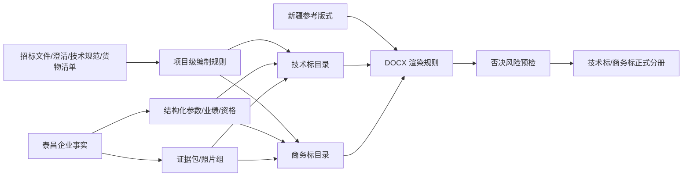

# 泰昌技术标/商务标模板与招标要求融合需求调研稿

> 文档状态：待客户/产品/技术联合评审
> 编制日期：2026-07-11
> 试点主体：河北泰昌电力器材科技有限公司
> 本轮边界：仅调研、盘点、差距分析和需求定义；不修改业务代码，不入库，不调整现网 RAG，不生成新的正式投标文件。

---

## 1. 调研结论摘要

客户反馈成立，并且不是单纯的“字体、页边距或图片多少”问题，而是当前系统交付模型与真实投标人成稿模型不一致：

- 当前系统主要按“AI 长正文 + 少量自动配图”生成技术标和商务标。
- 客户认可的新疆成稿实际是“招标规定表单 + 参数逐项响应 + 评审要素组织 + 大量证据附件页”。
- 泰昌新提供的《技术补充文件》和《商务补充文件》，不只是资料包，而是已经按招标文件第六章组织的泰昌证据型分册，具有极高的“泰昌事实盘点 + 章节到证据的编排”价值。
- 招标文件第六章及投标人须知/评标办法才是每个项目目录、格式、必填表单、上传端口和否决门禁的最高优先级依据。新疆成稿和泰昌补充文件都不得直接覆盖它。

因此，建议将后续能力定义为：

> 以招标文件生成“项目级投标编制规则”，以泰昌一手资料填充事实、参数、表单和证据页，以新疆成稿复用分册组织和版式，以当前长正文生成能力作为需要论述的内容块，最终生成“正文、表格、响应项、附件证据页”混合编排的技术标/商务标。

---

## 2. 需求背景与业务目标

### 2.1 业务背景

泰昌投标人员已经明确：

1. 当前系统生成的技术标、商务标与其实际预期明显不符。
2. 客户认可新疆技术标/商务标的分册目录、章节组织、表单与正文/附件布局，但不认可其他企业的图片、参数、证书、业绩和事实。
3. 客户按招标文件与新疆成稿的思路，又提供了泰昌自身的技术/商务补充文件。
4. 客户强调每份招标文件已规定投标文件组成、表单格式和部分正文要求，未按要求编制可能直接导致否决投标。

### 2.2 核心业务目标

- 把“能写长文”升级为“能按招标文件编制完整投标分册”。
- 确保每个项目的技术标/商务标目录可追溯到招标文件原始条款。
- 确保泰昌证书、报告、工艺、设备、人员、业绩等证据可按章节成组编排，而不是随机插入少量图片。
- 保留当前系统已成熟的文字型正文生成能力，不做推倒式重构。
- 建立“否决风险优先”的编制与导出前检查机制。

### 2.3 非目标

- 不把新疆其他投标人的任何事实或图片复制为泰昌事实。
- 不把泰昌电缆保护管资料默认用于架空绝缘导线项目。
- 不把任何一份参考目录硬套到全部省份、批次、物料和分标。
- 不在本轮调研中执行数据库入库、代码改造或正式文件导出。

---

## 3. 用户角色与核心痛点

| 角色 | 核心任务 | 当前痛点 | 需要的系统结果 |
| --- | --- | --- | --- |
| 泰昌投标编制人员 | 按招标文件完成技术标/商务标 | 系统输出像通用方案，不像真实投标分册 | 招标目录原样落地，表单、响应、证据页完整编排 |
| 资料管理员 | 管理证书、报告、图片、合同、人员资料 | 资产虽已入库，但很难判断应放在哪个章节、是否完整 | 按产品/证据类型/报告/页序形成证据包 |
| 项目负责人 | 把关否决风险、章节和材料完整性 | 难以确认系统是否真正按招标文件执行 | 要求来源、适用条件、完成状态和阻断原因清晰可查 |
| 审核人员 | 检查偏差、保证值、签章、附件 | 容易出现误填“无偏差”、证据过期或跨产品误用 | 项目级合规清单和人工复核门禁 |

---

## 4. 调研范围与证据清单

### 4.1 本轮五份核心 Word 文件

| 文件 | 定位 | 实测概况 | 可使用范围 |
| --- | --- | --- | --- |
| 《技术文件 - 10kV架空绝缘导线-新疆》 | 其他企业正式技术标参考成稿 | 100.9MB，1425 段，82 表，408 个媒体文件，33 个 section，约 512 页 | 仅可参考分册目录、编号、表单/附件布局和版式 |
| 《商务文件 - 10kV架空绝缘导线-新疆》 | 其他企业正式商务标参考成稿 | 32.2MB，237 段，3 表，168 个媒体文件，12 个 section，约 177 页 | 同上，不得使用其证照、审计、查询报告、业绩等事实 |
| 《技术补充文件》 | 泰昌技术事实与证据编排稿 | 90.6MB，825 段，10 表，352 个媒体文件，目录至 368 页 | 可作泰昌事实候选源，必须回溯客户原始资料并通过产品适用性/有效期门禁 |
| 《商务补充文件》 | 泰昌商务事实与证据编排稿 | 95.9MB，308 段，4 表，339 个媒体文件，目录至 325 页 | 可作泰昌商务事实候选源，敏感页、时效性页和项目条件页需复核 |
| 《招标文件其他章节-SL265A》 | 本批项目的招标要求源 | 819 段，29 表，19 个 section，包含投标人须知、评标办法、供货要求、第六章投标文件格式 | 章节、格式、必填项、上传规则、评审与否决条件的最高优先级依据 |

### 4.2 同包关联文件

- 《第一章 投标邀请书-SL265A》：项目名称、招标编号、分标、包号、资格等项目上下文。
- 技术规范书压缩包：技术条款、固化 ID、技术参数特性表、投标人保证值和点对点应答的主要来源。
- 货物清单 XLSX：分标/包/物料/规格/数量/交货/技术规范编码的结构化来源。
- 澄清、修改、补遗：在真实项目中可覆盖原招标文件，必须进入规则合并。

---

## 5. 核心原则与权威优先级

### 5.1 五级优先级

```text
招标文件、澄清、补遗中的强制要求
> 当前项目的分标/包/物料/资格模式/保证金等条件
> 泰昌原始企业事实、结构化参数和已审核证据资产
> 泰昌补充文件的章节到证据编排关系
> 新疆成稿的分册风格与版式参考
> 系统通用模板和 AI 自由生成
```

### 5.2 来源边界

| 来源 | metadata 定位 | 允许用途 | 禁止用途 |
| --- | --- | --- | --- |
| 泰昌原始资料/补充文件中可追溯资料 | `source_domain=enterprise_fact` | 支撑泰昌事实、参数、资质、设备、业绩和正式证据页 | 未核对原始来源、产品适用性或有效期时直接正式使用 |
| SL265A 招标文件包 | `source_domain=tender_requirement` | 目录、格式、技术要求、评审要素、否决规则 | 作为泰昌企业事实 |
| 新疆技术/商务成稿 | `source_domain=reference_template`, `reference_only=true` | 分册结构、版式、编号、证据页组织方式 | 作为泰昌事实、参数、图片、业绩或证书 |

---

## 6. 招标文件强制要求与否决风险

### 6.1 本批已识别的高风险要求

| 类别 | 招标原要求摘要 | 系统需求 |
| --- | --- | --- |
| 技术参数逐项响应 | 必须填写具体数值等实质内容，不得只写“响应/完全响应/按招标文件执行” | 参数表应做字段级完整性检查；空值或笼统响应应阻断正式导出 |
| 偏差表 | 所有偏离应在指定偏差表列明；未列明则视为未提出偏离 | 不得在无数据依据时自动写“无偏差”；需建立要求值-保证值-偏差结论链路 |
| 第六章格式 | 有格式的文件必须按格式编制，实质性修改或未按要求签署可视为无效 | 原样表单应优先进入 `template_docx`/结构化表单渲染，不应由 AI 改写表头、列和声明 |
| 投标文件组成 | 价格文件按包、商务/技术文件按分标制作，并按指定端口上传 | 项目模型必须区分“包级价格册”和“分标级技术/商务册” |
| 资格预审复用 | 预审材料已是投标文件一部分，本次仅允许按要求更新/补充；重复提交部分可不予评审 | 章节应支持 `inherited_from_prequalification` / `update_required` / `not_required` 状态，不得无差别贴全量资料 |
| 资料真实性 | 虚假资格、业绩、验收、擅改技术要求均可否决 | 每个证据块必须保留原始文件、页码、所有者、产品和审核状态 |
| 项目条件 | 本批“免收投标保证金” | 商务补充文件中的保证金/保险章节必须在本项目自动标为不适用，不得照抄入册 |
| 人员关系说明 | 未如实提交与国网系统人员关系说明将被否决 | 应为商务标项目级必填表，不能只靠通用正文代替 |
| 电子文件与签章 | 技术/商务完整文件上传辅助系统，格式页的签字/盖章要求须执行 | 系统仅生成占位与待办；签章图片不得未授权自动插入 |
| 文件大小/图片压缩 | 无证明材料处尽量使用可编辑文字；图片建议黑白、150/96ppi，8-10 张 A4 图约 1MB | 不应简单“图越多越好”；应在清晰可读、文件体积和正式证据完整性之间取平衡 |

### 6.2 规则产物要求

每个项目解析后应产出项目级《投标编制规则清单》，至少包含：

- 规则 ID、原文件、章节/表格/页码、原文摘要；
- 适用分册、适用分标/包/物料；
- `required` / `conditional` / `forbidden` / `reference_only`；
- 是否有固定格式、是否必须结构化填写、是否需要签章；
- 关联评分项、否决级别、导出前检查器；
- 人工确认状态及确认人。

---

## 7. 目标技术标目录模型

### 7.1 骨架原则

- 以当前项目第六章“技术文件”组成表为骨架。
- 以技术规范书、评分标准和货物清单生成子章节和表格。
- 以泰昌技术补充文件确定证据包应如何挂接。
- 以新疆技术标参考编号、分页、目录和证据页观感。

### 7.2 建议项目级技术标骨架

```text
（一）技术偏差表
  1. 技术偏差表（招标原样表单）

（二）专项投标文件
  1. 业绩文件（依资格模式/第六章条件决定是否提交）
  2. 技术特性参数表
     2.1 按固化 ID/技术规范编码/规格生成的参数表
     2.2 技术规范点对点应答
  3. 货物组件材料配置表
  4. 符合招标文件投标人资格要求的证明文件
  5. 针对评审要素需要补充的其他文件
     5.1 产品制造质量控制
         5.1.1 原材料/组部件进厂检验检测措施
         5.1.2 生产工艺与关键控制点
         5.1.3 质量管控体系
         5.1.4 生产制造环境/试组装环境
         5.1.5 资质能力核实资料
         5.1.6 MES/BIM/智能仓储等数字化应用（仅有真实证据时）
     5.2 履约风险与绩效评价
     5.3 绿色低碳生产及绿色回收
  6. 招标文件规定的其他应提交技术文件
  7. 技术服务（培训、安装指导、备品备件、故障响应）
  8. 售后服务保障及承诺
  9. 质量保证措施方案
  10. 生产场地、生产能力、剩余产能与厂房面积
  11. 生产装备（招标原样表单）
  12. 调试试验场所与试验检测设备（招标原样表单）
  13. 制造工艺（招标原样表单）
  14. 认证证书（招标原样表单 + 证据页）
  15. 主要技术人员、项目经理及证书（招标原样表单 + 证据页）
  16. 检测检验报告与校准证书
  17. 资质业绩凭证单（依本批资格模式决定是否出现）
  18. 其他
```

### 7.3 泰昌技术补充文件提供的高价值事实域

| 事实/证据域 | 补充文件内容 | 现有数字资产对照 | 使用决策 |
| --- | --- | --- | --- |
| 技术参数 | `G004-500013634-00006` 参数表 | 现有 CPVC/MPP 内径 250 报告参数结构化层 | 必须按招标固化 ID、物料、规格做匹配；不匹配则禁用 |
| 生产工艺 | MPP、CPVC、N-HAP、PE 工艺流程及工序控制 | 已有生产线、设备、部分工艺/质量资料 | 作为电缆保护管产品族事实，不得进入架空绝缘导线项目 |
| 生产/试组装环境 | 生产现场与环境证据 | 已有生产制造能力资产 | 可归一为“证据包”，但需检查图片来源、拍摄时间和产品关联 |
| 履约与绩效 | 履约风险、绩效评价 | 已有 1 项结构化业绩，但验收/履约证明仍是缺口 | 每个结论必须绑定可追溯报告/凭证，不得只抽取标题 |
| 绿色低碳 | ESG、三废、环评、绿色规划、碳足迹、绿证、绿色供应链 | 补充批已入库多类绿色低碳资产 | 不能只以文件标题认定“已取得认证”，需核对发证机构、证书号、有效期和适用范围 |
| 服务与保障 | 培训、安装指导、备件、故障响应、售后承诺、质量措施 | 可与当前文字生成能力融合 | 正文可编辑，但时限、人员、网点、备件数等承诺不得无依据生成 |
| 检测报告 | CPVC、MPP、N-HAP、UPVC 报告 | CPVC/MPP 关键参数已有结构化查询；其他报告覆盖待核对 | 报告应按“报告级证据包”整页编排，不能随机抽 1-2 页配图 |
| 校准证书 | 拉力机、万能试验机、熔体流动仪、维卡、锤击、电子天平 | 已有试验检测资产 | 要按设备编号、校准证书号、有效期建关联，避免“设备图和证书不对应” |

---

## 8. 目标商务标目录模型

### 8.1 建议项目级商务标骨架

```text
（一）商务偏差表
  1. 商务偏差表（招标原样表单）

（二）投标保证金/投标保证保险
  仅在招标文件要求时出现；本 SL265A 批次应标为不适用并不进入正式目录。

（三）补充文件
  1. 投标保证金（条件章节）
  2. 投标人情况
     2.1 投标人与国家电网公司系统人员关系说明
     2.2 投标人基本情况表
     2.3 股东及出资情况/股权证明材料
  3. 企业法人营业执照
  4. 有效的税务登记证明
  5. 符合招标文件投标人资格要求的证明文件
     5.1 资格预审结果通知书/更新材料
     5.2 资质业绩凭证单（依资格模式）
     5.3 查询报告及截图
         5.3.1 国家企业信用信息公示系统
         5.3.2 信用中国
  6. 财务状况（按招标文件规定年份）
  7. 针对评审要素需要补充的其他文件
     7.1 应急保供/履约能力（仅评分表要求时）
     7.2 绿色发展规划及管理体系认证
     7.3 环境影响、绿电绿证、碳足迹（仅评分表要求时）
     7.4 创新激励机制、供应链保障措施（仅评分表要求时）
  8. 企业名称/资格资质变更证明（如有）
  9. 制造商授权委托书（仅适用时）
  10. 供应商关于配合开展资质能力信息核实的承诺函
  11. 公章对投标专用章授权书
  12. 其他

（四）法定代表人（单位负责人）授权委托书
```

### 8.2 泰昌商务补充文件提供的高价值事实域

| 事实/证据域 | 补充文件内容 | 现有数字资产对照 | 使用决策 |
| --- | --- | --- | --- |
| 主体资格 | 基本情况、营业执照、税务证明、股权资料 | 现有基础证照已入库 | 需核对统一社会信用代码、法人、地址、有效期和敏感字段展示权限 |
| 资格预审 | 预审通知书、资质业绩凭证单 | 现有资格/资信资料 | 按项目资格模式和有效期决定只引用结果还是更新附件 |
| 信用查询 | 企信系统、信用中国、裁判文书网、执行信息网等 | 现有资料完整度评分中仍列为项目前强校验项 | 查询结果有强时效性，应记录查询时间、入口、公司名称和完整页序，不宜长期复用旧截图 |
| 财务状况 | 2024 年审计报告等 | 系统已有 2023/2024/部分后续财务资料记录 | 本批要求 2022-2024，必须按招标规定年份做集合完整性检查 |
| 绿色/环保/碳 | ESG、三废、环评、绿电证书、绿色供应链、碳足迹 | 补充批已有大量同类资产 | 必须由当前评分表决定是否进入商务标，避免为了“页数多”堆砌无关证据 |
| 知识产权与荣誉 | 发明专利、软件著作权、守合同重信用 | 资产库中需继续做文件级完整性核对 | 只在招标/评分要求相关时进入；过期荣誉不得当作当前有效资质 |
| 授权/签章 | 授权委托、投标专用章授权书 | 签名、手章、公章已被限制为不自动进正式标书 | 正确；系统只出占位和待签清单，不自动盖章 |

---

## 9. 与当前数字资产的对照结论

### 9.1 现有能力和数据基础

根据现有入库与真实导出记录：

- 首批泰昌资料已重建为 300 个正式整页/原图资产，已排除 242 个 MinerU 局部切图。
- 2026-06-11 补充批又入库 297 个资产，记录为证照、生产/试验设备、绿色低碳、检验报告、财务、业绩等。
- 现有导出记录中有 597 个候选企业资产，但技术标单次选中量仍约 16-24 张，商务标同样是少量插图模式。
- 已有 CPVC/MPP 检验报告结构化参数层和真实 API/stream 验证。
- 已有 1 项合同 + 中标通知书交叉核对的结构化业绩。
- 已有技术/商务分册 profile、新疆版式参考规则、参考目录结构化规则和产品适配阻断逻辑。

### 9.2 本轮 Word 媒体粗比对

本轮将两份泰昌补充 Word 中的媒体与本地可定位的 586 个已有正式资产文件进行了精确哈希与图像感知哈希初步比对：

| 文件 | Word 媒体 | 感知哈希相同 | 感知近似 | 未找到可靠视觉匹配 |
| --- | ---: | ---: | ---: | ---: |
| 技术补充文件 | 352（1 个 WMF 未参与图像比对） | 28 | 114 | 209 |
| 商务补充文件 | 339 | 40 | 144 | 155 |

注意：Word 会重编码、压缩或截取图片，精确哈希命中很低；感知哈希对空白页、文档扫描页也可能产生近似命中。因此上表仅证明“资产库与新补充文件部分重叠，但新文件不能视为已完整入库”，不能据此直接宣称 209/155 张为新资产。正式入库必须回溯原始文件、页码、证据类型并做内容级去重。

### 9.3 差距分类

| 分类 | 已有情况 | 本轮结论 |
| --- | --- | --- |
| 资产数量 | 已有约 597 个候选资产 | 不是单纯“图片不够”，而是证据包、顺序、完整页序和项目适用关系缺失 |
| 产品边界 | 已有架空导线项目阻断 CPVC/MPP 事实的机制 | 必须保留并升级到表格、证据页、目录三层，不只阻断 prompt |
| 目录 | 已有参考目录规则提示 | 需从“低优先级 planner hint”升级为“招标文件解析后的项目级权威规则” |
| 正文 | 长正文生成已较完整 | 应保留，但仅用于技术服务、质量方案、售后、制度说明等需论述章节 |
| 表单/参数 | 有结构化参数和表格能力基础 | 需把第六章原样表单与技术规范参数表提升为一等内容块，禁止 AI 自由改列 |
| 证据附件 | 当前主要是章节相关性选图，单次导出通常不超过 24 张 | 需新增“文件级证据包”和“按原始页序整包导出”，不得用随机单页选图替代 |
| 敏感性 | 签章资产已禁止自动导出 | 还需对身份证、社保、银行、审计、股权页实施项目级授权和托管 |

---

## 10. 目标产品模型

不建议继续把整份投标文件仅建模为“章节 + Markdown 正文”。目标模型应至少支持以下内容块：

| 内容块 | 用途 | 典型例子 |
| --- | --- | --- |
| `narrative` | AI/人工可编辑正文 | 质量保证、培训、售后方案 |
| `fixed_form` | 招标第六章原样表单 | 商务/技术偏差表、人员关系说明 |
| `structured_parameter_table` | 技术要求值/保证值/偏差 | 技术特性参数表 |
| `point_by_point_response` | 技术规范逐条应答 | 固化 ID 对应条款级响应 |
| `evidence_bundle` | 一份原始证据的完整页序 | 检验报告、证书、审计报告、合同 |
| `photo_group` | 客户原始现场/产品照片 | 生产线、设备、厂房、产品实物 |
| `declaration` | 固定文本 + 项目字段 + 待签章 | 承诺函、授权书 |
| `conditional_placeholder` | 待客户补充/确认项 | 保证值、授权代表、签章日期 |

其关系应是：



---

## 11. 功能需求

### FR-01 招标文件规则抽取

- 识别第六章投标文件组成表、表单、附注、上传端口。
- 同时抽取投标人须知、评标办法、技术规范和澄清补遗中的条件与否决项。
- 生成可人工审核的项目级规则，不允许未经审核的低置信规则直接作为否决阻断依据。

### FR-02 目录权威合并

- 招标文件明确章节作为必选骨架。
- 项目条件决定条件章节是否出现。
- 评分表动态生成“评审要素补充文件”的子目录。
- 新疆/泰昌参考目录只允许补全未明确的编排层级，不能创造不适用章节。

### FR-03 原样表单与结构化填充

- 技术/商务偏差表、投标人基本情况表、人员关系说明、生产装备等格式优先保留原表头、合并单元格、声明和签章位。
- 原样表单未填字段进入待办清单，不得由模型自动编造。
- 表单应支持项目级版本和来源哈希，招标补遗更新后可识别已过期表单。

### FR-04 技术参数与点对点应答

- 按固化 ID、技术规范编码、物料编码、规格生成响应对象。
- 优先从泰昌结构化参数和对应检验报告填充投标人保证值。
- 不可确定的参数必须保留为待确认，不得用“完全响应”替代具体值。
- 生成后应进行位号、单位、范围、上下限、报告号和来源页校验。

### FR-05 泰昌证据包

- 以“原始文件”而不是“单张图片”为基本单元管理证据。
- 记录证据包类型、原文件、页数、页序、完整性、产品、有效期、敏感级别、可用分册和推荐章节。
- 支持“整包插入”、“指定页范围”、“仅作文本事实来源”三种策略。
- 检验报告、证书、审计报告、合同和查询报告默认按原页序整页导出，不使用 MinerU 局部切图。

### FR-06 产品适用性门禁

- 资产、参数、工艺、检验报告、设备和证据包都要带产品族/物料/规格适用性。
- 架空绝缘导线项目必须阻断 CPVC/MPP/N-HAP/UPVC 电缆保护管事实。
- 不能仅在 AI prompt 中做阻断，还要在候选资产、表格填充、目录、导出 manifest 和正式检查中阻断。

### FR-07 分册证据编排

- 每个章节允许设置为“正文为主、表格为主、图文证据、整页附件、混合”。
- 证据页按文件和页序编排，支持拖拽调整，但人工调整不得破坏报告完整性。
- 附件页不在正文显示内部评分、检索理由、资产路径或 API URL。

### FR-08 项目级完整性与否决预检

- 按招标要求展示“已完成/待确认/缺失/不适用/被禁止”。
- 对固定表单缺失、保证值空白、偏差未确认、人员关系表缺失、年份不齐、证书过期、误用产品等进行阻断。
- 区分“高风险警告”与“正式导出阻断”，并显示原招标条款。

### FR-09 DOCX/PDF 输出

- 优先使用招标文件可编辑 Word 格式；无客户模板时再使用新疆参考版式 profile。
- 保留正式封面、目录、连续页码、分页、表格、横向节和附件页。
- 支持大量证据页时的分批渲染、图片压缩、失败重试、完整性 manifest 和体积预估。
- 最终上传的双层 PDF 需另做可搜索文本层、图像层、字体、页码、文件完整性验证。

### FR-10 导出审计

每次正式导出至少记录：

- 项目/分标/包/物料/模板/招标文件版本；
- 规则数、必选章节数、条件章节决策；
- 固定表单完成率、参数表完成率、待确认项；
- 证据包候选/选中/页数/插入/失败/跳过原因；
- 产品适配、跨资料域、敏感性和否决检查结果；
- DOCX 字段刷新、PDF 转换、页数、文件大小和哈希。

---

## 12. 数据与 metadata 需求

### 12.1 项目规则

```text
rule_id
project_id
source_file
source_section
source_page
source_table
requirement_text
rule_type
severity
volume_type
applicable_packages
applicable_materials
condition_expression
required_format
signature_required
review_status
source_sha256
```

### 12.2 证据包

```text
evidence_bundle_id
enterprise
source_domain
source_document_name
source_file
source_sha256
evidence_type
product_family
material_category
model_specs
report_or_certificate_no
issue_date
expiry_date
page_count
page_assets[]
completeness_status
quality_tier
sensitivity
allowed_for_bid
applicable_volumes
applicable_sections
review_status
```

### 12.3 参数响应行

```text
tender_parameter_id
technical_spec_code
solidification_id
material_code
product_family
specification
parameter_name
unit
tender_required_value
bidder_guaranteed_value
deviation
evidence_report_no
evidence_source_page
verification_status
```

### 12.4 关键边界字段

所有用于正式导出的资产仍必须保留：

```text
enterprise=泰昌
doc_owner=河北泰昌电力器材科技有限公司
source_domain=enterprise_fact
reference_only=false
fact_source_allowed_for_enterprise=true
tenant_visibility=taichang_only
access_scope=taichang_tenant_internal
```

---

## 13. 交互流程需求

### 13.1 推荐流程

1. 创建项目，上传完整招标文件包、澄清、技术规范书和货物清单。
2. 系统生成《投标编制规则清单》和技术/商务标目录草案。
3. 投标人员审核高风险规则、条件章节和固定格式。
4. 系统按产品/规格匹配泰昌事实、结构化参数和证据包。
5. 每章显示正文、表单、参数、证据页和缺口。
6. 用户完成待确认保证值、偏差、授权、签章、年份、证书有效期等事项。
7. 执行正式导出预检；存在否决级问题时阻断。
8. 真实导出 DOCX，刷新目录/页码，转换并校验双层 PDF。

### 13.2 关键页面

- 招标要求解析与审核页。
- 技术标/商务标项目目录页。
- 参数响应与偏差核对页。
- 泰昌证据包管理页。
- 章节内容块编排页。
- 完整性/否决风险检查页。
- 导出预览与审计报告页。

---

## 14. 非功能需求

| 类别 | 需求 |
| --- | --- |
| 准确性 | 招标强制规则不得仅依赖 LLM 自由理解；表格、编号、条件和否决项应结构化 |
| 可追溯 | 每个章节、表格、参数和证据页可回溯至原文件和页码 |
| 兼容性 | 保留现有标准正文型导出；新能力作为项目/分册/章节级策略，不破坏其他项目 |
| 性能 | 支持 300-600 页、300-500 个媒体的 DOCX 生成；大文件导出应可续传/重试并显示进度 |
| 稳定性 | 单页证据失败不得静默遗漏；必须在 manifest 记录并阻断正式交付或需人工豁免 |
| 安全 | 身份、社保、银行、财务、签章资料按租户、项目和角色授权；导出操作留审计日志 |
| 可维护性 | 规则、目录、表单、版式、证据策略分层，不将某省或某批次规则硬编码到通用逻辑 |

---

## 15. MVP 范围与分期建议

### P0：项目规则与泰昌证据盘点

1. 对本 SL265A 包做完整的第六章、技术参数、评分项、否决项结构化评审稿。
2. 对两份泰昌补充 Word 做原始文件回溯、页级去重、证据包完整性盘点。
3. 产出“已有/新增/冲突/缺失/禁止”五类资产清单。
4. 由泰昌投标人员确认目录和高风险规则。

### P1：项目级分册骨架与表单

1. 按招标规则生成技术/商务目录，支持必选/条件/禁止章节。
2. 先落地技术/商务偏差表、技术特性参数表、人员关系说明、基本情况表。
3. 支持当前正文生成作为 `narrative` 块插入。

### P2：证据包与图片附件型导出

1. 实现报告/证书/合同/审计报告的文件级证据包。
2. 实现按原始页序的整包导出和章节编排。
3. 实现大文件体积、图片清晰度、页序、敏感性和产品适配门禁。

### P3：真实投标交付闭环

1. 可编辑 Word 模板定位填充。
2. 双层 PDF 导出和上传前检查。
3. 项目规则、资产、表单、偏差、签章和导出审计闭环。

---

## 16. 验收标准

### 16.1 目录与规则

- 技术/商务标一级及核心二级目录与当前项目第六章一致率 100%。
- 每个必选/条件/禁止章节均有招标原文来源。
- 本批“投标保证金”不进入正式商务标目录。
- 不出现施工类通用目录，不出现招标文件未要求的随意大章。

### 16.2 内容与数据

- 技术参数不允许用笼统“完全响应”代替要求的具体保证值。
- 无可追溯依据的保证值、偏差结论、产能、服务时限、人员和业绩数值不得自动填充。
- 固定格式表单的表头、列、声明和签章位不得被实质改写。
- 每个资格/报告/证书结论都能回溯原文件与页码。

### 16.3 资产与产品边界

- 正式导出只使用泰昌 `enterprise_fact` 且 `formal_bid_ready` 的资产。
- 新疆参考稿图片、辽宁/其他招标资料图片、河北豪乾图片在泰昌正式标书命中数为 0。
- 架空绝缘导线项目中 CPVC/MPP/N-HAP/UPVC 参数、工艺、报告和图片命中数为 0。
- 报告/证书证据包的实际插入页数与选定页序一致，失败页不得静默略过。

### 16.4 DOCX/PDF 交付

- 技术标、商务标分册封面口径为“投标文件 / 投标人：河北泰昌电力器材科技有限公司”。
- 目录层级、编号、页码、横向表格、附件分页正确，字段刷新成功。
- DOCX XML 不包含内部路径、API URL、检索分数、`taichang_*`、`production_capacity` 等内部字段。
- 对 300-600 页、300-500 媒体进行至少一次真实 DOCX -> 字段刷新 -> PDF 回归。
- 正式导出前不存在否决级未确认项；普通告警有明确人工豁免记录。

---

## 17. 风险分析

| 风险 | 级别 | 具体表现 | 应对策 |
| --- | --- | --- | --- |
| 把参考稿当成模板硬套 | P0 | 各省/批次目录差异被忽略 | 招标文件项目级规则最高优先 |
| 产品串用 | P0 | 电缆保护管资料出现在架空导线项目 | 产品族/物料/规格全链路门禁 |
| 表单被 AI 改写 | P0 | 表头、列、声明、签章位与招标原样不一致 | 原样表单结构化渲染/可编辑模板填充 |
| 无依据“无偏差” | P0 | 技术响应未经参数比对即承诺 | 参数及偏差结构化核对 + 人工确认 |
| 证据页不完整 | P0 | 只选中报告个别页或顺序错乱 | 原始文件级证据包和完整性门禁 |
| 时效资料过期 | P0 | 信用查询、证书、校准、财务年份不符本批要求 | 有效期/查询时间/年份集合检查 |
| 资料堆砌 | P1 | 为了模仿页数插入与评审无关证据 | 以第六章和评分项为章节收录依据 |
| 文件体积过大 | P1 | 上传超限或导出失败 | 图片分级压缩、可读性抽检、体积预算 |
| 敏感信息泄露 | P0 | 身份、社保、账户、审计、签章资料无授权输出 | 项目级授权、默认限制、导出审计 |

---

## 18. 待业务评审/客户确认事项

1. 客户所说“完全认可新疆目录和格式”，是指无招标明确格式时的默认风格，还是要求所有项目均强制沿用？本稿建议仅作默认参考，招标原样优先。
2. 泰昌补充文件是否已由投标人员审核为“企业标准事实包”，还是仅针对某个电缆保护管项目的临时编稿？
3. 《技术补充文件》中 CPVC/MPP/N-HAP/UPVC 报告、工艺和设备的当前有效性、适用型号及可公开范围。
4. 查询报告、审计报告、社保、身份证、银行资料是否允许系统托管并自动进入项目导出。
5. 未来主要交付物是 DOCX，还是实际上传的双层 PDF；若两者都要，验收以哪个为主。
6. 证据附件是默认全量收录，还是必须由投标人员在项目中勾选后收录；本稿建议高风险/敏感资料必须人工勾选。

---

## 19. 本轮最终建议

1. **不把需求简化为“把图片上限从 24 改成 400”**。核心是招标规则、表单、参数响应和文件级证据包，图片数量只是结果。
2. **不应让新疆参考稿成为全局硬编码模板**。应将其沉淀为正式国网投标分册的默认版式/编排风格，而项目目录由当次招标文件生成。
3. **将两份泰昌补充文件作为 P0 数据治理批次**。它们极有价值，但需先做原始资料回溯、内容级去重、证据包重建、产品适用性和时效性审核，不宜将 Word 内嵌图直接批量入库。
4. **保留当前文字型标书能力**。将其收敛到真正需要论述的章节，并让表单、参数、点对点响应、证据附件成为一等内容对象。
5. **先由泰昌投标人员评审本文档的目标目录和否决规则，再启动代码实施**。建议先用 1 个真实招标包做端到端样板，而不是一次性改全部生成链路。
