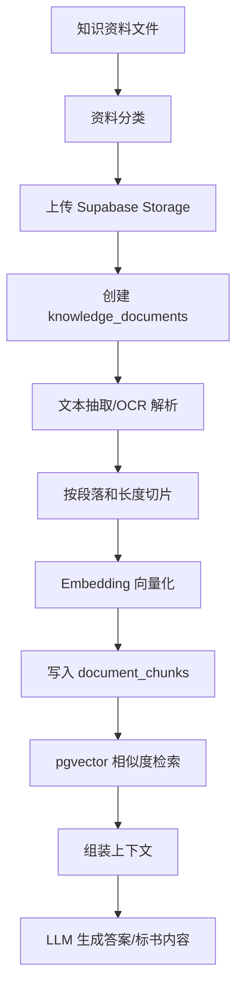

# RAG 知识库架构

> 相关代码：`backend/rag/`、`rag_seed/power_grid_resources/`

## 概述

系统使用 PostgreSQL + pgvector 作为企业知识库的唯一向量链路。早期遗留的 ChromaDB 已移除（见任务清单 P1-9），向量写入与检索统一在 PostgreSQL 内完成。

### RAG 技术框架与模型

当前 RAG 知识库采用"Supabase 业务库 + pgvector 向量检索 + DashScope Embedding + LLM 流式问答"的实现方式。

| 层级 | 技术/模型 | 作用 |
| --- | --- | --- |
| 业务数据库 | Supabase PostgreSQL | 保存知识文档元数据、文档分片、解析状态和业务表 |
| 向量检索 | pgvector | 在 PostgreSQL 内保存 embedding 向量并执行相似度检索 |
| 对象存储 | Supabase Storage | 保存原始知识库文件、招标文件和生成文档 |
| 向量模型 | 默认 DashScope `text-embedding-v4`（1024 维），可切换本地 Ollama `qwen3-embedding`，系统设置/环境变量可调 | 将用户问题、知识分片和图片资产描述转换为向量 |
| Rerank 重排 | 默认 DashScope `qwen3-rerank`，可切换 `gte-rerank-v2`，系统设置可关闭（fail-open） | 对 pgvector 初召回结果二次排序，提升电网术语、设备型号、资质名称和评分条款匹配准确率 |
| 问答模型 | 默认 `deepseek-v4-flash`（随 `knowledge_model` 配置），可在系统设置中调整 | 基于召回片段和企业图片资产生成最终回答 |
| 追问意图模型 | 默认读取 `knowledge_followup_model`，未配置时回退到系统文本模型 | 回答结束后识别用户下一步意图，生成 3 个业务追问 |
| 流式输出 | DashScope SSE / Flask `text/event-stream` | 支持 RAG 回答逐段返回，降低首屏等待体感 |
| 文本抽取 | PyPDF2 / Mammoth / Markdown 读取 | 处理普通 PDF、DOCX 和 Markdown 文档 |
| OCR/版面解析 | MinerU，可选 | 处理扫描版 PDF、复杂表格、图片型招标文件 |
| 图片预览与导出 | Pillow + Supabase Storage | 上传企业资信/产品图片时生成 WebP 缩略图，详情预览优先加载缩略图；DOCX 导出优先使用本地/存储原图，超大图片写入 Word 前按清晰压缩处理 |

当前核心代码：

| 文件 | 说明 |
| --- | --- |
| `backend/rag/ingestion.py` | 上传知识库资料后的解析、图片上下文提取、embedding 和 `document_chunks` 写入 |
| `backend/rag/chunking.py` | 父子双层分块器（按 doc_role 路由 + 网页噪声清洗） |
| `backend/rag/retrieval.py` | 用户问题向量化、调用 RPC 检索、组装 Prompt、生成 RAG 回答 |
| `scripts/rag/ingest_power_grid_v2.py` | 电网种子库父子分块 v2 入库（含丰富 metadata） |
| `scripts/rag/eval_recall.py` | Base 测试集召回评测（Recall@k / 串扰 / A/B） |
| `backend/rag/vector_store.py` | DashScope embedding 封装、文本抽取与分片工具（`ensure_extractable_text` 做扫描件检测） |
| `backend/api/routes.py` | `/api/knowledge/search`、`/api/knowledge/search/stream` 和 `/api/knowledge/followups` API |

RAG 检索链路：

```text
用户问题
→ 系统配置的 Embedding 模型生成 query embedding
→ Supabase RPC: match_knowledge_chunks
→ pgvector 相似度检索 document_chunks
→ Supabase RPC: match_knowledge_assets 检索企业资信/产品图片资产
→ 图片资产关键词兜底召回，覆盖营业执照、社保、业绩、产品图片等短文本资产
→ 召回 top-k 文档分片
→ 组装带来源信息和图片资产信息的 Prompt
→ 系统配置的知识库问答模型生成回答
→ SSE 流式返回答案
→ 前端展示答案、内联图片、参考资料来源
→ 回答完成后异步调用 /api/knowledge/followups 生成模型追问建议
```

追问建议链路：

```text
RAG 回答完成
→ 前端先基于规则生成兜底追问，保证用户立即可继续操作
→ 前端异步提交用户问题、AI 回答、召回资料、图片资产到 /api/knowledge/followups
→ 后端调用系统配置的追问意图模型
→ 模型输出固定 JSON: intent + followups
→ 后端兼容字符串 JSON 和 dict 两种模型返回格式，并做去重、长度和问号规范化
→ 前端用模型追问替换兜底追问；模型失败时保留规则兜底
```

分片与元数据策略：

- **当前推荐：父子双层分块（v2）**。按文件角色（法规/合同按“条”、标准按条文、招标公告按业务段、话术按段落）分化切分；子块（条/款级）参与向量召回，父块（章/节级）用于写作上下文回溯，子块经 `metadata.parent_index` 指向父块。实现见 `backend/rag/chunking.py`，入库见 `scripts/rag/ingest_power_grid_v2.py`。完整说明见 [docs/rag/chunking-strategy.md](../rag/chunking-strategy.md)。
- 早期统一约 `1800` 字符的定长切分（`rag_seed/.../ingest_power_grid_rag_seed.py`）仅作历史兜底，新数据不再使用。
- 每个分片写入 `document_chunks.content`，向量写入 `document_chunks.embedding`（父块 embedding 置空，不参与召回）。
- `document_chunks.metadata` 保存 `chunk_layer / parent_index / doc_role / authority_level / citation_policy / block_type / content_sha256` 及资料分类、来源单位、文件路径、标签等。
- 召回经 `match_knowledge_chunks_filtered` 做 metadata 定向过滤（doc_role/省份/批次）+ `project_id` 隔离；向量索引为 HNSW。
- 前端 RAG 回答完成后展示参考资料来源，帮助用户核对答案依据。
- 企业资信库、企业产品库上传的图片/附件写入 `knowledge_assets`，可通过向量召回和关键词兜底参与 RAG 问答。
- RAG 回答若提到 `图片资产1`、`图片资产2、3、4` 等编号，前端会自动把对应图片以 Markdown 图片形式插入到相应段落后，避免只输出文字描述。
- 图片预览优先加载缩略图，原图保留用于标书正文插图、附件查看和 DOCX 导出。

当前已验证的电网种子库入库结果（父子分块 v2，2026-06）：

- 入库文档：26 份（Markdown 类；15 份 PDF 待 MinerU 解析后纳入）
- 父块：298 个；子块（已嵌入）：2449 个
- Embedding：Ollama `qwen3-embedding:0.6b` @ 1024 维（可切回百炼 `text-embedding-v4`）
- 分类：电网招标文件、政策法规、标准规范、标准话术
- Base 召回基线：Recall@5 86.7%、来源类别准确率 100%、跨类别串扰 0%（见 [docs/rag/evaluation-records.md](../rag/evaluation-records.md)）
- 检索接口：`POST /api/knowledge/search`
- 流式检索接口：`POST /api/knowledge/search/stream`
- 追问建议接口：`POST /api/knowledge/followups`

### RAG 数据流



### RAG 资料分类

当前电网行业种子库使用以下分类：

| 分类 | 用途 |
| --- | --- |
| `01_tender_documents` | 国网公开采购公告、客户提供招标文件包、ECP/ETP 流程和物资类招标样本 |
| `02_policy_regulations` | 招投标、电力法、能源法、电力建设安全、质量监督、备案、国网采购管理制度 |
| `03_standards_specs` | 电力建设标准目录、GB/DL/Q-GDW 标准引用说明、配网/接地/电缆/低压电器等规范 |
| `04_standard_phrases` | 自建国网投标话术、章节库、资格/商务/技术/质量安全环保模板、检查清单 |

### RAG 入库脚本

电网行业种子资料位于：

```text
rag_seed/power_grid_resources/
```

目录结构：

```text
rag_seed/power_grid_resources/
├── 01_tender_documents/      # 国网公开采购公告、客户招标文件包、流程样本
├── 02_policy_regulations/    # 政策法规
├── 03_standards_specs/       # 标准规范目录、GB/DL/Q-GDW 标准引用说明
├── 04_standard_phrases/      # 自建国网投标话术与章节模板
├── _scripts/
│   ├── download_power_grid_rag_seed.py
│   └── ingest_power_grid_rag_seed.py
├── index.csv
├── index.jsonl
└── README.md
```

重新下载公开资料：

```bash
python rag_seed/power_grid_resources/_scripts/download_power_grid_rag_seed.py
```

入库到 Supabase RAG 知识库：

```bash
python rag_seed/power_grid_resources/_scripts/ingest_power_grid_rag_seed.py
```

入库逻辑：

1. 读取 `index.csv`。
2. 只处理 `status=downloaded` 或 `status=generated` 的有效资料。
3. 跳过下载失败的 `.url.md` 占位文件。
4. 将原始文件上传到 Supabase Storage。
5. 写入 `knowledge_documents`。
6. 抽取文本并按段落切片。
7. 调用 Embedding 模型生成向量。
8. 写入 `document_chunks`。
9. 生成 `ingestion_report.md` 和 `ingestion_report.json`。

当前种子库已验证可入库：

- Markdown/网页型资料和自建标准话术可直接入库。
- PDF 标准、法规和客户标书需先经过 MinerU/OCR 抽取、格式复核和版权边界确认，再显式纳入 RAG。
- 检索链路：`search_knowledge_base()` 可正常召回电网行业资料。
