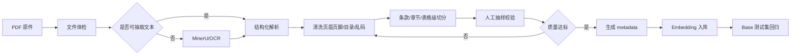
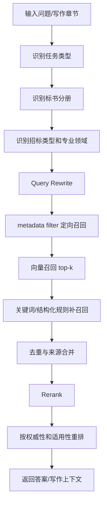

# 国家电网招投标 RAG 生产策略

> 适用项目：AI 标书项目（`ai_bidding_power_grid`）  
> 输出日期：2026-06-01  
> 参考资料：`检索增强RAG在实际生产环境下的应用.md`、当前项目 RAG 代码与种子知识库状态

## 1. 结论摘要

当前项目已经具备 RAG 基础链路：知识文档入库、Embedding、pgvector 向量召回、Rerank 兜底、图片/资质资产检索、知识库问答生成等能力。但从真实生产可用角度看，RAG 目前还不能仅以“已向量化”作为完成标准。

国家电网招投标场景下，RAG 的核心难点不是单纯选择更大的 Embedding 模型，也不是简单调大或调小 `chunk_size`，而是以下四件事：

1. 文档解析质量是否可靠。
2. 分块是否保留法规、标准、招标条款的完整语义。
3. 召回是否按标书类型、分册、资料性质和专业领域定向过滤。
4. 是否有国网招投标场景的 Base 测试集持续验证召回质量。

因此，本项目后续 RAG 策略应从“能入库”升级为“可解释、可评估、可复验、可按业务场景召回”。

## 2. 当前项目 RAG 现状

### 2.1 已具备能力

当前项目已有以下基础能力：

| 能力 | 当前状态 | 说明 |
| --- | --- | --- |
| 知识文档上传 | 已具备 | 支持知识文件上传、解析任务异步化。 |
| MinerU 解析入库 | 已具备基础链路 | 可将解析后的 Markdown 和图片上下文写入知识库。 |
| Embedding | 已具备 | 当前默认使用 DashScope `text-embedding-v4`，1024 维。 |
| 向量库 | 已统一到 pgvector | ChromaDB 路径已移除，当前统一使用 PostgreSQL/pgvector。 |
| 文本知识检索 | 已具备 | `search_knowledge_base` 调用 `match_knowledge_chunks` RPC。 |
| 图片/资质资产检索 | 已具备 | `search_knowledge_assets` 支持向量召回、Rerank、关键词 fallback、分册过滤。 |
| Rerank | 已具备 fail-open 机制 | 配置缺失或调用失败时保留向量召回结果。 |
| 知识问答 Prompt | 已具备 | 可拼接文本片段和图片/资质资产来源。 |

### 2.2 当前主要短板

| 短板 | 风险 |
| --- | --- |
| 文本知识库仍偏通用分块 | 法规条款、标准条文、招标要求可能被切断或混入无关上下文。 |
| PDF 直接入库质量不可控 | PyPDF2 抽取容易丢失表格、页眉页脚、条款结构和扫描件内容。 |
| 文本检索缺少强 metadata filter | 技术标、商务标、资格文件、服务类、工程类资料可能混在一起召回。 |
| 国网场景 Base 测试集缺失 | 无法客观判断“检索效果是否真的完成”。 |
| 种子库仍有水利场景遗留测试痕迹 | 会干扰电网招投标场景的验收标准。 |
| 召回策略尚未包含查询改写 | 用户口语化问题和标准文件正式表达之间存在语义落差。 |
| 向量索引性能尚未形成专项巡检 | 数据量上升后，可能出现索引未命中、全表扫描、JIT 额外开销等问题。 |

## 3. 生产最佳实践对本项目的启发

### 3.1 `chunk_size` 不是首要矛盾

业内经验指出，在电力规程、法规、标准这类结构化文档中，单纯调 `chunk_size` 往往收益有限。真正影响检索质量的是“语义单元是否完整”。

对本项目而言，不建议把策略定义成“统一 512 字、1024 字或 1800 字切分”。更合理的是按资料类型采用不同切分策略：

| 资料类型 | 推荐切分方式 |
| --- | --- |
| 法规政策 | 按章、条、款、项切分，保留条号。 |
| 国家/行业标准 | 按章节、条文、表格说明、附录切分。 |
| 招标文件 | 按分册、评分项、资格要求、响应要求、合同条款切分。 |
| 技术标模板 | 按章节标题、措施项、工艺流程、质量/安全/进度模块切分。 |
| 商务标模板 | 按承诺函、偏差表、响应表、服务承诺、付款条款切分。 |
| 企业资质/业绩材料 | 按证照、人员、业绩、合同、社保、获奖、设备资产切分。 |
| 通用说明文档 | 可使用段落递归切分，设置合理 overlap。 |

原则：一个 chunk 应该能独立回答一个明确问题，不能把一个完整条款切成两半，也不能把多个无关条款合在一起。

### 3.2 PDF 入库前必须做质量门禁

当前待处理的 15 份 PDF 不应直接通过 `--include-pdf` 批量入库。原因是：

1. PDF 原生文本抽取不等于结构化解析。
2. 扫描件或加密 PDF 可能抽不出有效文本。
3. 页眉页脚、目录、表格、页码、脚注会污染 chunk。
4. 标准规范中的条款编号、表格标题、适用范围很容易丢失。
5. 错误文本一旦入库，会长期影响检索和生成结果。

推荐 PDF 入库流程：



建议质量门禁：

| 检查项 | 最低要求 |
| --- | --- |
| 文本抽取率 | 关键章节可读，不能只有目录或乱码。 |
| 条款编号 | 章/节/条/款应尽量保留。 |
| 表格处理 | 标准表、评分表、资格表不得直接压成不可读长文本。 |
| 页眉页脚 | 应尽量清理，不进入主要 chunk。 |
| 来源引用 | 每个 chunk 应保留文件名、章节、页码或条款编号。 |
| 抽样校验 | 每份重要文档至少抽样 5-10 个 chunk。 |

### 3.3 文档类型不能混在一个召回语义空间里

招投标场景的知识库天然有多种资料类型。技术标、商务标、资格文件、法规标准、企业资料、项目资料混在一起召回，会带来高相似度但低可用性的噪声。

本项目应采用“统一物理表 + metadata 定向过滤”的路线作为第一阶段，不急于拆成多个物理向量库。原因是当前项目已经统一到 pgvector，保持表结构稳定、通过 metadata 做业务过滤，落地成本更低。

后续当数据量、租户隔离或性能要求上升时，再考虑按知识库类别拆物理索引。

### 3.4 Embedding 模型先做基线，不盲目追榜

业内经验中强调，MTEB/CMTEB 排名不等于垂直行业真实效果。对本项目而言，模型选择应遵循：

1. 先保留当前 DashScope `text-embedding-v4` 作为基线。
2. 先完成清洗、结构化切分、metadata filter、Base 测试集。
3. 通过测试集确认瓶颈后，再比较 Embedding、Rerank、Query Rewrite 的收益。
4. 不建议在没有评测集的情况下直接更换大模型。

如果后续考虑更换模型，应关注：

| 决策项 | 建议 |
| --- | --- |
| 向量维度 | 优先兼容 pgvector 当前 schema，避免频繁迁移。 |
| 高维模型 | 如果超过 pgvector 当前向量维度限制，应优先选择模型可配置维度或规划向量库迁移。 |
| 量化 | 不建议为节省存储轻易量化向量。 |
| 成本 | 大模型 Embedding 只有在 Base 测试集证明收益明显时才值得引入。 |
| 私有化 | 如果客户要求内网部署，应提前评估 GPU、vLLM 服务化、批处理能力。 |

### 3.5 Rerank 是增强项，不应掩盖分块问题

当前项目已有 Rerank fail-open 机制，这是正确的生产设计。Rerank 能改善排序，但不能修复以下问题：

1. chunk 本身被切断。
2. OCR 错字导致专业术语错误。
3. 召回池混入大量不相关资料。
4. metadata 缺失导致无法按场景过滤。

因此，Rerank 的定位应是“候选集排序增强”，而不是“兜底所有知识库质量问题”。

推荐策略：

| 阶段 | Rerank 策略 |
| --- | --- |
| 当前阶段 | 保持 fail-open，避免外部模型异常影响主链路。 |
| Base 建立后 | 对比有/无 Rerank 的 top-k 命中率和延迟。 |
| 数据量扩大后 | 根据场景决定是否只对高价值链路启用 Rerank。 |
| 实时要求高的接口 | 可配置降级为向量召回 + metadata filter。 |

### 3.6 查询改写应进入中期路线

用户输入通常不是标准文件中的正式表述。例如：

| 用户问题 | 知识库中可能的正式表述 |
| --- | --- |
| 技术标质量保证怎么写 | 质量管理体系、质量保证措施、施工质量控制流程 |
| 这条会不会废标 | 否决投标条件、资格审查不通过情形、实质性响应 |
| 服务类人员怎么配 | 项目团队配置、服务人员资质、驻场服务安排 |
| 电缆施工验收参考什么 | 电缆线路施工及验收标准、试验检测要求 |
| 商务偏差怎么填 | 商务条款响应、偏差表、合同条款响应 |

推荐增加一层 Query Rewrite：


第一阶段不必追求复杂 Agent 化，可以先用轻量 Prompt 实现：

```text
你是国家电网招投标知识库检索助手。
请将用户问题改写为 3 条更适合检索法规、标准、招标文件和标书模板的查询语句。
要求使用电力行业和招投标正式术语，不要改变用户意图。
```

## 4. 推荐知识库分类体系

### 4.1 第一层：资料来源性质

| 类别编码 | 类别名称 | 典型内容 | 用途 |
| --- | --- | --- | --- |
| `policy_regulation` | 法规政策 | 招标投标法、电力法、建设工程质量/安全条例等 | 合规判断、否决风险、引用依据 |
| `standard_spec` | 国家/行业/电网标准 | GB、DL/T、国网标准、技术导则 | 技术标写作、标准引用、技术合规 |
| `sgcc_procurement_rule` | 国网采购规则 | 国网采购流程、供应商管理、评审规则 | 资格审查、流程解释、风险提示 |
| `tender_document` | 招标文件样例 | 技术规范书、商务条款、评标办法、合同条款 | 项目解析、响应策略、章节规划 |
| `bid_template` | 标书模板/话术 | 技术标模板、商务响应模板、服务方案模板 | 正文生成、章节扩写、格式参考 |
| `enterprise_asset` | 企业资料 | 资质、业绩、人员、证照、产品图册 | 资格文件、商务文件、附件材料 |
| `project_private` | 项目私有资料 | 客户上传的实际招标文件、澄清文件、图纸 | 当前项目定向生成和合规检查 |

### 4.2 第二层：标书使用场景

| 字段 | 推荐值 |
| --- | --- |
| `applicable_volumes` | `technical`、`business`、`qualification`、`price`、`appendix` |
| `applicable_bid_types` | `engineering`、`service`、`goods`、`equipment`、`design`、`supervision`、`operation_maintenance` |
| `professional_domains` | `distribution_network`、`transmission_line`、`substation`、`cable_line`、`grounding`、`secondary_circuit`、`commissioning_test`、`power_system_planning` |
| `usage_purposes` | `content_generation`、`compliance_check`、`risk_warning`、`outline_planning`、`deviation_table`、`standard_reference`、`qa` |
| `grid_company` | `sgcc`、`csg`、`generic_power` |

### 4.3 第三层：权威性和引用策略

| 字段 | 推荐值 | 说明 |
| --- | --- | --- |
| `authority_level` | `law`、`regulation`、`national_standard`、`industry_standard`、`sgcc_rule`、`tender_file`、`enterprise_material`、`template` | 用于排序和回答时控制引用优先级。 |
| `citation_policy` | `direct_quote_allowed`、`summary_only`、`internal_reference_only` | 标准全文、版权资料、客户资料应谨慎引用。 |
| `effective_date` | 日期 | 法规、标准、采购规则需保留有效时间。 |
| `version` | 文本 | 标准号、年份、招标文件版本等。 |
| `source_file` | 文件路径/文件名 | 用于追溯。 |
| `source_page` | 页码 | 用于人工复核和答案引用。 |
| `source_section` | 章节/条款号 | 用于精确定位。 |

### 4.4 推荐 metadata 示例

```json
{
  "source_category": "standard_spec",
  "source_subcategory": "gb_standard",
  "grid_company": "sgcc",
  "applicable_bid_types": ["engineering", "goods"],
  "applicable_volumes": ["technical"],
  "applicable_sections": ["施工组织设计", "质量保证措施", "试验检测方案"],
  "professional_domains": ["cable_line", "electrical_installation"],
  "usage_purposes": ["content_generation", "compliance_check", "standard_reference"],
  "authority_level": "national_standard",
  "citation_policy": "summary_only",
  "source_file": "03_standards_specs/30_GB_50168-2018_电气装置安装工程电缆线路施工及验收标准.pdf",
  "source_page": 12,
  "source_section": "5.2 电缆敷设",
  "standard_no": "GB 50168-2018",
  "effective_date": "2019-05-01"
}
```

## 5. 推荐召回策略

### 5.1 总体路线



### 5.2 不同任务的召回优先级

| 任务 | 第一优先资料 | 第二优先资料 | 降权资料 |
| --- | --- | --- | --- |
| 技术标正文生成 | 标准规范、技术标模板、招标技术要求 | 法规政策、企业业绩 | 商务承诺、资格证照 |
| 商务标响应 | 招标商务条款、商务模板、合同条款 | 法规政策、企业资料 | 纯技术标准 |
| 资格文件生成 | 企业资质、人员、业绩、证照 | 招标资格要求、采购规则 | 技术施工方案 |
| 合规/废标风险检查 | 招标文件、法规政策、采购规则 | 标准规范 | 通用模板 |
| 偏差表生成 | 招标条款、合同条款、技术规范书 | 商务/技术响应模板 | 行业背景资料 |
| 大纲规划 | 招标文件、模板、评分办法 | 标准规范、企业资料 | 泛化问答资料 |
| 标准依据问答 | 国家/行业/国网标准 | 法规政策 | 企业模板 |

### 5.3 工程类、服务类、货物类的差异

| 招标类型 | RAG 重点 |
| --- | --- |
| 工程类 | 施工组织设计、质量/安全/进度、施工工艺、试验检测、验收标准、项目管理机构。 |
| 服务类 | 服务范围、服务流程、人员配置、响应时效、质量保障、运维机制、类似业绩。 |
| 货物/设备类 | 技术参数、供货方案、检验试验、安装调试、售后服务、产品资质。 |
| 设计类 | 设计依据、设计组织、成果交付、质量控制、专业配置。 |
| 监理类 | 监理大纲、旁站/巡视/平行检验、质量安全进度控制。 |
| 运维类 | 巡检计划、故障响应、备品备件、应急预案、服务 SLA。 |

## 6. PDF 和种子库入库策略

### 6.1 15 份未向量化 PDF 的处理原则

当前 15 份 PDF 不能简单定义为“待入库即可完成”。更准确的任务状态应是：

> 已完成资料盘点，尚未完成结构化解析、清洗、质量校验、metadata 标注和 Base 回归，因此尚不建议直接批量入库。

推荐分批：

| 批次 | 内容 | 处理方式 |
| --- | --- | --- |
| 第一批 | GB 50150、GB 50168、GB 50169、GB 50171、DL/T 5729 等技术标准 | MinerU/OCR + 条款级切分 + 技术标 metadata。 |
| 第二批 | 电力法、建设工程质量/安全条例、电力建设安全监管办法 | 法规条款级切分 + 合规/风险 metadata。 |
| 第三批 | 新型电力系统蓝皮书、行动方案、配电网指导意见 | 背景知识摘要化入库，不宜按全文细碎召回。 |
| 第四批 | 管理文件及技术标准名录 | 建议做“标准索引库”，用于查标准名称、适用范围和引用提示。 |

### 6.2 入库验收口径

一份资料不能只以“写入 chunks 成功”作为完成标准。建议验收口径：

| 验收项 | 通过标准 |
| --- | --- |
| 解析结果 | 正文、条款、表格、页码基本可读。 |
| 分块质量 | 抽样 chunk 语义完整，来源可追溯。 |
| metadata | 至少包含资料类别、适用分册、招标类型、专业领域、来源文件。 |
| 检索验证 | Base 问题 top-k 能召回正确片段。 |
| 生成验证 | 用于正文生成时不引入明显错误依据。 |
| 合规验证 | 不把模板话术误当法规或强制标准。 |

## 7. SGCC RAG Base 测试集策略

### 7.1 为什么必须建立 Base

没有 Base 测试集，RAG 的“完成”只能停留在功能层面，无法判断真实效果。对本项目，应建立国家电网招投标场景的 Base，而不是沿用南方电网、水利或通用电力问答。

Base 的作用：

1. 验证召回准确率。
2. 比较不同分块策略。
3. 比较有/无 Query Rewrite、Rerank、metadata filter 的效果。
4. 防止后续批量入库导致检索质量下降。
5. 支撑客户演示和阿里云测试环境验收。

### 7.2 第一版 Base 规模

建议第一版 30-50 条，后续扩展到 100-300 条。

| 类别 | 数量建议 | 示例 |
| --- | --- | --- |
| 技术标准引用 | 8-12 | 电缆线路施工验收、接地装置验收、交接试验要求。 |
| 技术标写作 | 8-12 | 质量保证、安全文明施工、试验检测、进度控制。 |
| 商务响应 | 5-8 | 商务偏差、服务承诺、合同条款响应。 |
| 资格/资信 | 5-8 | 营业执照、资质证书、人员证书、业绩证明。 |
| 合规/废标风险 | 5-8 | 实质性响应、资格审查、否决条款。 |
| 服务类场景 | 4-6 | 运维服务、技术支持、响应时效、团队配置。 |

### 7.3 推荐评估指标

| 指标 | 含义 | 第一阶段目标 |
| --- | --- | --- |
| `Recall@5` | 前 5 条是否包含正确资料 | >= 70% |
| `Recall@10` | 前 10 条是否包含正确资料 | >= 85% |
| `MRR` | 正确资料排序是否靠前 | 建立基线即可 |
| 来源准确率 | 返回资料是否属于正确类别/分册 | >= 80% |
| 生成可用率 | 基于召回生成的答案是否可人工采用 | 人工抽样评估 |
| 幻觉率 | 是否编造标准号、证书编号、金额、日期 | 严格控制 |

## 8. 性能和运维策略

### 8.1 pgvector 索引巡检

当知识库数据量增长后，需要定期确认向量查询是否真正使用索引。业内材料中提到，向量表达到几十万条后，如果 SQL 写法或索引配置不当，可能退化为全表扫描。

建议巡检项：

| 项目 | 建议 |
| --- | --- |
| HNSW/IVFFLAT 索引 | 确认 `document_chunks.embedding` 和 `knowledge_assets.embedding` 已建立合适索引。 |
| 查询计划 | 使用 `EXPLAIN ANALYZE` 检查是否全表扫描。 |
| PostgreSQL JIT | 对向量查询测试开启/关闭 JIT 的延迟差异。 |
| top-k 设置 | 避免无控制地扩大候选集。 |
| metadata filter | 尽量在向量候选前或 RPC 内部完成过滤，减少无关候选。 |
| 慢查询日志 | 接入 SLS 后跟踪 RAG 检索耗时。 |

### 8.2 可观测性

RAG 生产链路应记录：

1. 查询文本和改写后的查询文本。
2. 命中的资料类别、文件、章节、页码。
3. 向量召回耗时。
4. Rerank 耗时和是否降级。
5. top-k 相似度分布。
6. metadata filter 条件。
7. 是否命中 Base 标注答案。
8. 生成答案引用了哪些来源。

### 8.3 降级策略

| 故障 | 降级方式 |
| --- | --- |
| Rerank 不可用 | 保留向量召回结果。 |
| Query Rewrite 不可用 | 使用原始 query 检索。 |
| Embedding 服务异常 | 返回明确错误，不生成无依据答案。 |
| 图片资产检索异常 | 保留文本知识回答。 |
| metadata filter 过严无结果 | 可逐级放宽，但需在日志中记录。 |
| Base 测试明显退化 | 阻止批量入库或上线。 |

## 9. 分阶段落地计划

### P0：策略定稿和分类体系落地

目标：先把知识库标准定下来，避免继续无结构入库。

任务：

1. 确认 `source_category`、`applicable_volumes`、`applicable_bid_types`、`professional_domains`、`usage_purposes` 等 metadata 字段。
2. 整理现有种子库和已入库资料的分类映射。
3. 将水利场景遗留测试逐步替换为国家电网招投标用例。

### P1：首批 PDF 结构化入库

目标：选择 3-5 份最有价值的标准规范做高质量样板。

任务：

1. 对 GB 50150、GB 50168、GB 50169、GB 50171、DL/T 5729 做解析质量检查。
2. 使用 MinerU/OCR 输出 Markdown。
3. 清洗页眉页脚、目录、乱码和无效内容。
4. 按条款/章节切分。
5. 补齐 metadata。
6. 入库后用 Base 问题验证。

### P2：召回策略升级

目标：从“全库向量召回”升级为“场景化召回”。

任务：

1. 为文本知识库增加 metadata filter。
2. 根据标书分册、招标类型、专业领域定向召回。
3. 增加权威性排序规则。
4. 保持 Rerank fail-open。

### P3：Query Rewrite 和混合检索

目标：解决用户口语化问题和专业文档术语不一致的问题。

任务：

1. 增加轻量 Query Rewrite。
2. 针对标准号、条款号、资质名称、证书名称增加关键词召回。
3. 合并向量召回和关键词召回结果。
4. 用 Base 测试集评估收益。

### P4：性能和生产运维

目标：支撑阿里云测试环境和后续客户演示。

任务：

1. 检查 pgvector 索引和 RPC 查询计划。
2. 接入 RAG 检索日志和慢查询日志。
3. 建立批量入库前后的 Base 回归流程。
4. 输出 RAG 运维 Runbook。

## 10. 推荐的完成定义

后续不要再用“PDF 已入库”或“向量化完成”作为 RAG 的唯一完成定义。建议改为以下分级：

| 状态 | 定义 |
| --- | --- |
| `inventoried` | 已盘点资料，知道文件类型、页数、加密/扫描情况。 |
| `parsed` | 已完成 MinerU/OCR 或可靠文本解析。 |
| `cleaned` | 已清理页眉页脚、乱码、目录噪声。 |
| `chunked` | 已按结构切分，chunk 语义完整。 |
| `tagged` | 已补齐 metadata。 |
| `indexed` | 已生成 Embedding 并写入向量库。 |
| `evaluated` | 已通过 SGCC Base 测试集。 |
| `production_ready` | 已具备可观测性、回归测试和降级策略。 |

当前项目 RAG 应定位为：

> 基础链路已完成，生产级国网招投标知识库工程仍在推进中。下一步重点不是简单批量入库，而是建立分类体系、结构化解析样板、Base 测试集和场景化召回策略。

