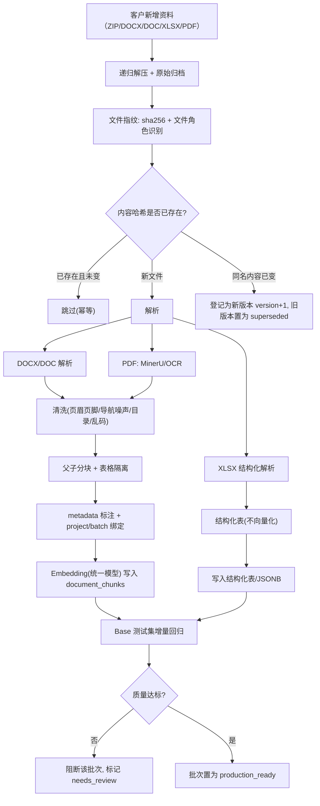
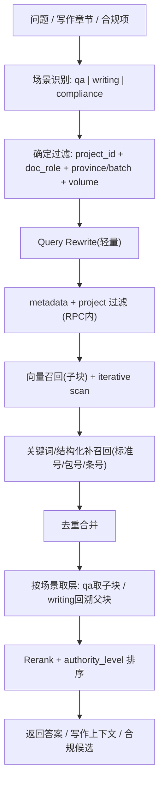

# 国家电网物资协议库存标书 RAG 技术路线与实施规范

> 项目：AI 标书项目 `ai_bidding_power_grid`
> 文档用途：作为 AI 技术专家进行 RAG 解析、清洗、分块、入库、召回、评测**开发与实施的依据**
> 文档级别：实施规范（取代上一版“评审稿”，可直接拆解为开发任务）
> 输出日期：2026-06-02
> 适用边界：第一期聚焦国网配网物资协议库存类（铁构件、接地铁、镀锌扁钢、角钢、圆钢、不锈钢电缆支架等相近物资）。架构需面向**客户资料持续补充**设计，不做一次性脚本。

---

## 0. 本版相对上一版的关键调整

本版在原“评审稿”基础上做了四处实质性升级，技术专家应以本版为准：

1. **从“按类型分块”升级为“父子双层分块（Small-to-Big）”**。原方案只说按类型切分，但没有解决“同一份资料要同时服务问答（要小、要准）和写作（要大、要全）”的矛盾。本版引入父块/子块两层结构。
2. **明确三大消费场景的差异化召回**：智能问答、写作依据索引、合规检查。三者优化目标不同（precision / coverage / recall），不能共用一套无差别召回。
3. **新增“持续增量入库”作为一等需求**。客户资料会源源不断补充，因此版本管理、去重、幂等重入、增量回归必须在架构层解决，而不是靠人工重跑脚本。
4. **明确 pgvector 选型结论与必须的索引整改**（ivfflat → HNSW、iterative scan、project 隔离过滤），并给出触发换库的客观条件。
5. **新增 Embedding 模型能力评估**（§9.4）：`text-embedding-v4 @1024` 作为第一期基线满足需要，明确“embedding 非当前瓶颈”、换模型/改维度需全量重嵌、以及私有化备选。

本版同时点明当前代码与目标架构的差距（见附录 A），供排期参考。

---

## 1. 结论摘要

1. 客户资料**不应统一“全部向量化”**，应先识别文件角色（doc_role），再路由到不同的**切分策略**与**入库形态**（文本向量库 / 结构化表 / 仅归档）。
2. 同一份文本资料需切成**父子双层 chunk**：子块（条/款级，小而准）服务问答与精确召回；父块（章/节级，完整上下文）服务标书正文写作。embedding 统一用一个模型、一个向量空间，**分化的是“怎么切、进哪个库、打什么标签”，不是“用几个 embedding 模型”**。
3. 召回必须**先做 metadata + project 过滤再做向量召回**，并按消费场景（问答/写作/合规）使用不同的过滤条件、top-k 和排序策略。
4. **pgvector 选型满足项目需求，第一期不换库**；但必须把索引从 ivfflat 改为 HNSW，并在加入过滤后启用 iterative index scan，避免“后过滤漏召回”。
5. 架构必须**面向持续增量**：以内容哈希做幂等、以版本号管理同一资料的迭代、以批次（batch）做可追溯与可回滚、以 Base 测试集做增量回归门禁。
6. **必须建立按三场景标注的 Base 测试集**。没有测试集，无法判断每批新资料入库后召回质量是提升还是退化。

第一期目标定义：

> 基于客户江西、山西国网物资协议库存铁构件标书样本，建成第一版“国网配网物资协议库存类”RAG 样板库与**可持续增量的入库流水线**，跑通解析→清洗→父子分块→metadata→入库→三场景召回→Base 回归的闭环，并能在后续批次资料补充时自动幂等、版本化、回归。

---

## 2. 核心设计原则

| 编号 | 原则 | 含义 |
| --- | --- | --- |
| P1 | 解析质量优先 | 先保证 DOC/DOCX/XLSX/PDF 解析可靠，再谈向量化。 |
| P2 | 按角色路由 | 先识别 doc_role，再决定切分策略和入库形态。 |
| P3 | 父子双层 | 文本资料切子块（召回）+ 父块（写作上下文），可互相回溯。 |
| P4 | 过滤先行 | metadata filter + project 过滤在向量召回之前或同一条 SQL 内完成。 |
| P5 | 场景分化 | 问答/写作/合规使用不同召回参数与排序，不共用无差别召回。 |
| P6 | 结构化不压扁 | 货物清单、技术参数表保留结构化字段，不压成长文本向量。 |
| P7 | 增量幂等 | 同一文件重复入库不产生重复 chunk；同一资料更新走版本管理。 |
| P8 | 可追溯可回滚 | 每个 chunk 可溯源到 文件/版本/批次/章节/页码；批次可回滚。 |
| P9 | 评测门禁 | 新批次入库前后跑 Base 测试集，质量退化则阻断上线。 |
| P10 | 权威可控 | 按 authority_level 排序，按 citation_policy 控制引用边界。 |

---

## 3. 数据流水线总览（面向持续增量）



关键点：流水线的入口是“**批次（ingestion batch）**”而不是“单文件脚本”。每一次客户补充资料 = 一个新批次，批次内每个文件按指纹判定 跳过/新增/升版本，批次结束跑回归。

---

## 4. 文件分层与入库形态

按 doc_role 路由到三种归宿，**不要混在一个无过滤语义空间里**：

| 入库形态 | 适用文件 | 处理 |
| --- | --- | --- |
| **文本向量库** `document_chunks` | 主招标文件、招标公告、投标注意事项、技术规范书正文、合同通用/专用条款、法规、标准条文、自建话术 | 父子分块 + embedding |
| **结构化表 / JSONB** | 货物清单 XLSX、技术参数特性表、投标人保证值表、供货一览表 | 解析为行/列结构，精确查询；可选生成“一句话摘要”做弱向量补充，但摘要不替代结构化数据 |
| **仅归档** | ZIP / RAR / SIGN / ZB / 内层压缩包 | 原始留存与追溯，不参与 embedding，不进问答上下文 |

doc_role 识别建议用“文件名规则 + 路径规则 + 内容首部特征”三者结合，识别结果写入 metadata，识别不确定时落 `doc_role=unknown` 并标 `needs_review`，不要默认塞进通用库。

doc_role 取值（第一期）：
`main_tender_file` / `tender_notice` / `bid_notice_prequalification` / `bid_notice_postqualification` / `bid_instructions`（投标注意事项）/ `technical_spec` / `contract_general_terms` / `contract_special_terms` / `goods_list`（结构化）/ `policy_regulation` / `standard_spec` / `sgcc_rule` / `self_phrase`（自建话术）/ `archive_only` / `unknown`

---

## 5. 解析策略

### 5.1 各格式解析路径（含当前缺口）

| 格式 | 解析方式 | 当前代码状态 |
| --- | --- | --- |
| `.docx` | 原生解析（保留标题层级/表格/样式）；复杂版式走 MinerU | 已支持原生（mammoth 抽纯文本，**丢标题层级，需增强**） |
| `.doc`（老二进制） | 需 LibreOffice/antiword 转换或 MinerU | **当前不支持，会乱码**（山西技术规范书是 .doc，必须修） |
| `.xlsx` | openpyxl 结构化解析为行列 | **当前不支持，会按文本乱码**（货物清单必须修） |
| `.pdf` | MinerU/OCR，保留页码/表格/章节 | 已有 MinerU 链路；种子脚本用 PyPDF2（噪声大，仅作兜底） |

### 5.2 清洗规则（入库前强制）

- 删除网页抓取导航残留（如“您当前位置 / 首页 > 正文 / 大 中 小”）、重复页眉页脚、纯页码、空段、乱码段。
- 保留章节号、条款号、表格标题、标准号、招标编号、批次编号、包号。
- 目录单独标 `block_type=toc`，不作为主要召回答案来源。
- 招标文件：识别“第X章/第X节”，把“投标人须知前附表/评标办法前附表/投标文件格式”优先结构化。
- 投标注意事项：把“否决投标条件/实质性响应/资格要求”抽为合规规则项。
- 合同：按条款号（如 1.1、1.1.1）切分，保留通用/专用差异。

---

## 6. 分块策略（核心：父子双层 + 按类型）

### 6.1 为什么必须父子双层

三个消费场景对 chunk 的诉求是冲突的：

| 场景 | 优化目标 | 理想 chunk |
| --- | --- | --- |
| 智能问答 | precision@小k | 子块：条/款级，200~600 字 |
| 写作依据 | coverage + 连贯上下文 | 父块：章/节级，完整段落 |
| 合规检查 | recall / 穷尽 | 规则项：逐条，不合并 |

为问答切的小块拿去写作会太碎（LLM 写不出连贯正文）；为写作切的大块拿去问答会太糊（precision 差）。因此**一份资料切一次，产出两层**：

- **子块（child）**：参与向量召回、问答、合规判定。小而自洽。
- **父块（parent）**：完整章/节上下文。子块通过 `parent_id` 指向父块。
- 召回时“**用子块命中，按场景返回**”：问答返回子块；写作返回该子块所属父块（或父块全文），保证上下文连贯。

### 6.2 各文件类型切分单元

| 资料类型 | 父块（parent） | 子块（child） | 备注 |
| --- | --- | --- | --- |
| 法规 / 合同条款 | 章 / 节 | **每“条/款/项”一个子块** | 子块保留条号 |
| 国家/行业标准 | 章节 | 条文 / 表格说明 | 保留标准号+条文号 |
| 主招标文件 | 章 | 节 / 前附表项 / 评标办法项 | 表格走结构化 |
| 招标公告 | 公告全文 | 业务段（采购范围/资格要求/平台要求/递交） | 资格要求按条拆 |
| 投标注意事项 | 全文 | **每条风险一个子块**（并转规则项） | 合规检查依赖 |
| 技术规范书 | 通用部分 / 专用部分 | 条款 + 表格级 | 表格隔离结构化 |
| 自建话术 | 用途章节 | 可直接生成的片段 | 写作直用 |

### 6.3 切分硬性约束

- **不用统一固定长度作为主策略**。1800 字固定切分仅作“无结构兜底”，且兜底也要在标题/条号/句号边界回退，不得从字中间截断。
- 子块目标长度：法规/合同 200~600 字；技术/标准 300~800 字。父块不设硬上限，以“一个完整章/节语义单元”为界。
- **表格不得压成长文本混入正文流**。表格单独成块，保留 `table_id`，并按 6.4 三形态存储。
- 子块必须能独立回答一个明确问题；不得把一个完整条款切两半，也不得把多个无关条款塞进一个子块。

### 6.4 表格 chunk 三形态

```json
{
  "table_id": "sx_0526AB_pkg1_technical_params_001",
  "table_title": "技术参数特性表",
  "table_role": "technical_parameter_table",
  "retrieval_summary": "接地铁镀锌扁钢技术参数与投标人保证值对照表",
  "columns": ["序号", "名称", "项目需求值或表述", "投标人保证值", "备注"],
  "rows": [
    {"序号": "1", "名称": "接地铁镀锌扁钢", "项目需求值或表述": "...", "投标人保证值": ""}
  ]
}
```

三形态 = 原始结构（行列/表头/合并单元格）+ 检索摘要（一句话，可做弱向量）+ 行级记录（精确查询）。

---

## 7. Metadata 规范（开发字段表）

每个文本子块/父块至少携带以下字段（写入 `document_chunks.metadata` jsonb，并把高频过滤字段同步进可索引列）：

```json
{
  "chunk_layer": "child",                         // child | parent
  "parent_id": "uuid-of-parent-chunk",            // child 指向 parent
  "doc_role": "technical_spec",
  "source_category": "project_private",           // 见 §4 取值
  "authority_level": "tender_file",               // 见 §12 权威序
  "citation_policy": "internal_reference_only",   // direct_quote_allowed | summary_only | internal_reference_only
  "grid_company": "sgcc",
  "province": "山西",
  "batch_no": "0526AB",
  "package_no": "包1",
  "material_category": "铁构件",
  "qualification_mode": "资格后审",                // 资格预审 | 资格后审 | null
  "applicable_volumes": ["technical"],            // qualification|business|technical|price|appendix
  "applicable_bid_types": ["goods"],
  "professional_domains": ["distribution_network", "grounding", "steel_components"],
  "usage_purposes": ["qa", "compliance_check", "content_generation"],
  "block_type": "clause",                         // clause|table|toc|paragraph|rule
  "source_file": "国网山西电力2026年第二次...招标文件.docx",
  "source_section": "第三章 评标办法",
  "source_page": 12,
  "doc_version": 1,                               // 见 §8 版本管理
  "ingestion_batch_id": "batch_20260602_001",     // 见 §8 批次
  "content_sha256": "..."                          // 见 §8 去重
}
```

为支持高效过滤，建议把 `project_id`（已存在列）、`doc_role`、`province`、`batch_no`、`doc_version`、`ingestion_batch_id` 提升为**独立列**或建 jsonb 表达式索引，不要只靠 jsonb 全量扫描。

---

## 8. 持续增量入库（本版重点）

客户资料会源源不断补充，入库必须是**可重入、可版本化、可回滚、可回归**的流水线，而非一次性脚本。

### 8.1 幂等与去重

- 以 `content_sha256`（文件内容哈希）作为幂等键：内容未变则跳过，不重复 embedding、不产生重复 chunk。
- 当前种子脚本以 `(bucket, object_path)` 判存在、`--refresh` 整体重写，**粒度过粗**：同一资料小改也会整文件重切重嵌。建议改为“文档级版本 + chunk 级内容哈希”双重判定。

### 8.2 版本管理

- 同一逻辑资料（同 `source_file` 或同 `doc_key`）内容变化时：旧版本 chunk 置 `status=superseded`（保留可追溯，不参与默认召回），新内容写为 `doc_version+1`。
- 默认召回只命中 `status=indexed` 且最新版本；历史版本仅在显式追溯时可查。
- 招标文件常见 V1/V2/V3（如江西“招标文件V2”、“投标注意事项V3”），版本管理是刚需，不是可选项。

### 8.3 批次与回滚

- 每次资料补充 = 一个 `ingestion_batch_id`。批次记录：来源、文件清单、各文件状态、chunk 数、回归结果。
- 批次可整体回滚（删除该批次写入的 chunk、恢复被 supersede 的旧版本），用于“新批次质量不达标”时快速止损。

### 8.4 增量回归门禁

- 新批次写入后、置为 `production_ready` 前，自动跑 Base 测试集（§11）。
- 指标相对上一基线**退化超过阈值则阻断**该批次上线，标 `needs_review`。这是防止“越加资料、召回越差”的唯一客观手段。

### 8.5 增量对索引的影响

- HNSW 支持增量插入，无需重建即可服务新数据（这也是不选 ivfflat 的原因之一，见 §9）。
- 数据量阶段性增长后，定期用 `EXPLAIN ANALYZE` 复核是否仍走索引、recall 是否下降。

---

## 9. 向量库选型与索引规范

### 9.1 选型结论：第一期保留 pgvector，不换库

当前部署：`pgvector/pgvector:pg16`，`document_chunks.embedding vector(1024)`、`knowledge_assets.embedding vector(1024)`。

适配理由：

1. **数据规模匹配**：种子库当前约 273 chunk，叠加客户标书做到数万~数十万 chunk 是常态，pgvector 在百万级以内完全胜任。
2. **核心诉求是“标量强过滤 + 向量召回 + 关系联查”**：province/batch_no/doc_role 过滤、与货物清单结构化表 JOIN，都能在同一条 SQL、同一事务内完成。这正是 pgvector 相对纯向量库（Chroma/Milvus）的优势。
3. **运维成本低**：项目已统一到 pgvector（Chroma 路径已移除），不额外引入有状态服务与数据同步。

### 9.2 必须的索引整改

| 项 | 现状 | 整改 |
| --- | --- | --- |
| 索引类型 | `ivfflat (lists=100)` | **改为 HNSW**（`USING hnsw (embedding vector_cosine_ops)`） |
| 小数据 recall | ivfflat 在数百行时分区大量为空，召回易漏，且需数据量才能训练好质心 | HNSW 不依赖数据量、增量友好、中小规模 recall/延迟更好 |
| 过滤后漏召回 | 纯 top-k 后过滤，过滤条件命中少时可能“查回来全被过滤掉” | 启用 pgvector **iterative index scan**；对 province/batch_no/project_id 等高基数过滤字段加 B-tree 配合 |

HNSW 建议初始参数：`m=16, ef_construction=64`，查询期按召回质量调 `hnsw.ef_search`。

### 9.3 触发“重新评估换库”的客观条件

满足任一才考虑专用向量库，在此之前换库属过度工程：

- 单租户 chunk 稳定超过约 500 万~1000 万，且高 QPS、对 P99 延迟敏感；
- 需要多租户物理隔离 + 独立扩缩容；
- 需要 pgvector 暂不支持的高级 ANN 特性。

### 9.4 Embedding 模型选型与能力评估

**当前配置**：百炼 `text-embedding-v4` @ 1024 维（`backend/core/config.py` 默认值，可经 `DASHSCOPE_EMBEDDING_MODEL` / 系统设置覆盖）；配套 Rerank 为 `qwen3-rerank`。

**模型底子**：基于 Qwen3-Embedding 系列商用版，约 4B 参数，32K token 上下文，支持 100+ 语言，维度可选（64~2048），中文检索属第一梯队。

**结论：作为第一期基线满足项目日常需要，不是短板，不需要更换。** 与本项目语料的契合点：

| 项目需求 | v4 能力 | 契合度 |
| --- | --- | --- |
| 纯中文、招投标术语密集语料 | Qwen3 系中文检索强项 | 强 |
| 父块（章/节级，不设硬上限） | 32K 上下文，完整章节可一次嵌入，无需为迁就模型再切碎 | 强（直接支撑 §6 父子分块） |
| 十万级 chunk + pgvector/HNSW | 1024 维是表达力与检索效率平衡点 | 合适 |
| 阿里云测试环境部署 | 托管 API，免自建 GPU | 合适 |

**重要判断：embedding 不是当前瓶颈。** RAG 召回质量当前主要受制于其**前置环节**（1800 字盲切、条文截断、`.doc`/`.xlsx` 解析缺失、网页噪声、metadata 缺失）与**后置环节**（`match_knowledge_chunks` 无过滤导致跨省/跨批次串扰）。在这些未修复前更换更强的 embedding，Recall 不会明显提升。因此模型选型遵循：

> 第一期保留 v4 @1024 作为基线 → 先补清洗/父子分块/metadata/过滤/Base 测试集 → 用 Base 测试集量化瓶颈 → 再比较“升维（1024→1536/2048）、换 Rerank、加 Query Rewrite”的边际收益。不在无评测集的情况下盲目换模型或改维度。

**已知局限与对策**：

| 局限 | 说明 | 对策 |
| --- | --- | --- |
| 精确符号不敏感 | 标准号（GB 50168 vs 50169）、包号（0526AB）、条号（第三十三条）在向量空间易判为近似——所有向量模型通病 | §10 要求配关键词/结构化补召回兜底 |
| 超长单块截断 | 32K 已很大，极个别超长全文不分块仍会截 | §6 父子分块已规避 |
| 闭源 / 按 token 计费 / 依赖外网 | 批量重嵌有一次性成本，依赖 DashScope 可用性 | 见私有化备选 |

**换模型的硬约束**：`document_chunks.embedding` 为固定 `vector(1024)`，且 v3/v4 向量空间不同。**任何更换模型或更改维度都必须全量重嵌并迁移向量列维度**，不能只改配置（否则新查询向量与历史向量不在同一空间，召回失真）。

**私有化备选**：若客户后续要求纯内网部署，可换为可私有化的开源 **Qwen3-Embedding**（与 v4 同源，迁移成本低），自托管 GPU 推理；需提前评估 GPU、vLLM 服务化与批处理能力。

---

## 10. 召回策略（三场景差异化）

### 10.1 总链路



### 10.2 三场景参数对照

| 维度 | 智能问答 | 写作依据 | 合规检查 |
| --- | --- | --- | --- |
| 返回层 | 子块 | **父块（回溯）** | 子块/规则项 |
| top-k | 5~8 | 15~30 | 尽量穷尽（按 doc_role 全量过一遍） |
| 优化目标 | precision | coverage + 权威性 | recall |
| 过滤重点 | doc_role + 语义 | **project_id 锁本标书** + volume + authority | bid_instructions/否决条款/评标办法 |
| 排序 | 相似度 + rerank | authority_level 优先 | 不漏优先 |

### 10.3 让 `retrieval_hint` 真正生效（现存缺陷）

当前 `bid_volumes.py` 的 `retrieval_hint` 只是拼进 LLM prompt 的文本，**没有真正参与检索过滤**；问答与写作共用同一个无过滤 RPC。整改：把分册策略映射为**真实的 metadata 过滤条件**（doc_role / applicable_volumes / authority_level），在 RPC 层生效，而不是仅作提示词。

### 10.4 任务召回优先级

| 任务 | 第一优先 | 第二优先 | 降权 |
| --- | --- | --- | --- |
| 技术响应生成 | 本标书技术规范书 + 技术参数表 | 自建技术话术、标准引用 | 合同条款、资格证照 |
| 商务响应生成 | 本标书合同条款 + 商务要求 | 商务话术、法规 | 技术规范细表 |
| 资格文件生成 | 本标书资格要求 + 投标文件格式 + 企业资信资产 | 供应商管理规则 | 技术施工方案 |
| 合规/否决检查 | 投标注意事项 + 否决条款 + 评标办法 + 公告 | 法规、国网规则 | 通用模板 |
| 货物清单问答 | 结构化表（不走向量） | 技术规范关联表 | 普通文本向量 |

---

## 11. 写作依据索引（专项）

“客户资料作为标书书写依据”有三条特有要求，普通问答召回不满足：

### 11.1 项目隔离：本标书资料是强依据

- 本标书的招标文件/技术规范/货物清单/合同 → **必选、置顶、强约束**，用 `project_id` 锁定（`document_chunks.project_id` 列已存在，需在入库时绑定并在写作召回时过滤）。
- 通用库（法规/标准/历史话术）→ 补充依据，不得盖过本标书的真实要求。

### 11.2 权威性排序（authority_level）

```text
法规 > 国标/行标 > 国网规则 > 本标书招标文件 > 合同条款 > 自建话术
```

写作时按 authority 排序，避免把“话术模板”当成强制要求，或漏掉招标文件里的真实条款（这类错误在投标中可能直接导致废标）。

### 11.3 引用合规（citation_policy）+ 可追溯

| citation_policy | 适用 | 约束 |
| --- | --- | --- |
| `direct_quote_allowed` | 自建话术 | 可直接引用 |
| `summary_only` | 法规、国标/行标全文（版权边界） | 仅摘要/条文引用位置 |
| `internal_reference_only` | 客户标书资料 | 内部参考，不外泄原文 |

每个写作依据必须可追溯到 `source_file + source_section + source_page + doc_version`，便于人工复核。

---

## 12. Base 测试集（按三场景标注）

### 12.1 规模与分布

第一版 40 条，覆盖客户当前江西/山西资料：

| 类别 | 数量 | 验证目标 | 主场景 |
| --- | ---: | --- | --- |
| 招标文件结构 | 5 | 召回正确章节 | qa |
| 资格/审查方式 | 5 | 区分资格预审/后审 | qa/compliance |
| 否决项/风险 | 6 | 召回投标注意事项/否决条款/评标办法 | compliance |
| 技术规范 | 10 | 召回正确物资/参数/保证值 | qa/writing |
| 合同/商务 | 6 | 召回合同通用/专用条款 | qa/writing |
| 货物清单 | 4 | 命中结构化表，不依赖向量 | qa |
| 格式/平台要求 | 4 | PDF/TP、签章、上传、解密要求 | compliance |

### 12.2 必须含跨批次负样本（防串扰）

最大风险是江西/山西、资格预审/后审混召回。除正向用例外，**必须加显式负样本**：

```json
{
  "id": "N01",
  "question": "山西0526AB包1的技术参数保证值要求是什么？",
  "scenario": "qa",
  "metadata_filter": {"province": "山西", "batch_no": "0526AB"},
  "expected_sources": [{"doc_role": "technical_spec", "province": "山西"}],
  "must_not_include": [{"province": "江西"}, {"batch_no": "1826AA"}]
}
```

单独统计“**批次串扰率**”，只测正向 Recall 会让最危险的问题测不出来。

### 12.3 三场景分别评测

| 场景 | 指标 | 第一阶段目标 |
| --- | --- | --- |
| 问答 | Recall@5 / 来源类别准确率 / 幻觉率 | ≥70% / ≥80% / 0 容忍 |
| 写作 | 父块覆盖率 / authority 排序正确率 | 建基线，持续提升 |
| 合规 | 否决项 Recall@10 / 漏检率 | ≥85% / 越低越好 |
| 全局 | 批次串扰率 / 结构化表命中率 | 越低越好 / ≥90% |

标注用 JSONL，字段含 `id / question / scenario / metadata_filter / expected_sources / must_include_keywords / must_not_include`。

---

## 13. 入库状态机与验收

| 状态 | 定义 |
| --- | --- |
| `collected` | 原始文件已归档（含 sha256） |
| `parsed` | 解析完成，有 Markdown/表格/样式产物 |
| `cleaned` | 已清洗页眉页脚/导航/目录/乱码 |
| `chunked` | 已父子分块，表格已结构化 |
| `metadata_ready` | chunk/表格 metadata + project/batch/version 已补齐 |
| `indexed` | 已写入向量库/结构化表 |
| `validated` | 已通过 Base 增量回归 |
| `production_ready` | 可用于客户演示/测试环境 |
| `superseded` | 被新版本取代，保留追溯 |
| `needs_review` | doc_role 不确定或回归不达标，人工介入 |

验收口径：一份资料**不能只以“写入 chunks 成功”为完成**，必须到 `validated`/`production_ready`。

---

## 14. 实施计划（分阶段）

### P0：可持续增量的解析与分块样板

1. 修复解析缺口：`.doc`（LibreOffice/MinerU）、`.xlsx`（openpyxl 结构化）。
2. 实现清洗（页眉页脚/网页导航/目录/乱码）。
3. 实现**父子双层分块** + 表格隔离；法规/合同按条切，标准/招标按章节切。
4. 实现幂等（content_sha256）+ 版本管理 + 批次（ingestion_batch_id）。
5. 输出每文件 `manifest.json` 与批次解析质量报告。

### P0：metadata + RPC 过滤落地

1. 入库真正写入 §7 全部 metadata，绑定 `project_id`。
2. `match_knowledge_chunks` 增加 metadata/project/version 过滤参数，默认只召回最新 indexed。
3. 让 `retrieval_hint` 映射为真实过滤条件。

### P0：Base 测试集 + 增量回归门禁

1. 编写 40 条（含跨批次负样本），按三场景标注。
2. 跑当前现状出基线数字。
3. 接入“新批次入库前后回归对比”，退化阻断。

### P1：召回与索引增强

1. 索引 ivfflat → HNSW；启用 iterative scan + 过滤列 B-tree。
2. 父子回溯召回；authority_level 排序；citation_policy 控制引用。
3. 轻量 Query Rewrite；标准号/包号/条号关键词补召回。

### P2：场景闭环验证

技术响应、商务响应、技术偏差表、合同响应、否决项检查、格式/平台提交检查各跑一遍，确认 RAG 既能问答也能服务写作与合规。

---

## 15. 风险与控制

| 风险 | 表现 | 控制 |
| --- | --- | --- |
| 江西/山西混召回 | 问山西召回江西 | 强制 province/batch_no/package_no 过滤 + 负样本回归 |
| 资格预审/后审混淆 | 引用错误资格模式 | metadata `qualification_mode` 过滤 |
| 写作依据太碎 | 正文不连贯 | 父子分块，写作返回父块 |
| 把话术当强制要求 | 正文引用不严谨、废标风险 | authority_level 排序 + project 强约束 |
| 技术参数表丢失 | 响应缺保证值依据 | 表格结构化单独入库 |
| 越加资料越差 | 新批次拉低召回 | 增量回归门禁 + 批次回滚 |
| 重复/旧版本干扰 | 召回到过期 V1 | content_sha256 幂等 + 版本 superseded |
| 后过滤漏召回 | 过滤后无结果 | HNSW + iterative scan + 过滤列索引 |
| .doc/.xlsx 解析失败 | 关键资料缺失 | 修复解析路径，失败标 needs_review |

---

## 16. 给技术专家的开发清单（可直接拆任务）

数据层：

- [ ] `document_chunks` 增列：`doc_role`、`province`、`batch_no`、`doc_version`、`ingestion_batch_id`、`chunk_layer`、`parent_id`、`content_sha256`、`status`；建对应索引。
- [ ] embedding 索引 ivfflat → HNSW（`document_chunks`、`knowledge_assets` 两张表）。
- [ ] 新增结构化表（货物清单/技术参数表）或规范化 JSONB 存储 + 行级查询接口。

入库层：

- [ ] 解析：补 `.doc`、`.xlsx`；增强 `.docx` 标题层级抽取；PDF 走 MinerU。
- [ ] 清洗模块（页眉页脚/网页导航/目录/乱码）。
- [ ] 父子分块器（按 doc_role 路由 + 表格隔离）。
- [ ] 增量引擎：content_sha256 幂等、版本管理、批次记录与回滚。

召回层：

- [ ] `match_knowledge_chunks` 加 metadata/project/version 过滤参数 + iterative scan。
- [ ] `search_knowledge_base` 按场景（qa/writing/compliance）分化参数与返回层（子块/父块）。
- [ ] `retrieval_hint` 映射为真实过滤；authority_level 排序；citation_policy 控制引用。

评测层：

- [ ] 40 条 Base 测试集（含跨批次负样本），三场景标注（JSONL）。
- [ ] 增量回归脚本 + 上线门禁。

---

## 附录 A：当前代码与目标架构差距（排期参考）

| 模块 | 当前实现 | 目标 | 差距 |
| --- | --- | --- | --- |
| 分块 | 统一 1800 字（`split_for_rag` / `build_document_chunks`） | 父子双层 + 按类型 + 表格隔离 | 大 |
| 解析 | docx(mammoth 纯文本)/pdf(PyPDF2)，无 .doc/.xlsx | 多格式 + 标题层级 + 结构化表 | 大 |
| 清洗 | 基本无（网页导航噪声直接入库） | 强制清洗 | 中 |
| metadata | 扁平 category/doc_type/tags | §7 完整字段 + 可索引列 | 大 |
| 召回过滤 | `match_knowledge_chunks` 纯 top-k，无过滤 | metadata+project+version 过滤 | 大 |
| 场景分化 | 问答/写作共用同一 RPC，retrieval_hint 仅进 prompt | 三场景差异化 + 真过滤 | 中 |
| 索引 | ivfflat(lists=100) | HNSW + iterative scan | 中 |
| 增量 | (bucket,object_path) 判存 + 整文件 refresh | 哈希幂等 + 版本 + 批次 + 回滚 | 大 |
| 评测 | 无 | 三场景 Base + 回归门禁 | 大 |

> 注：上述差距基于对 `rag_seed/.../ingest_power_grid_rag_seed.py`、`backend/rag/retrieval.py`、`backend/rag/vector_store.py`、`backend/parsing/bid_interpreter.py`、`migrations/postgres/001_schema.sql` 的实际审阅。
