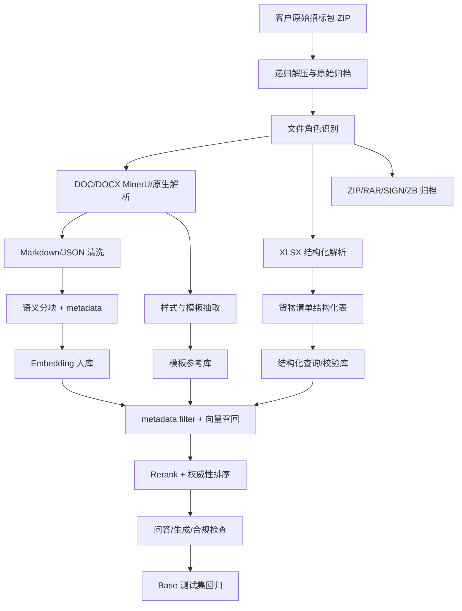
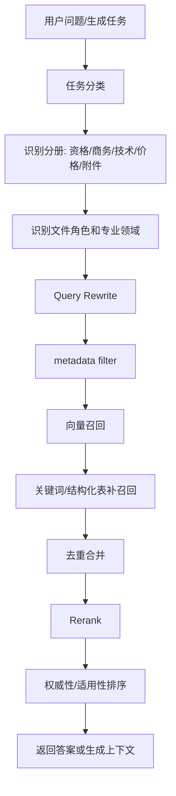

# 国家电网物资协议库存标书 RAG 技术路线评审稿

> 项目：AI 标书项目 `ai_bidding_power_grid`  
> 文档用途：供 AI 技术专家评审 RAG 生产路线、解析清洗策略、分块策略、召回策略和测试集设计  
> 输出日期：2026-06-01  
> 适用边界：第一期聚焦国网配网物资协议库存类，重点覆盖铁构件、接地铁、镀锌扁钢、角钢、圆钢、不锈钢电缆支架等相近物资，不追求全品类、全业务类型覆盖。

## 1. 结论摘要

客户当前提供的两批资料不适合简单“全部向量化”，而应拆成多条数据处理通道：

1. 主招标文件、招标公告、投标注意事项、技术规范书、合同条款进入文本 RAG，但必须按文档角色、章节、表格和业务语义切分。
2. 货物清单 XLSX 不进入普通文本向量库，应解析为结构化表，用于包号、物料、数量、单位、技术规范关联和报价一致性校验。
3. ZIP、RAR、SIGN、ZB 等文件只做原始归档和追溯，不参与向量检索。
4. 主招标文件和技术规范书同时应进入“模板参考库”，用于抽取投标文件格式、技术参数表、投标人保证值表、页边距、字体、标题层级和表格样式。
5. 必须建立第一版 Base 测试集。没有测试集，无法判断 RAG 是“能入库”还是“可准确召回、可用于生成和合规检查”。

第一期建议目标定义为：

> 基于客户提供的江西、山西国网物资协议库存铁构件标书样本，建设第一版国网配网物资协议库存类 RAG 样板库，跑通招标文件解析、技术规范召回、合同/商务条款问答、投标注意事项合规检查、货物清单结构化解析和投标文件格式参考闭环。

## 2. 输入资料范围

### 2.1 客户提供资料

当前已归档到：

```text
rag_seed/power_grid_resources/01_tender_documents/
├── 20_国网江西电力2026年第一次配网省网协议库存物资类公开招标采购/
└── 21_国网山西电力2026年第二次物资协议库存公开招标采购/
```

两批资料均为“铁构件/包1”场景。

### 2.2 江西批次核心文件

| 文件 | 角色 | 处理优先级 |
| --- | --- | --- |
| `（资格预审）国网江西电力2026年第一次配网（省网）协议库存物资类公开招标采购招标文件V2.docx` | 主招标文件 | P0 |
| `（资格预审）...招标公告.docx` | 资格预审公告 | P0 |
| `（资格后审）...招标公告.docx` | 资格后审公告 | P0 |
| `投标注意事项V3.docx` | 否决风险和格式提醒 | P0 |
| `国家电网江西公司物资固化技术规范书_铁附件.doc` | 技术规范书 | P0 |
| `国网江西省电力有限公司_2021年江西公司配省网协议库存固化ID编制...docx` | 技术规范专用部分索引 | P1 |
| `5.120 10kV及以下协议库存货物采购合同通用条款（材料类）（2024版）.docx` | 合同通用条款 | P0 |
| `5.120 10kV及以下协议库存货物采购合同（材料类）（2024版）.docx` | 合同协议书模板 | P1 |
| `合同专用条款其他文件...docx` | 合同专用条款 | P0 |
| `货物清单_1826AA_铁构件...xlsx` | 货物清单 | P0，结构化 |
| `.zip/.sign/.zb` | 原始归档、签名、电子投标工程文件 | 归档，不入库 |

### 2.3 山西批次核心文件

| 文件 | 角色 | 处理优先级 |
| --- | --- | --- |
| `国网山西电力2026年第二次物资协议库存公开招标采购招标文件.docx` | 主招标文件 | P0 |
| `国网山西电力2026年第二次物资协议库存公开招标采购招标公告.docx` | 招标公告 | P0 |
| `接地铁镀锌扁钢（角钢、圆钢）-技术规范书（上传）.docx` | 技术规范书 | P0 |
| `铁构件技术规范书-不锈钢电缆支架.doc` | 技术规范书 | P0 |
| `国网山西省电力公司第一次固化ID编制接地铁...doc` | 技术规范书 | P1 |
| 多个 `国网山西省电力公司/有限公司_20xx年...固化ID编制...docx` | 技术规范专用部分索引 | P1 |
| `5.120 10kV及以下协议库存货物采购合同通用条款（材料类）（2024版）.docx` | 合同通用条款 | P0 |
| `5.120 10kV及以下协议库存货物采购合同（材料类）（2024版）.docx` | 合同协议书模板 | P1 |
| `合同专用条款其他文件...docx` | 合同专用条款 | P0 |
| `货物清单_0526AB_铁构件...xlsx` | 货物清单 | P0，结构化 |
| `.zip/.rar/.sign` | 原始归档、压缩包、签名 | 归档，不入库 |

## 3. 总体技术路线



核心原则：

- 先保证解析质量，再做向量化。
- 先做 metadata 和业务过滤，再谈召回效果。
- 不用统一 chunk size 解决所有问题，应按资料类型切分。
- 不把模板话术、法规、标准、招标文件、企业资料混在一个无过滤语义空间里。
- 不把结构化表格压扁成长文本后直接向量化。

## 4. 文件分层与 RAG 类型

### 4.1 文本 RAG

适用文件：

- 主招标文件 DOCX
- 招标公告 DOCX
- 投标注意事项 DOCX
- 技术规范书 DOC/DOCX
- 合同通用条款 DOCX
- 合同专用条款 DOCX
- 自建国网话术 Markdown
- 已清洗法规/标准 Markdown

用途：

- 条款问答
- 技术响应生成
- 商务响应生成
- 合规检查
- 偏差表辅助
- 大纲规划

### 4.2 结构化 RAG / 表格库

适用文件：

- 货物清单 XLSX
- 技术参数表
- 供货一览表
- 投标人保证值表
- 商务/技术偏差表

用途：

- 精确查询包号、物料、数量、单位、规格型号
- 识别技术规范与货物清单的对应关系
- 检查报价表、投标响应、技术参数是否一致
- 为正文生成提供结构化上下文

实现建议：

- XLSX 原样解析为 JSON/数据库表。
- 技术参数表从 DOCX/MinerU 结果中抽出为结构化 table blocks。
- 表格既保留结构化字段，也生成简短可检索摘要，但摘要不替代结构化数据。

### 4.3 模板参考库

适用文件：

- 主招标文件中的“第六章 投标文件格式”
- 技术规范书中的参数表、保证值表、供货一览表
- 合同协议书模板
- 商务/技术偏差表格式
- DOCX 样式信息

用途：

- 生成投标文件章节格式
- 控制 Word 导出样式
- 生成偏差表、投标函、授权书、技术响应表
- 形成国网物资类标书模板 profile

注意：

- 模板参考库不是普通问答 RAG。
- 模板片段应带 `template_role`、`docx_style_profile`、`table_schema` 等 metadata。
- 对 Word 格式，应从 DOCX 中抽取页面设置、字体、标题样式、表格样式，而不是仅靠文本描述。

### 4.4 合规规则库

适用文件：

- 投标注意事项
- 招标公告中的资格要求、投标文件要求、平台上传要求
- 主招标文件中的否决投标条款、投标人须知、评标办法
- 法规政策、国网供应商管理规则

用途：

- 资格审查风险提示
- 废标/否决项检查
- 文件签章、上传、解密、PDF/TP 工程文件检查
- 报价一致性、超限价、保证金、投标有效期检查

建议处理方式：

- 不只做向量化，还应抽取成规则项。
- 每条规则至少包含：规则文本、来源文件、章节、适用批次、风险等级、检查对象、是否可自动检查。

### 4.5 原始归档库

适用文件：

- 原始 ZIP
- 内层 ZIP
- RAR
- SIGN
- ZB

用途：

- 客户资料追溯
- 原始文件还原
- 电子投标工具文件留存

不建议：

- 不参与 embedding。
- 不进入普通知识问答。
- 不作为正文生成上下文。

## 5. 解析和清洗策略

### 5.1 DOCX/DOC 解析

建议采用“双路解析 + 对比”的路线：

1. 原生 DOCX 解析：适合提取标题层级、段落、表格、样式、页边距、字体。
2. MinerU 解析：适合统一输出 Markdown、保留版面和复杂表格，尤其用于 DOC/DOCX 转 PDF 后解析或复杂版式场景。

入库前应生成中间产物：

```text
parsed_outputs/sgcc_customer_tenders/
├── manifest.json
├── markdown/
├── tables/
├── styles/
└── chunks/
```

`manifest.json` 建议记录：

```json
{
  "source_file": "原始文件路径",
  "file_hash": "sha256",
  "province": "江西",
  "batch_no": "1826AA",
  "package_no": "包1",
  "material_category": "铁构件",
  "doc_role": "main_tender_file",
  "parser": "mineru/docx_native",
  "parse_status": "success",
  "generated_at": "2026-06-01T00:00:00+08:00"
}
```

### 5.2 清洗规则

通用清洗：

- 删除重复页眉页脚。
- 删除纯页码、空段、乱码段。
- 保留章节号、条款号、表格标题。
- 保留“资格预审/资格后审”“招标编号”“批次编号”“包号”等关键信息。
- 对目录单独标注为 `toc`，不作为主要召回答案来源。

招标文件清洗：

- 将“第一章/第二章/第三章”等章级结构识别出来。
- 将“投标人须知前附表”“评标办法前附表”“投标文件格式”等表格优先结构化。
- 将“否决投标条件”“实质性响应”“资格要求”抽取为合规规则项。

技术规范书清洗：

- 保留“通用部分/专用部分”边界。
- 保留“技术参数特性表”“项目需求值或表述”“投标人保证值”。
- 表格不得压成不可读长文本。
- 对每个表格生成 `table_id`，供 chunk 和结构化数据共同引用。

合同条款清洗：

- 按条款号切分，如 `1.1`、`1.1.1`。
- 保留通用条款和专用条款差异。
- 对履约保证金、付款、交付、质量保证、违约、争议解决等高频商务点打标签。

## 6. 分块策略

### 6.1 基本原则

一个 chunk 应该能独立回答一个明确问题。不能把完整条款切断，也不能把多个无关条款塞进一个 chunk。

不建议使用统一固定长度切分，例如全部 1000 字或 1800 字。固定长度只能作为兜底，不应作为主策略。

### 6.2 不同文件类型的 chunk 方案

| 资料类型 | 主切分单元 | chunk 建议 |
| --- | --- | --- |
| 招标公告 | 招标条件、采购范围、资格要求、招标文件获取、投标文件递交、平台要求、联系方式 | 每个业务段落一个 chunk，资格要求可按条拆分 |
| 主招标文件 | 章、节、前附表、评标办法项、投标文件格式项 | 章/节级切分，表格单独结构化 |
| 投标注意事项 | 每个风险类别、每条否决风险 | 每条风险一个 chunk，可转规则 |
| 技术规范书 | 通用部分、专用部分、技术参数表、供货一览表、试验、包装运输 | 条款级 + 表格级混合 |
| 合同条款 | 条、款、项 | 每个条款一个 chunk，必要时合并上下文 |
| 标准规范 | 章节、条文、表格说明、附录 | 标准号 + 条文号必须保留 |
| 自建话术 | 章节模板、资格话术、商务话术、质量安全环保话术 | 按用途拆成可直接生成的片段 |

### 6.3 chunk metadata

建议每个 chunk 至少包含：

```json
{
  "source_category": "project_private",
  "source_subcategory": "sgcc_tender_file",
  "grid_company": "sgcc",
  "province": "山西",
  "batch_no": "0526AB",
  "package_no": "包1",
  "material_category": "铁构件",
  "doc_role": "main_tender_file",
  "applicable_bid_types": ["goods"],
  "applicable_volumes": ["qualification", "business", "technical", "price"],
  "professional_domains": ["distribution_network", "grounding", "steel_components"],
  "usage_purposes": ["qa", "compliance_check", "content_generation"],
  "authority_level": "tender_file",
  "citation_policy": "internal_reference_only",
  "source_file": "国网山西电力2026年第二次物资协议库存公开招标采购招标文件.docx",
  "source_section": "第三章 评标办法",
  "source_table": "评标办法前附表",
  "qualification_mode": "资格后审"
}
```

### 6.4 表格 chunk 设计

表格不建议只转成自然语言。建议同时保存三种形态：

1. 原始结构：行、列、合并单元格、表头。
2. 检索摘要：一句话描述表格用途。
3. 单元级/行级记录：用于精确查询。

示例：

```json
{
  "table_id": "sx_0526AB_pkg1_technical_params_001",
  "table_title": "技术参数特性表",
  "table_role": "technical_parameter_table",
  "columns": ["序号", "名称", "项目需求值或表述", "投标人保证值", "备注"],
  "rows": [
    {
      "序号": "1",
      "名称": "接地铁镀锌扁钢",
      "项目需求值或表述": "...",
      "投标人保证值": ""
    }
  ]
}
```

## 7. 召回策略

### 7.1 总体召回链路



### 7.2 metadata filter 必须先行

示例：

- 问“技术参数保证值怎么填”：优先过滤 `doc_role=technical_spec`、`usage_purposes=content_generation/deviation_table`。
- 问“这个会不会废标”：优先过滤 `doc_role=tender_notice/main_tender_file/risk_checklist`、`usage_purposes=compliance_check/risk_warning`。
- 问“履约保证金怎么约定”：优先过滤 `doc_role=contract_terms`、`applicable_volumes=business`。
- 问“货物清单里有哪些物资”：不先走向量，直接查结构化 XLSX 表。

### 7.3 不同任务召回优先级

| 任务 | 第一优先资料 | 第二优先资料 | 降权资料 |
| --- | --- | --- | --- |
| 技术响应生成 | 技术规范书、技术参数表、供货要求 | 自建技术话术、标准引用说明 | 合同条款、资格证照 |
| 商务响应生成 | 合同条款、商务要求、投标文件格式 | 商务话术、法规政策 | 技术规范细表 |
| 资格文件生成 | 招标资格要求、投标文件格式、企业资信资料 | 供应商管理规则 | 技术施工方案 |
| 合规/否决检查 | 投标注意事项、否决条款、评标办法、公告 | 法规政策、国网规则 | 通用模板 |
| 技术偏差表 | 技术规范书、项目需求值、投标人保证值表 | 技术话术 | 法规背景 |
| 商务偏差表 | 合同条款、商务条款、投标文件格式 | 商务话术 | 技术标准 |
| 货物清单问答 | XLSX 结构化表 | 技术规范关联表 | 普通文本向量 |
| Word 格式参考 | 主招标文件样式、投标文件格式章节 | 合同模板样式 | 普通知识片段 |

### 7.4 Query Rewrite

第一期可以采用轻量改写，不需要复杂 Agent。

示例 Prompt：

```text
你是国家电网物资协议库存招投标知识库检索助手。
请将用户问题改写为 3 条更适合检索招标文件、技术规范书、合同条款和投标文件格式的查询语句。
要求：
1. 使用国家电网、物资协议库存、技术规范、投标文件、否决项等正式术语。
2. 不改变用户问题的意图。
3. 如果问题涉及物料、包号、省份、批次，必须保留。
```

### 7.5 Rerank 定位

Rerank 是排序增强，不是质量兜底。它不能修复：

- chunk 被切断。
- OCR 错字。
- metadata 缺失。
- 表格被压扁。
- 不同省份/批次资料混召回。

第一期建议：

- 保持 Rerank fail-open。
- 先完成 metadata filter、结构化切分、Base 测试集。
- 再比较有/无 Rerank 对 `Recall@5`、`Recall@10`、MRR 的提升。

## 8. 测试集设计

### 8.1 是否必须做测试集

必须做。

原因：

1. 这些资料存在江西/山西、资格预审/资格后审、公告/主文件/技术规范/合同等多维差异，不测试就无法发现混召回。
2. 技术规范书里存在表格和投标人保证值，普通向量召回很容易召到相似但错误的物资或年份。
3. RAG 不只是能问答，还要服务标书正文生成和合规检查，错误引用会直接影响投标风险。
4. 后续批量入库更多资料时，测试集是防止检索质量退化的唯一客观基线。

### 8.2 第一版 Base 测试集规模

建议第一版 40 条，覆盖客户当前资料即可，不做泛电网大而全。

| 类别 | 数量 | 验证目标 |
| --- | ---: | --- |
| 招标文件结构 | 5 | 能否召回正确章节，如投标人须知、评标办法、投标文件格式 |
| 资格/审查方式 | 5 | 能否区分资格预审、资格后审、资格要求 |
| 否决项/风险 | 6 | 能否召回投标注意事项、否决条款、评标办法 |
| 技术规范 | 10 | 能否召回正确物资、技术参数、投标人保证值 |
| 合同/商务 | 6 | 能否召回合同通用/专用条款和商务响应要求 |
| 货物清单 | 4 | 验证结构化表，不依赖普通向量 |
| 格式/平台要求 | 4 | 验证 PDF/TP、签章、上传、解密、离线工具要求 |

### 8.3 测试样例

| 编号 | 问题 | 期望召回 |
| --- | --- | --- |
| T01 | 山西 0526AB 包1 的主招标文件包含哪些章节？ | 山西主招标文件目录 |
| T02 | 江西这批资格预审和资格后审公告有什么区别？ | 江西资格预审/资格后审公告 |
| T03 | 投标文件未按江西投标文件编制工具生成 PDF 和 TP 工程文件有什么风险？ | 江西招标公告/主招标文件的平台要求 |
| T04 | 铁构件技术规范中投标人保证值能否只写“响应”？ | 技术规范书中关于投标人保证值的要求 |
| T05 | 接地铁镀锌扁钢技术规范的供货范围和技术参数在哪里？ | 山西接地铁镀锌扁钢技术规范书 |
| T06 | 合同专用条款中履约保证金如何约定？ | 山西合同专用条款 |
| T07 | 10kV 及以下协议库存货物采购合同通用条款中质量保证期怎么处理？ | 合同通用条款 |
| T08 | 山西货物清单中包1有哪些物资和数量？ | 山西 XLSX 结构化表 |
| T09 | 江西货物清单对应的批次编号是什么？ | 江西 XLSX 结构化表 |
| T10 | 哪些情形可能导致报价相关废标？ | 投标注意事项和评标办法 |

### 8.4 标注格式

建议用 JSONL 存放测试集：

```json
{
  "id": "T04",
  "question": "铁构件技术规范中投标人保证值能否只写响应？",
  "task_type": "technical_spec_qa",
  "expected_sources": [
    {
      "source_file_contains": "技术规范",
      "doc_role": "technical_spec",
      "source_section_contains": "投标人保证值"
    }
  ],
  "must_include_keywords": ["投标人保证值", "不能空格", "不能以响应两字代替"],
  "metadata_filter": {
    "material_category": "铁构件",
    "usage_purposes": ["qa", "compliance_check"]
  }
}
```

### 8.5 评估指标

| 指标 | 含义 | 第一阶段目标 |
| --- | --- | --- |
| `Recall@5` | 前 5 条是否包含正确来源 | >= 70% |
| `Recall@10` | 前 10 条是否包含正确来源 | >= 85% |
| `MRR` | 正确来源排序是否靠前 | 建立基线，后续持续提升 |
| 来源类别准确率 | 召回是否来自正确文件角色 | >= 80% |
| 批次准确率 | 是否召回正确省份/批次/包号 | >= 90% |
| 结构化表命中率 | XLSX 类问题是否命中结构化表 | >= 90% |
| 幻觉率 | 是否编造金额、日期、标准号、包号 | 0 容忍 |

## 9. 入库验收标准

一份资料不能只以“写入 chunks 成功”作为完成标准。建议按以下状态分级：

| 状态 | 定义 |
| --- | --- |
| `collected` | 原始文件已收集并归档 |
| `parsed` | 已完成 MinerU/原生解析，有 Markdown、表格、样式等产物 |
| `cleaned` | 已清洗页眉页脚、目录噪声、乱码、重复内容 |
| `chunked` | 已按业务语义分块，表格已结构化 |
| `metadata_ready` | chunk 和表格已补齐 metadata |
| `indexed` | 已写入向量库或结构化表 |
| `validated` | 已通过 Base 测试集回归 |
| `production_ready` | 可用于客户演示或测试环境 |

## 10. 第一阶段实施计划

### P0：解析样板

目标：先把客户资料解析成可审计的中间产物。

任务：

1. 批量解析 P0 文件：主招标文件、公告、投标注意事项、技术规范书、合同条款、货物清单。
2. 为每个文件生成 `manifest.json`。
3. 输出解析质量报告：是否成功、Markdown 字数、表格数量、图片数量、失败原因。

### P1：清洗和分块

目标：形成可入库 chunk 和结构化表。

任务：

1. 对主招标文件按章节切分。
2. 对技术规范书按条款和表格切分。
3. 对合同按条款号切分。
4. 对投标注意事项抽取规则项。
5. 对货物清单解析为结构化表。

### P2：第一批入库

目标：形成第一版国网物资协议库存 RAG 样板库。

入库顺序：

1. 投标注意事项和否决项。
2. 技术规范书。
3. 主招标文件。
4. 招标公告。
5. 合同条款。
6. 自建国网话术。

### P3：Base 测试集回归

目标：证明召回准确。

任务：

1. 编写 40 条测试问题。
2. 标注期望来源和关键 metadata。
3. 跑向量召回、metadata filter、Rerank 对比。
4. 输出 Recall@5、Recall@10、MRR、来源类别准确率。

### P4：生成和合规场景验证

目标：验证 RAG 不只是问答可用，也能服务标书生成。

场景：

1. 技术响应初稿。
2. 商务响应初稿。
3. 技术偏差表。
4. 合同条款响应。
5. 否决项检查。
6. 格式和平台提交检查。

## 11. 主要风险与控制措施

| 风险 | 表现 | 控制措施 |
| --- | --- | --- |
| 江西/山西资料混召回 | 问山西召回江西文件 | 强制 province、batch_no、package_no filter |
| 资格预审/后审混淆 | 引用错误资格模式 | metadata 增加 `qualification_mode` |
| 技术参数表丢失 | 生成响应缺少保证值依据 | 表格结构化，表格单独入库 |
| 合同条款被误当技术规范 | 商务/技术上下文混杂 | doc_role 和 applicable_volumes 过滤 |
| 标准 PDF 噪声 | 页眉页脚、目录、乱码进入 RAG | PDF 质量门禁和抽样校验 |
| 模板话术被当法规 | 回答引用不严谨 | authority_level 和 citation_policy 排序 |
| 无法证明效果 | 客户质疑 RAG 准确性 | Base 测试集 + 指标报告 |

## 12. 建议评审关注点

请 AI 技术专家重点评审以下问题：

1. 当前“统一物理表 + metadata filter”的路线是否足够支撑第一期，是否需要更早拆分多向量库。
2. DOCX 原生解析与 MinerU 双路解析是否必要，还是优先选择单一路径。
3. 技术规范表格是否应进入独立结构化表，还是可由 Markdown 表格承担。
4. Base 测试集第一版 40 条是否足够，指标目标是否合理。
5. Query Rewrite 是否放在第一期，还是等第一版 metadata filter 和 Base 完成后再做。
6. Rerank 是否需要在第一期强制启用，还是保持 fail-open 的增强项。
7. 标准规范 PDF 是否应在第一期纳入，还是先只做招标文件和技术规范书。

## 13. 推荐评审结论

推荐按以下路线推进：

1. 第一阶段不追求全量资料入库，先做客户真实标书 P0 文件的高质量解析、清洗和分块。
2. 第一阶段必须建立 Base 测试集，否则无法判断 RAG 准确性。
3. 第一阶段必须做 metadata filter，否则不同省份、批次、文件角色会混召回。
4. 货物清单和技术参数表必须结构化，不能只做普通向量化。
5. 主招标文件样式应进入模板参考库，为后续 DOCX 导出提供国网标书格式依据。
6. 待第一版召回质量稳定后，再扩展标准 PDF、更多省份和更多物资品类。

