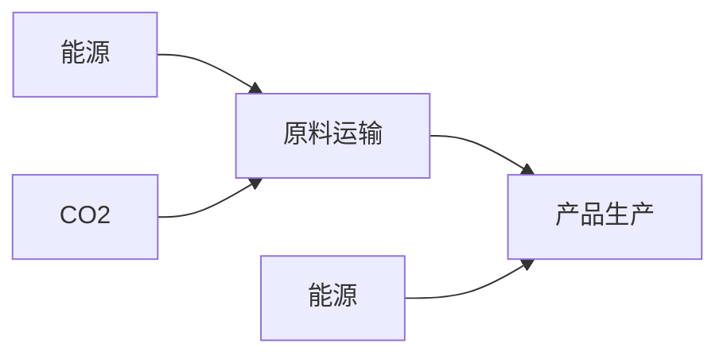

# 碳足迹报告

企业名称：河北泰昌电力器材科技有限公司

报告编号：ZRC-TZJ2025224

第三方服务机构：广东中认联合认证有限公司

查询网址：www.zrlhrz.com

2025年10月16日

text_image

16日
江苏银行联合认证有限公司
报告专用章

# 基本信息

# 报告信息

报告编号：ZRC-TZJ2025224

编写单位：广东中认联合认证有限公司

编制人员：丁亚亚

审核单位：广东中认联合认证有限公司

审核人员：陆一文

发布日期：2025年10月16日

# 申请者信息

公司全称：河北泰昌电力器材科技有限公司

统一社会信用代码：91130607056539515C

地址：保定市满城区陉阳驿村

联系人：晁坤琳

联系方式：0312-7083333

# 采用的标准信息

ISO/TS 14067-2018《温室气体-产品的碳排放量-量化和通信的要求和指南》

PAS2050：2011《商品和服务在生命周期内的温室气体排放评价规范》

# 目录

1．执行摘要， 4   
2．产品碳足迹(CFP)介绍. 5   
3．目标与范围定义. 6

3.1公司及其产品介绍... 6  
3.2研究目的... 6  
3.3研究的边界．..  
3.4功能单位... 8  
3.5生命周期流程图的绘制 8   
3.6取舍原则  
3.7影响类型和评价方法..  
3.8数据质量要求.. 10

4.过程描述. 11

4.1原材料运输阶段.  
4.2产品生产阶段...

5.数据的收集和主要排放因子说明 11  
6.碳足迹计算， 12

6.1碳足迹识别... .12   
6.2 计算公式... 12  
6.3碳足迹数据计算.. 13  
6.4碳足迹数据分析... 13

7.不确定分析， 14

8.结语 15

text_image

4th
CHONG REN LIAN HE REN ZHIENG

# 1．执行摘要

河北泰昌电力器材科技有限公司作为行业知名企业，为相关环境披露要求，履行社会责任、接受社会监督，特邀请广东中认联合认证有限公司对其生产产品的碳足迹排放情况进行研究，出具研究报告。研究的目的是以生命周期评价方法为基础，采用ISO/TS 14067-2018《温室气体-产品的碳排放量-量化和通信的要求和指南》、PAS2050：2011《商品和服务在生命周期内的温室气体排放评价规范》的要求中规定的碳足迹核算方法，计算得到河北泰昌电力器材科技有限公司的电能计量箱、电缆保护管、铁附件的碳足迹。

本报告的功能单位定义为生产“1吨电能计量箱、电缆保护管、铁附件”。系统边界为“从摇篮到大门”类型，调研了电能计量箱、电缆保护管、铁附件原材料运输阶段、电能计量箱、电缆保护管、铁附件生产阶段。

报告中对生产电能计量箱、电缆保护管、铁附件的不同过程比例的差别、各生产过程碳足迹比例做了对比分析。从单个过程对碳足迹贡献来看，发现产品生产对产品碳足迹的贡献最大，其次为原材料运输阶段。研究过程中，数据质量被认为是最重要的考虑因素之一。本次数据收集和选择的指导原则是：数据尽可能具有代表性，主要体现在生产技术、地域、时间等方面。电能计量箱、电缆保护管、铁附件生产生命周期主要过程活动数据来源于企业现场调研的初级数据，部分通用的原辅料数据来源于CLCD-China数据库、瑞士Ecoinvent数据库、欧洲生命周期参考数据库（ELCD）以及EFDB数据库，本次评价选用的数据在国内外LCA 研究中心被高度认可和广泛应用。

数据库简介如下：

CLCD-China 数据库是一个基于中国基础工业系统生命周期核心模型的行业

平均数据库。CLCD包括国内主要能源、交通数据和基础原材料的清单数据集。

Ecoinvent数据库由瑞士生命周期研发中心开发，数据主要来源于瑞士和西欧国家，该数据库包含约4000条的产品和服务的数据集，涉及能源、运输、建材、电子、化工、纸浆和纸张、废物处理和农业活动。

ELCD 数据库由欧盟研究总署开发，其核心数据库包含超过300个数据集，其清单数据来自欧盟行业协会和其他来源的原材料、能源、运输、废物管理数据。

EFDB 数据库为联合国政府间气候变化专门委员会（IPCC）为便于各国温室气体排放和减缓情况进行评估而建立的排放因子及参数数据库，以其科学性、权威性的数据评估被国际上广泛认可。

# 2．产品碳足迹(CFP)介绍

近年来，温室效应、气候变化已成为全球关注的焦点，“碳足迹”这个新的术语越来越广泛地为全世界所使用。碳足迹通常分为项目、组织、产品这三个层面。其中，产品碳足迹（Carbon Footprint of Products，CFP）是指衡量某个产品或服务在其生命周期各阶段的温室气体排放量总和，即从原材料开采、产品生产（或服务提供）、分销、使用到最终处置/再生利用等多个阶段的各种温室气体排放的累加。温室气体主要包括二氧化碳（CO2）、甲烷（CH4）、氧化亚氮（N2O）、氢氟碳化物（HFC）、全氟化碳（PFC）等。碳足迹的计算结果为产品生命周期各种温室气体排放量的加权之和，用二氧化碳当量（CO2e）表示，单位为kgCOze或者 tCOze。全球变暖潜质（GlobalWarming Potential，简称GWP），即各种温室气体的二氧化碳当量值，通常采用联合国政府间气候变化专家委员会（IPCC）提供的值，目前这套因子被全球范围广泛使用。

产品碳足迹计算只包含一个完整生命周期评估（LCA）的温室气体的部分。基于LCA的评价方法，国际上已建立起多种碳足迹评估指南和要求，用于产品碳足迹认证，目前广泛使用的碳足迹评估标准有三种：①《PAS2050：2011商品和服务在生命周期内的温室气体排放评价规范》，此标准是由英国标准协会（BSI）与碳信托公司（Carbon Trust）、英国食品和乡村事务部（Defra）联合发布，是国际上最早的、最具体计算方法的标准，也是目前使用较多的产品碳足迹评价标准；②《温室气体核算体：产品寿命周期核算与报告标准》，此标准是由世界资源研究所（WorldResources Institute）和世界可持续发展工商理事会（WorldBusiness Council for Sustainable Development）发布的产品和供应链标准;③《IS0/TS14067：2018 温室气体—产品碳足迹一量化和信息交流的要求与指南》，此标准以PSA 2050 为种子文件，由国际标准化组织（ISO）编制发布。产品碳足迹核算标准的出现目的是建立一个一致的、国际认可的评估产品碳足迹的方法。

# 3．目标与范围定义

# 3.1公司及其产品介绍

河北泰昌电力器材科技有限公司创建于2010年，2012年改组为企业有限公司。公司注册资本10000万元。占地面积约6800平方米，办公面积约1200 平方米。公司主要产品有“泰昌”牌电力器材产品符合国家及行业标准及相关技术条件，均获得国家颁发的生产许可证。公司主要经营水泥制品、电线、电缆、低压电表计量箱、电力金具、玛钢件、配电箱、复合材料绝缘横担、开关柜、避雷器、隔离开关、熔断器、绝缘子、电缆保护管研发、制造、加工；高低压开关、安全工具、通信设备、变压器及配件、仪器、仪表、互感器、电缆分支箱、电缆接头、工具瓷件、电力线材、铁塔、交通安全设施、箱式开闭所、环网柜、紧锁连接头、智能电能质量矫正装置批发、零售。公司拥有多台全自动注塑成型机、压接机、捏合机、开炼机、芯棒打磨机、激光打标机等先进的生产设备；同事拥有工频试验装置、冲击试验成套检测设备、拉力试验机等专业的检测设备。公司全体员工坚持“用户第一、质量第一、服务第一、信誉第一”的宗旨，恪守质量承诺，用更好的质量和服务回报广大客户的厚爱。

# 3.2研究目的

本研究的目的是得到河北泰昌电力器材科技有限公司生产的电能计量箱、电缆保护管、铁附件全生命周期过程的碳足迹，为河北泰昌电力器材科技有限公司开展持续的节能减排工作提供数据支撑。

碳足迹核算是实现低碳、绿色发展的基础和关键，披露产品的碳足迹是环境保护工作和社会责任的一部分，也是河北泰昌电力器材科技有限公司走向行业龙头的重要一步。本项目的研究结果将为河北泰昌电力器材科技有限公司与电能计量箱、电缆保护管、铁附件的采购商和原材料的供应商的有效沟通提供良好的途径，对促进产品全供应链的温室气体减排具有一定积极作用。

本项目研究结果的潜在沟通对象包括两个群体：一是河北泰昌电力器材科技有限公司内部管理人员及其他相关人员，二是企业外部利益相关方，如上游主要原材料供应商、下游采购商、地方政府和环境非政府组织等。

# 3.3研究的边界

根据本项目的研究目的，按照ISO/TS14067-2018、PAS 2050：2011标准的要求，本次碳足迹评价的边界为河北泰昌电力器材科技有限公司2024年全年生产活动及非生产活动数据。经现场走访与沟通，确定本次评价边界为：产品的碳足迹=原材料运输＋产品生产

# 3.4功能单位

为方便系统中输入/输出的量化，功能单位被定义为生产1吨电能计量箱、电缆保护管、铁附件。

# 3.5生命周期流程图的绘制

根据 PAS2050：2011《商品和服务在生命周期内的温室气体排放评价规范》绘制1吨电能计量箱、电缆保护管、铁附件的生命周期流程图，其碳足迹评价模式为从商业到产品评价：包括从原料获取，通过制造到产品出厂整个过程的排放。电能计量箱、电缆保护管、铁附件的生命周期流程图如下：

flowchart

图1产品生命周期评价边界图

在本项目中，产品的系统边界属“从摇篮到大门”的类型，为了实现上述功能单位，电能计量箱、电缆保护管、铁附件的系统边界见下表：

表1包含和未包含在系统边界内的生产过程

<table><tr><td>包含的过程</td><td>未包含的过程</td></tr><tr><td>a 原材料运输b 生产过程电力等能源的消耗c 产品运输</td><td>a 次要辅料运输</td></tr></table>

# 3.6取舍原则

本项目采用的取舍原则以各项原材料投入占产品重量或过程总投入的重量比为依据，具体规则如下：

I普通物料重量<1%产品重量时，以及含稀贵或高纯成分的物料重量<0.1%产品重量时，可忽略该物料的上游生产数据；总共忽略的物料重量不超过 5%;

Ⅱ大多数情况下，生产设备、厂房、生活设施等可以忽略；

ⅢI在选定环境影响类型范围内的已知排放数据不应忽略。

本报过所有原辅料和能源等消耗都关联了上游数据，部分消耗的上有数据才有近似替代的方式处理，基本无忽略的物料。

# 3.7影响类型和评价方法

基于研究目标的定义，本研究只选择了全球变暖这一种影响类型，并对产品生命周期的全球变暖潜值（GWP）进行了分析，因为GWP是用来量化产品碳足迹的环境影响指标。

研究过程中统计了各种温室气体，包括二氧化碳（CO）、甲烷（CH4）、氧化亚氮（NO）、四氟化碳(CF)、六氟乙烷(C2F）、六氟化硫(SF）、氢氟碳化物(HFC)

和哈龙等。并且采用了IPCC 第四次评估报告（2007年）提出的方法来计算产品生命周期的GWP 值。该方法基于100 年时间范围内其他温室气体与二氧化碳相比的得到的相对辐射影响值，即特征化因子，此因子用来将其他温室气体的排放量转化为COz当量（COze）。例如，1kg 甲烷在100年内对全球变暖的影响相当于25kg二氧化碳排放对全球变暖的影响，因此以二氧化碳当量（COze）为基础，甲烷的特征因子就是 25kgCOze。

# 3.8数据质量要求

为满足数据质量要求，在本研究中主要考虑了以下几个方面：

I数据准确性：实景数据的可靠程度

Ⅱ数据代表性：生产商、技术、地域以及时间上的代表性

Ⅲ模型一致性：采用的方法和系统边界一致性的程度

为了满足上述要求，并确保计算结果的可靠性，在研究过程中首先选择来自生产商和供应商直接提供的初级数据，其中企业提供的经验数据取平均值，本研究在 2025年2月进行数据的调查、收集和整理工作。当初级数据不可得时，尽量选择代表区域平均和特定技术条件下的次级数据，次级数据大部分选择来自CLCD-China 数据库、瑞士Ecoinvent 数据库、欧洲生命周期参考数据库（ELCD）以及 EFDB 数据库；当目前数据库中没有完全一致的次级数据时，采用近似替代的方式选择数据库中的数据。数据库的数据是经严格审查，并广泛应用于国际上的LCA研究。各个数据集和数据质量将在第4章对每个过程介绍时详细说明。

# 4.过程描述

# 4.1原材料运输阶段

主要数据来源：供应商运输距离、CLCD-China 数据库、瑞士Ecoinvent数据库、欧洲生命周期参考数据库（ELCD）以及 EFDB 数据库。

分析：企业大多数原材料使用陆路运输购入。本研究采用数据库数据和供应商平均运距来计算原材料运输过程产生的碳排放。

# 4.2产品生产阶段

# （1）过程基本信息

过程名称：电能计量箱、电缆保护管、铁附件的生产

过程边界：从原材料进场到产品出厂

# （2）数据代表性

主要数据来源：企业2024年实际生产数据

企业名称：河北泰昌电力器材科技有限公司

基准年：2023年

主要原料：塑料颗粒、ABS 颗粒、聚氯乙烯、角钢

主要能耗：电力、汽油

# 5.数据的收集和主要排放因子说明

为了计算产品的碳足迹，必须考虑活动水平数据、排放因子数据和全球增温潜势（GWP）。活动水平数据是指产品在生命周期中的所有的量化数据（包括物质的输入、输出；能量使用；交通等方面）。排放因子数据是指单位活动水平数据排放的温室气体数量。利用排放因子数据，可以将活动水平数据转化为温室气体排放量。如：电力的排放因子可表示为：COze/kWh，全球增温潜势是将单位质量的某种温室效应气体（GHG）在给定时间段内辐射强度的影响与等量二氧化碳辐射强度影响相关联的系数，如CH4（甲烷）的GWP 值是21。活动水平数据来自现场实测；排放因子采用IPCC 规定的缺失值。活动水平数据主要包括：电力消耗量等。排放因子数据主要包括电力排放因子等。

# 6.碳足迹计算

# 6.1碳足迹识别

<table><tr><td>序号</td><td>主体</td><td>活动内容</td><td colspan="2">活动数据来源</td></tr><tr><td>1</td><td>生产设备</td><td>消耗电力、天然气</td><td rowspan="2">初级活动数据</td><td>生产报表</td></tr><tr><td>2</td><td>制冷机、空调、采暖等辅助设备</td><td>消耗电力</td><td>生产报表</td></tr><tr><td>3</td><td>原材料运输</td><td>消耗柴油、汽油</td><td>次级活动数据</td><td>供应商地址、数据库</td></tr><tr><td>4</td><td>产品运输</td><td>消耗柴油、汽油</td><td>次级活动数据</td><td>客户地址、数据库</td></tr></table>

# 6.2计算公式

产品碳足迹的公式是整个产品生命周期中所有活动的所有材料、能源和废物乘以其排放因子后再加和。其计算公式如下：

$$
\mathrm{CF} = \sum_ {\mathrm{i} = 1, \mathrm{j} = 1} ^ {\mathrm{n}} \mathrm{P} _ {\mathrm{i}} \times \mathrm{Q} _ {\mathrm{ij}} \times \mathrm{GWP} _ {\mathrm{i}}
$$

其中，CF 为碳足迹，P为活动水平数据，Q为排放因子，GWP为全球变温潜势。排放因子源于EFDB 数据库和相关参考文献，由于部分物料数据库中暂无排放因子，取值均来自于相近物料排放因子。

# 6.3碳足迹数据计算

<table><tr><td>项目</td><td>组分</td><td>消耗数据</td><td>排放因子</td><td>GWP</td><td> $tCO_2e$ </td></tr><tr><td>电力(MWh)</td><td> $CO_2$ </td><td>92.758</td><td>0.5568 $tCO_2/MWH$ </td><td>1</td><td>51.65</td></tr><tr><td>汽油(t)</td><td> $CO_2$ </td><td>0.435097897</td><td>2.924 $tCO_2/t$ </td><td>1</td><td>1.27</td></tr><tr><td>原材料运输 (tkm)</td><td> $CO_2$ </td><td>231257.5</td><td>0.14kg/tkm</td><td>1</td><td>32.38</td></tr><tr><td>产品运输 (tkm)</td><td> $CO_2$ </td><td>1669226.32</td><td>0.14kg/tkm</td><td></td><td>233.69</td></tr><tr><td colspan="5">合计( $tCO_2e$ )</td><td>318.99</td></tr></table>

# 6.4碳足迹数据分析

根据以上公式可以计算出 2024年度产品全周期的二氧化碳的排放量为318.99tC0ze。全年产品总产量为1615.524 吨。因此1吨产品的碳足迹为0.197tCO2e/t。从产品生命周期累计碳足迹贡献比例的情况，可以看出公司产品的碳排放环节主要集中在产品生产环节的能源消耗活动，其次为原材料运输。

电能计量箱、电缆保护管、铁附件产品生命周期碳排放清单：

<table><tr><td>环境类型</td><td>当量单位</td><td>原材料运输</td><td>产品生产</td><td>产品运输</td><td>合计</td></tr><tr><td>产品碳足迹(CF)</td><td> $tCO_{2}e$ </td><td>32.38</td><td>52.92</td><td>233.69</td><td>318.99</td></tr><tr><td colspan="2">占比(%)</td><td>10.15%</td><td>16.59%</td><td>73.26%</td><td>100.00%</td></tr></table>

所以为减小产品碳足迹，应重点研发加大对产品生产过程中的节能降耗管理。

为了减小产品碳足迹，建议如下：

（1）加强产品的生态设计，投入更多资金研发更节能的产品；  
（2）加强节能工作，从技术及管理层面提升能源效率，减少能源投入，厂内可考虑实施节能改造；  
（3）在原材料价位差异不大的情况下，尽量选取原材料碳足迹小的供应商；  
（4）在分析指标的符合性评价结果以及碳足迹分析、计算结果的基础上，结合环境友好的设计方案采用、落实生产者责任延伸制度、绿色供应链管理工作，提出产品生态设计改进的具体方案;

（5）继续推进绿色低碳发展意识

坚定树立企业可持续发展原则，加强生命周期理念的宣传和实践。运用科学方法，加强产品碳足迹全过程中数据的积累和记录，定期对产品全生命周期的环境影响进行自查，以便企业内部开展相关对比分析，发现问题。在生态设计管理、组织、人员等方面进一步完善;

（6）推进产业链的绿色设计发展

制定生态设计管理体制和生态设计管理制度，明确任务分工；构建支撑企业生态设计的评价体系；建立打造绿色供应链的相关制度，推动供应链协同改进。

# 7.不确定分析

不确定性的主要来源为初级数据存在测量误差和计算误差。减少不确定性的方法主要有：

使用准确率较高的初级数据；

对每道工序都进行能源消耗的跟踪监测，提高初级数据的准确性。

# 8.结语

低碳是企业未来生存和发展的必然选择，进行产品碳足迹的核算是实现温室气体管理，制定低碳发展的战略的第一步。通过产品生命周期的碳足迹核算，可以了解排放源，明确各生产环节的排放量，为制定合理的减排目标和发展战略打下基础。

text_image

承认联合认证
ZHONG REN LIAN HE REN ZHEJIANG

natural_image

Abstract wave design with green and blue gradients, no text or symbols present

