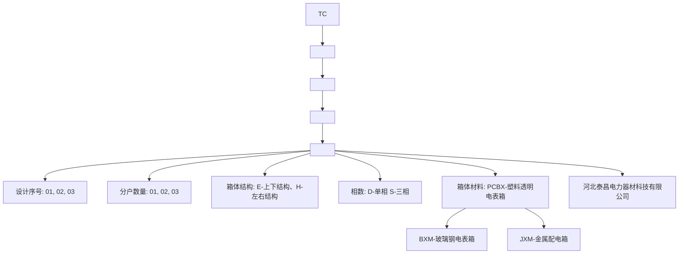
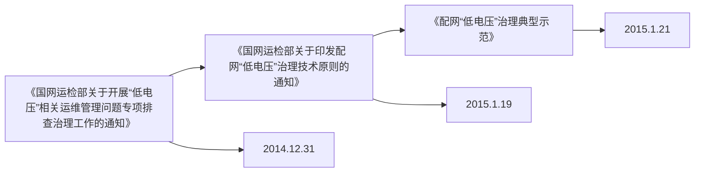
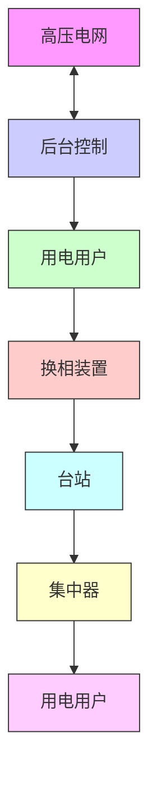
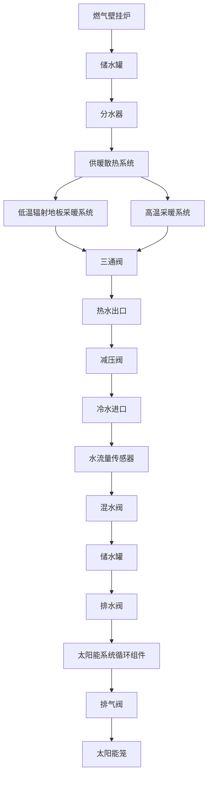

natural_image

Two line drawings of high-voltage transmission towers with power lines and ground connections, no text or symbols present.

## taighang

## 河北泰昌电力器材科技有限公司

HEBEITAICHANGELECTRIC

POWEREQUIPMENTTECHNOLOGYCO.,LTD.

河北泰昌电力器材科技有限公司创建于2010年，2012年改组为企业有限公司。公司注册资本6000万元。地处河北省保定满城区陉阳驿工业街，占地面积约5000平方米，办公面积约1200平方米。与京广铁路相临，交通便利，地理位置优越。

公司主要经营：低压电表计量箱、电力金具、配电箱、JP柜、避雷器、隔离开关、熔断器、绝缘子；电缆保护管；低压无功补偿装置；安全工器具；智能防盗机井房；燃气采暖热水炉；水泥制品制造；高低压开关，研发、制造、加工。所有产品经国家认可检测机构试验检测，均符合国家、行业标准

公司拥有多台全自动注塑成型机、四柱液压机、数控角钢生产线、数控激光切割机、数控折弯机、数控剪板机、压接机、捏合机、开式压力机、芯棒打磨机等先进的生产设备；同时拥有工频试验装置、冲击试验成套检测设备、拉力试验机等专业的检测设备。

河北泰昌电力器材科技有限公司率先通过国家ISO9001：2008质量体系认证，中国国家强制性质量认证（CQC）；环境管理体系认证；职业健康管理体系认证；拥有自己的经营理念及管理体系。我公司生产的“隆德泰昌”系列电力产品因质量可靠，性能优异，在行业中广受好评。

质量铸就品牌，诚信赢得市场；和谐汇聚人才，创新推动发展。公司经营团队坚持“诚信为本，和谐共赢”的企业宗旨，竭诚服务于全球每一个客户。

## 企业资质

## QUALIFICATIONS

text_image

营业执照
(副本)
盖章

法人代表：刘志勇
注册资本：壹仟万元整
成立日期：2013年11月18日

营业执照
2013年11月18日  2013年11月17日

经营范围：
本企业自产产品、技术开发、电力设备的制造、电力设备、仪器仪表、电器机械、电子元器件、金属材料、玻璃纤维、玻璃纤维、玻璃纤维、玻璃纤维、玻璃纤维、玻璃纤维、玻璃纤维、玻璃纤维、玻璃纤维、玻璃纤维、玻璃纤维、玻璃纤维、玻璃纤维、玻璃纤维、玻璃纤维、玻璃纤维、玻璃纤维、玻璃纤维、玻璃纤维、玻璃纤维、玻璃纤维、玻璃纤维、玻璃纤维、玻璃纤维、玻璃纤维、玻璃纤维、玻璃纤维、玻璃纤维、玻璃纤维、玻璃纤维、玻璃纤维、玻璃纤维、玻璃纤维、玻璃纤维
登记
2013年11月18日  2013年11月17日

text_image

开户许可证
核准号：J1341000123601
编号：1210-62126497
经审核，河北泰昌电力新材料科技有限公司_______符合开户条件，准予
开立基本存款账户。
法定代表人（单位负责人）：杨智______开户银行 中国银行满城支行
账号：10022840234
发证机关（盖章）
2015年12月02日

text_image

恒标
职业健康安全管理体系认证证书
证书编号：HB7102010486M
总证明
河北泰昌电力器材科技有限公司
职业健康安全管理体系符合标准：
GB/T 28001-2011 / DNSAS 18001:2007
该体系具备合规。
位于河北省保定市蒲城县胜利新村的河北泰昌电力器材科技有限公司的电力设备（组件、装置），电故障、低压无功补偿配电机的生产设备相关的职业健康安全带的活动。
成立日期：2019年8月8日
有效期：2019年8月8日至2019年8月8日
北京恒标质量认证有限公司
北京市海淀区中关村南大街23号
总经理（签名）：
XXX

text_image

NO. 0021204109
代码：G10130621000423601
名称：河北泰昌电力器材科技有限公司
地址：河北省保定市蒲城县陇阳驿村
有效期：截至2017年11月26日
机构
信用代码证
中国人民银行征信中心制
THE PEOPLE'S BANK OF CHINA CITIC BANK OF CHINA
中国人民银行征信中心
2023年11月26日

text_image

恒标
OCCUPATIONAL HEALTH SAFETY MANAGEMENT
SYSTEM CERTIFICATE OF CONFORMITY
Registration No.: 167-00358888
This is to certify that the Occupational Health Safety Management Systems of
Hebei TaChang Power Equipment Co., Ltd.
King Tong (Wang), Chongqing, Yang, China
Huang Xiang (Wang), Chongqing, Yang, China
Organization Call Number: 2009/04/24
has been found to enform to Occupational Health Safety
Management System Standard.
GBT 28001-2011 / GHXAS 18901-2007
This certificate is valid only to the following range:
Production of Electrical Fixtures (Cross Arm, Hang), Motor Boxer, Low
Voltage Reactive Compensation Distribution Cabinet and Related
Occupational Health Safety Management Activities by Hebei Taichang
Power Equipment Co., Ltd. Located at King Yang's Village, Manchang
County, Beijing, Hebei
Date of Issue: Aug. 2, 2014
Total Issue: Aug. 2, 2014 - Aug. 2, 2017
Certified organizations shall be certified upon the certificate certified on behalf of each
Area, City, and experience of qualified staff rights in the corresponding position. The certificate is valid
and has been issued to be certified upon the status of the registered person. The certificate is valid
by the above address of the registered person. The certificate is valid
BEIJING HONGBOAI DUALITY CERTIFICATION CO.,LTD.
301.38, 2014; Guangdong Province, Guangdong Province, China
General Manager:
TEXAS

text_image

恒标
环境管理体系认证证书
证证明
河北泰昌电力器材科技有限公司
环境管理体系符合标准：
GB/T 24001-2004/150 14001:2004
该体系覆盖范围：
位于河北省保定市蒲城县舒阳驿村的河北泰昌电力器材科技有限公司的电力金具（横担、拖搬）、电表箱、低压无功补偿配电柜的生产及其相关的环境管理活动
批准日期：2014年8月1日
有效期：2014年8月1日至2017年8月1日
北京恒标质量认证有限公司
北京市海淀区中关村大街75号
总经理（签名）：
IAF CNAS

text_image

恒标
ENVIRONMENT MANAGEMENT SYSTEM
CERTIFICATE OF CONFORMITY
Registration No. 2001-2004/2004
This is to certify that the Environmental Management System of
Hohel TaChang Power Equipment Co., Ltd.
Hohel TaChang Power Equipment Co., Ltd.
Production of Electrical Fittings (Cronex Arm, Hohel, Motor Boxes, Low Voltage Reactive Compensation Distribution Cabinet and Related
Environmental Management Activities by Hohel TaChang Power
Equipment Co., Ltd. Located at Xiang Yangxi Village, Machong County,
Hohel)
GIV/T 24001-2004/ISO 14001:2004
This certificate is valid only to the following range:
Production of Electrical Fittings (Cronex Arm, Hohel, Motor Boxes, Low
Voltage Reactive Compensation Distribution Cabinet and Related
Environmental Management Activities by Hohel TaChang Power
Equipment Co., Ltd. Located at Xiang Yangxi Village, Machong County,
Hohel)
Date of Issue: August 2014
ISSN No.: 864-873 - 864-873-7
Certified organization relating the validity part of the certificate representatives will be certified or
the number of certified audit grants issued to the corresponding certificate in the case of the certificate for the
 environmental management system.
BEIJING HENRIKAI QUALITY CERTIFICATION CO.,LTD.
NO. 25 (Registration No. 25) (Hohel, Hohel, P. & Sons)
General Manager:
IFA
CVAS

text_image

中国国家强制性产品认证证书
证书编号：201403016737214
委托人名称：姚婷
浙江海亮电器科技有限公司
生产厂家：浙江海亮电器科技有限公司
生产企业（范围）名称：姚婷
浙江海亮电器科技有限公司
生产厂家：浙江海亮电器科技有限公司
生产企业名称：姚婷
浙江海亮电器科技有限公司
生产厂家：浙江海亮电器科技有限公司
产品类别和系列：姚婷（型号）
批发行量（万股/张）
产品经营范围及技术要求
ISS 1291-5-2008
上述产品符合相关法律法规的规定。
CICAC-SP1（2014）第1版批准，特此公告。
发证日期：2014年1月1日
有效期至：2015年1月22日
证书有效期为自本次向特定对象发行的股份之日起至监管禁用期届满。
CQC
王佳：
中国质量认证中心
http://www.cqcc.com.cn

text_image

CERTIFICATE FOR CHINA COMPULSORY PRODUCT CERTIFICATION
No. 1 2014/05/01/73/2018
NAME AND ADDRESS OF THE APPLICANT
Name: Emerging Electric Power Equipment Technology Co., Ltd.
Designated: Vittitas, Marketing Group, Marketing Group, Office, Office
NAME AND ADDRESS OF THE MANUFACTURED
Name: Emerging Electric Power Equipment Technology Co., Ltd.
Designated: Vittitas, Marketing Group, Marketing Group, Office, Office
NAME AND ADDRESS OF THE FACTORY
Name: Emerging Electric Power Equipment Technology Co., Ltd.
Designated: Vittitas, Marketing Group, Marketing Group, Office, Office
MARK, NAME, AND SPECIFICATION
Exhibits Description:
FOR TOTAL DEBTORAL CONDITIONS IN CHINA CO., LTD.
IN CHINA CO., LTD.
THE CABBAGE AND TECHNICAL REQUIREMENTS FOR THE PRODUCTS
OF TOTAL DEBTORAL CONDITIONS IN CHINA CO., LTD.
This is not valid for any person approved products here are only one
excellence of the manufacturer's 2014 Q3 manufactured company (China) or
the company's 2014 Q3 of 2014.
Date of Issue: Nov. 31, 2014 Date of Employment: Nov. 31, 2019
Dealing of this certificate is subject to positive impact of any signature
and please refer to existing certification body and one approval date.
This certificate has been issued (except that) 2014's publication and other prior to
CQC President Wang Kujiao
CHINA QUALITY CERTIFICATION CENTRE
Beijing CNH, HK/Mongkong Rd., Beijing 100010 Y & China
http://www.cqc.com.cn

text_image

CERTIFICATE FOR CHINA COMPLISORY PRODUCT CERTIFICATION
No. 1011
CHINA COMPLISORY
CERTIFICATE OF THE SPECIAL
Name: Nanning Buryan, James Hsuhan, University of California,
Organizational of the State, New York City, Beijing, Beijing, Beijing, Beijing, Beijing, Beijing, Beijing, Beijing, Beijing, Beijing, Beijing, Beijing, Beijing, Beijing, Beijing, Beijing, Beijing, Beijing, Beijing, Beijing, Beijing, Beijing, Beijing, Beijing, Beijing, Beijing, Beijing, Beijing, Beijing, Beijing, Beijing, Beijing, Beijing, Beijing, Beijing, Beijing, Beijing, Beijing, Beijing, Beijing, Beijing, Beijing, Beijing, Beijing, Beijing, Beijing, Beijing, Beijing, Beijing, Beijing, China
CERTIFICATE OF THE MANUFACTURERS
Name: Nanning Buryan, James Hsuhan, University of California,
Organizational of the State, New York City, Beijing City, Beijing City, Beijing City, Beijing City, Beijing City, Beijing City, Beijing City, Beijing City, Beijing City, Beijing City, Beijing City, Beijing City, Beijing City, Beijing City, Beijing City, Beijing City, Beijing City, Beijing City, Beijing City, Beijing City, Beijing City, Beijing City, Beijing City, Beijing City, Beijing City, Beijing City, Beijing City, Beijing City, Beijing City, Beijing City, Beijing City, Beijing City, Beijing City, BeijingCity,
CERTIFICATE OF THE FACTORY
Name: Nanning Buryan (State) Research Laboratory (State)
Organizational of the State (State) Research Laboratory (State)
Certification of the Conductors for the Manufacturers
Date of issue: Apr. 12, 2013 Date of expiry: Apr. 12, 2014
Institute of this certificate is subject to positive results of the regular letter or instruction to be certified by the manufacturer's name and address. The company has a full name and a full number of employees in the industry.
Certification must be certified (except for additional information).
Cec President 王晓敏
CHINA QUALITY CERTIFICATION COURSE
Section 9 No. 108 (Exhibits Code), Indexing 1957A P.A.China.
http://www.cec.com.cn

text_image

中国国家强制性产品认证证书
证书编号：20130101677894
委托人名称：地址
河北集团电力器材科技有限公司
河北省宣武市煤业股份有限公司
生产者（制图）名称：地址
河北集团电力器材科技有限公司
河北省宣武市煤业股份有限公司
生产企业名称：地址
河北集团电力器材科技有限公司
河北省宣武市煤业股份有限公司
产品名称和系列：规格、型号
许昌发电机组（配电仪）
产品创新和技术要求
CQ 2013-0-2006
上述产品符合强制性产品认证资格规则
CQCA-01C-H11C 2013年表单，特此证。
发证日期：2013年04月12日
有效期至：2013年04月12日
证书有效期内无证书的有效期限需经登记机构约定到营业网点申请。
本品须经国家有关主管部门批准后方可经营。

text_image

CERTIFICATE FOR CHINA COMPULSORY PRODUCT CERTIFICATION
No.: 2016030301855270
NAME AND ADDRESS OF THE APPLICANT
Name: Tischung Electric Power Equipment Technology Co., Ltd.
Company Village, Building County, Building City, Suite
NAME AND ADDRESS OF THE MANUFACTURE
Name: Tischung Electric Power Equipment Technology Co., Ltd.
Company Village, Building County, Building City, Suite
NAME AND ADDRESS OF THE FACTORY
Name: Tischung Electric Power Equipment Technology Co., Ltd.
Company Village, Building County, Building City, Suite
NAME, WORD AND SPECIFICATION
Localisation Development Association
27. 2008.10.2016 (JPN) (JPN) (JPN) (JPN) (JPN) (JPN)
THE STANDARDS AND TECHNICAL REQUIREMENTS FOR THE PRODUCTS
IN 1974, 2016, 2017, 2018 (ISSN 2016)
Date is to certify that the above approved products have not the
requirements of implementation rather than the compliance certification.
NO. 1968-02-2016
Date of issue: Jan. 08, 2016 Date of expiry: Jan. 08, 2016
Status of this certificate is subject to positive results of the regular
pliance in connection by issuing certification needs won't the entity date.
This certificate can be certified without DOI: www.cac.com.cn
Cec President James Wang Yihao
CHINA QUALITY CERTIFICATION CENTER
Director: X No. 198, National Air, Beijing 1999; X & China
http://www.cac.com.cn
1313577

text_image

中国国家强制性产品认证证书
证号编号：201610101831079
委托人名称：城站
河北昌昌电力器材科技有限公司
河北省宣武市南泥镇西村村
生产者（制图）工作、城站
河北昌昌电力器材科技有限公司
河北省宣武市南泥镇西村村
生产企业名称：城站
河北昌昌电力器材科技有限公司
河北省宣武市南泥镇西村村
产品名称和型号：规格、型号
IP地址：(城市及城市式设备)
产品有效期：2016-04-20至2017-04-20 2017年1月1日至2017年12月31日，有效期：2017年1月1日至2017年12月31日。
上述产品符合授权产品认证范围：
CRJ-CP-01-2017年1月1日至2017年12月31日。
发证日期：2016-04-20 有效期至：2017年1月1日至2017年12月31日。
证券承销期内未在证券交易所挂牌交易或转让机构间以股票监管机构为准。
本证书所载证书是国家质量监督局2009年QFII-05号《中国国家强制性产品认证证书》。
CAC
主 程：王伟伟
中国质量认证中心
中签（盖章）：中国证券报（2009）第 100号
http://www.cac.com.cn
1313577

text_image

CERTIFICATE FOR CHINA COMPULSORY PRODUCT CERTIFICATION
No. 201303030100179
NAME AND ADDRESS OF THE APPLICANT
Name: Tischung Electronic Power Equipment Technology Co., Ltd.
Equipment Quality, Marketing Quality, Banking City, Beijing
NAME AND ADDRESS OF THE MANUFACTURER
Name: Tischung Electronic Power Equipment Technology Co., Ltd.
Equipment Quality, Marketing Quality, Banking City, Beijing
NAME AND ADDRESS OF THE FACTORY
Name: Tischung Electronic Power Equipment Technology Co., Ltd.
Equipment Quality, Marketing Quality, Banking City, Beijing
TITLE, MODEL AND SPECIFICATION
ISSN No. 2013-008-1564 (2013) 95-000-000-0000-000-000-000-000-000-000-000-000-000-000-000-000-000-000-000-000-000-
THE STANDARD AND TECHNICAL RESEGMENTS FOR THE PRODUCTS
OF 2013-3-2014
This is not costly that the above mentioned products are met; the
requirements of information below for comprehensive certification:
NO. 2013-612-612-612-612-612-612-612-612-612-612-612-612-612-612-612-612-612-612-612-
Date of issue: Apr. 17, 2015 Date of expiry: Apr. 17, 2018
Details of this certificate to subject to preliminary receipt of the register
Action as Disposition for listing certificate/bio by which the register parts
This certificate can be certified through CIEC's website or www.gcec.com.
CEC President: 马晓峰 CHINA QUALITY CERTIFICATION CENTRE
Section 5 No. 198-Marcheem, Bld. Anfang 159875 P & C Inc.
http://www.ccp.com.cn
0 0701234

text_image

中国国家强制性产品认证证书
证书编号：201101030407879
委托人名称：沈站
河北昌昌电力器材科技有限公司
河北省宣武市高速公路有限责任公司
生产者（制图）工作、论证
河北昌昌电力器材科技有限公司
河北省宣武市高速公路有限责任公司
生产企业名称：沈站
河北昌昌电力器材科技有限公司
河北省宣武市高速公路有限责任公司
产品系列和系列、规格、型号
线材牌电光源（标示版）
产品标准和技术要求
GB 7251.3-2006
上述产品符合强制性产品认证实施规则
CCK-016-016 2006年1月1日（有效期至2015年1月1日）
发证日期：2015年04月17日      星期起止：2015年04月17日
证书有续期内由证券机构有效注册或授权机构的定期向专业保持。
本证书已按国家有关主管部门批准并取得www.csc.com.cn查询。
CEC
主 任：
张博
中国质量认证中心
中国·北京·重庆国际金融有限公司 100% 号 100070
http://www.ccc.com.cn
9 0701234

text_image

CERTIFICATE FOR CHINA COMPULSORY PRODUCT CERTIFICATION
No. 1 301-691500000000000
NAME AND ADDRESS OF THE APPLICATE
Nobel Tsicheng Electric Power Equipment Technology Co., Ltd.
Erzeugent: Villan, Mezzung County, Newing City, Neno
NAME AND ADDRESS OF THE MANUFACTURE
Nobel Tsicheng Electric Power Equipment Technology Co., Ltd.
Erzeugent: Villan, Mezzung County, Newing City, Neno
NAME AND ADDRESS OF THE FACTURE
Nobel Tsicheng Electric Power Equipment Technology Co., Ltd.
Erzeugent: Villan, Mezzung County, Newing City, Neno
NAME, MODEL & SPECIFICATION
Law Voltage Protection Association
JP 16-6984-115, 2017; 2018; 2019; 2020; 2021; 2022; 2023; 2024; 2025; 2026; 2027; 2028
THE STANDERS AND TECHNICAL REQUIREMENTS FOR THE PRODUCTS
OR 7311.1-2005, 18/7-15/09-2008
This is not certified that the above mentioned products have any the requirements of certification required for commercial certification or other services.
Date of issue: Apr. 06, 2014 Date of expiry: Apr. 06, 2018
Majority of this certificate is subject to positive results of the regular follow-up information by issuing certification both on the same date.
This institution must be verified through DCS's website www.csc.org.cn
President:
Wang Kejun
CHINA QUALITY CERTIFICATION CENTER
Section No. 194, 195, 196, Beijing 199999 P.C.China
http://www.csc.org.cn
0 0910290

text_image

检验报告
First Report

单位名称：燃气轮机有限公司

法定代表人：王伟杰

财务负责人：

联系电话：（021）8539-6788

生产单位：湖北金源电力股份有限公司

电表地址：湖北省荆州市

说明：燃气轮机产品性能及质量指标如下：以上所示。

text_image

MA
CNAS
检验报告
Test Report

检验名称：燃气轮换器产品

型号/型号：120000

审核单位：

批准单位：河北冀东电气燃料科技有限公司

生产单位：河北冀东电气燃料科技有限公司

登记机构：

国家燃气局（北京）有限责任公司（以下简称“中国燃气局”）

China Gas & Chemical Engineering Corporation (以下简称“中国燃气局”)

国家燃气局（北京）有限责任公司（以下简称“中国燃气局”）

国家燃气局（北京）有限责任公司（以下简称“中国燃气局”）

国家燃气局（北京）有限责任公司（以下简称“中国燃气局”）

国家燃气局（北京）有限责任公司（以下简称“中国燃气局”）

国家燃气局（北京）有限责任公司（以下简称“中国燃气局”）

国家燃气局（北京）有限责任公司（以下简称“中国燃气局”）

国家燃气局（北京）有限责任公司（以下简称“中国燃气局”）

国家燃气局(北京)有限责任公司（以下简称“中国燃气局”）

国家燃气局(北京)有限责任公司（以下简称“中国燃气局”）

国家燃气局(北京)有限责任公司（以下简称“中国燃气局”）

国家燃气局(北京)有限责任公司（以下简称“中国燃气局”）

国家燃气局(北京)有限责任公司（以下简称“中国燃气局”）

国家燃气局(北京)有限责任公司（以下简称“中国燃气局”）

国家燃气局(北京)有限责任公司（以下统称：“中国燃气局”）

国家燃气局(北京)有限责任公司（以下统称：“中国燃气局”）

国家燃气局(北京)有限责任公司（以下统称：“中国燃气局”）

国家燃气局(北京)有限责任公司（以下统称：“中国燃气局”）

国家燃气局(北京)有限责任公司（以下统称：“中国燃气局”）

国家燃气局(北京)有限责任公司（以下统称：“中国燃气局”）

国家燃气局(北京市)有限责任公司（以下统称：“中国燃气局”）

国家燃气局(北京市)有限责任公司（以下统称：“中国燃气局”）

国家燃气局(北京市)有限责任公司（以下统称：“中国燃气局”）

国家燃气局(北京市)有限责任公司（以下统称：“中国燃气局”）

国家燃气局(北京市)有限责任公司（以下统称：“中国燃气局”）

国家燃气局(北京市)有限责任公司（以下统称：“中国气局”）

国家燃气局(北京市)有限责任公司（以下统称：“中国气局”）

国家燃气局(北京市)有限责任公司（以下统称：“中国气局”）

国家燃气局(北京市)有限责任公司（以下统称：“中国气局”）

国家燃气局(北京市)有限责任公司（以下统称：“中国气局”）

国家燃气局(北京市)有限责任公司（以下统称：“中国气局”）

国家燃气局(北京市)股份有限公司（以下统称：“中国气局”）

国家燃气局(北京市)股份有限公司（以下统称：“中国气局”）

国家燃气局(北京市)股份有限公司（以下统称：“中国气局”）

国家燃气局(北京市)股份有限公司（以下统称：“中国气局”）

国家燃气局(北京市)股份有限公司（以下统称：“中国气局”）

国家燃气局(北京市)股份有限公司（以下统称：“中国气局”）
国家燃气局(北京市)股份有限公司（以下统称：“中国气局”
）
国家燃气局(北京市)股份有限公司（以下统称：“中国气局”
）
国家燃气局(北京市)股份有限公司（以下统称：“中国气局”
）
国家燃气局(北京市)股份有限公司（以下统称：“中国气局”
）
国家燃气局(北京市)股份有限公司（以下统称：“中国气局”
）
国家燃气局(北京市)股份有限公司（以下统称：“中国气局”
）
国家燃气局(北京市)股份有限公司(以下统称：“中国气局”
）
国家燃气局(北京市)股份有限公司(以下统称：“中国气局”
）
国家燃气局(北京市)股份有限公司(以下统称：“中国气局”
）
国家燃气局(北京市)股份有限公司(以下统称：“中国气局”
）
国家燃气局(北京市)股份有限公司(以下统称：“中国气局”
）
国家燃气局(北京市)股份有限公司(以下统称：“中国气局”
）
国军天然气月供产品中心（上海）：
China Oil & Chemical Engineering Corporation (Shanghai Oil & Chemical Engineering Co., Ltd. Applicable Company)

text_image

MA
检验报告
Test Report

检验名称：燃气轮候车床

废气管件：LPG10

检验类型：

蒸汽轮候车：燃气轮候车上燃烧机控制装置
蒸汽轮候车：燃气轮候车上燃烧机控制装置
汽轮轮候车：燃气轮候车上燃烧机控制装置

请参照《燃气轮候车产品说明书》（修订）（C2015第1版）和《燃气轮候车产品说明书》（修订）

text_image

恒标
环境管理体系认证证书
证证明
河北泰昌电力器材科技有限公司
环境管理体系符合标准：
GB/T 24001-2004/ISO 14001:2004
该体系覆盖范围：
位于河北省保定市蒲城县特别碑村的河北泰昌电力器材科技有限公司的电力金具（破损、报废）、电表箱、低压无功补偿配电柜的生产及其相关的环境管理活动
北京恒标质量认证有限公司
北京市海淀区中关村南大街28号
总经理（签名）：
IAF
CNAS

text_image

ENVIRONMENT MANAGEMENT SYSTEM
CERTIFICATE OF CONFORMITY
Registration No.: 2001-037198
This is to certify that the Environmental Management System of
Hubei Tai Chang Power Equipment Co., Ltd.
Hugee Tai Chang Power Equipment Co., Ltd.
Exhibit No. 2001-037198
Has been found to conform to Environmental Management
System Standard:
GB/T 24001-2004/ISO 14001:2004
This certificate is valid only in the following range:
Production of Electrical Equipment (Cron Arts, Bkg), Motor Batten, Low Voltage Reactive Compensation Combination Cabinet and Related
Environmental Management Activities by Hubei TaiChang Power
Equipment Co., Ltd. Located at Ming Yueyi Village, Manichong County,
Baseline, Hubei
Date of Issue: Aug. 6, 2014
ISSN No. 8, 2014, Aug. 2, 2017
Certification of the entity's status of the certificate certified on the date of sale or
the report of the quality of the property sold to the securities referred to the certificate in this
year. The material must be used for any such material or equipment to be purchased or sold with either a material or equipment to be sold or sold with either a material or equipment to be sold or sold with either a material or equipment to be sold or sold with either a material or equipment to be sold or sold with either a material or equipment to be sold or sold with either a material or equipment to be sold or sold with either a material or equipment to be sold or sold with either a material or equipment to be sold or sold with either a material or equipment to be sold or sold with either a material or equipment to be sold
SOLING HONGKAO QUALITY CERTIFICATION CO.,LTD.
No. 15, Management No. 15, Air Quality Code No. 14, China
Copyright Manager:
IFAC
CNAS

text_image

中国国家强制性产品认证证书
证书编号：20140303018797
纳税人注册、地址
河北省昌平电器科技有限公司
河北省昌平电器科技有限公司
生产企业营业执照注册、地址
河北省昌平电器科技有限公司
河北省昌平电器科技有限公司
生产企业营业执照注册、地址
河北省昌平电器科技有限公司
河北省昌平电器科技有限公司
产品名称和类别、规格、型号
国风光电科技股份有限公司（国风光电产品技术）
JY-2006-01-2014 10:00 PM (15:00-18:00)（有效期至2014年1月1日）。
产品特点和技术要求：
GB 1215, 1-1001, GB/T 1375-1008
上述产品符合强制性产品认证实施规则
COCB-010-010 2013.1.1条，特此证。
发证日期：2014年01月18日      发证期：2015年04月18日
证书有效期内证书的有效期限须加盖公章的法定监管或法律文件。
本证书有效期限须经中国证券监督管理委员会证监许可[2014]28号文核准。
CEC
主 作：
张伟
中国质量认证中心
中邮（上海）信息咨询有限公司
http://www.cecg.com.cn
0 0910290

text_image

质量管理体系认证证书
河北泰昌电力器材科技有限公司
GB/T19001-2008 / ISO/9001:2008 标号
证书类型：非标本
证书有效期：2014年10月15日
证书登记号：2014-037-037
IAF GNAS

text_image

Hebei Taichang Electric Power Equipment
Technology Co., Ltd.
The Industrial Research Institute (IEA) registered
Address: Guangdong Province, Guangxi Province, China, China.
The Management System is at www.certiss.com
GB/T19001-2008 / ISO9001/2008 standard
Productivity: Electric Motor Resin and Low Voltage Buses
Power Generation Power Distribution Distributed
Qualification Rules: Production of Wastewater Electric
Power Buses (China), Japan, China (India) Lighting
Aviation: High Voltage Bandpass British High Voltage Bus,
Composite Modulator: Subs of Substrate Modulator
Production: Tube & Cable Braking Bus, Cablebran Channel Modulator

生产设备  

natural_image

Interior view of a factory floor with machinery and workers (no visible text or symbols)

注塑机  

natural_image

Interior view of a laboratory with a person seated at a workstation, surrounded by equipment and storage containers (no visible text or symbols)

注塑机

natural_image

Red industrial cutting machine on a workbench, no visible text or symbols

数控激光切割机

natural_image

Industrial hydraulic press machine with control panel and blue components (no visible text or symbols)

数控折弯机

化验检测设备  

natural_image

Woman in lab coat operating industrial equipment with a metal frame (no visible text or symbols)

分析探、硅、猛、硫、磷

natural_image

Scientist in lab coat working in a laboratory with shelves of glassware (no visible text or labels)

做拉力试验

natural_image

Woman in white lab coat working on electrical equipment beside a wooden cabinet (no visible text or symbols)

做硅、猛、磷分析

natural_image

Scientist in lab coat working with a wooden laboratory apparatus (no visible text or symbols)

做碳、硫分析

## 目录

电表箱

透明防窃..表箱技性能描述…

透明防窃电电表箱（上下结构）系列. .….04

透明防窃电电表箱左右结构．系列… ...….005

三相动力量…

JP柜 ........... ..009

三相不平衡.… ...013

全智能房房.· …….0.1.9

绝缘罩. ·……021

燃气采暖.水炉..

多用绝缘操作．..· ……024

JD系列携带型短路接地线 ...025

AF型安全防护系列. …027

施工工系列.……………….028

登杆工….系. ……….030

避雷器·系..

户外型跌落断器系.. .033

户外隔离开·系列… .034

复合绝缘子系列

电缆保护管系列 ..036

线路.件系 ..….039

紧固件系. .

## 电表箱

## 一、产品概述

透明塑料电表箱适用于交流50HZ，额定工作电压为220V及380V，额定工作电流为10A\~250A的供电系统中，供单相电能和动力电能的计量与控制管理。

本产品采用透明设计，透明材料的采用不仅直观，而且可以及时的发现表箱内的各类异常现象，提前排除用电中的安全隐患，真正达到用电安全，预防为主的宗旨。

新型环保工程塑料聚碳酸酯（PC），具有优良的透明性、电绝缘性、阻燃性、防紫外线老化、物理化学性能好、重量轻优异的耐候性能，不怕雨淋日晒，正常使用寿命达30年以上。

电表箱采用集成化设计理念，将各式电能表及整个计量回路集装于一体化封闭箱内，不仅占用空间小，易于安装和管理，而且能够阻止窃电者触及计量装置，防止窃电行为。

## 二、产品使用条件

1、工作环境温度：-40°C\~+90°C，日平均≤50°C：  
2、相对湿度：月平均相对湿度≤90%，日平均相对湿度≤90%；  
3、海拔高度：≤5000米：  
4、风户外：60m/s：  
5、耐受地震能力：烈度8度：  
6、阻燃等级：箱盖V0级，箱底V1级；  
7、耐温特性：-40C\~+90°C温度范围内无变形

## 三、工厂产品型号含义

flowchart

## 透明防窃电电表箱技术性能描述

## 四、产品结构特点

1、表箱由箱底和箱盖组成，扣合采用多点隐蔽式挂钩结构固定，可配合各种封、锁的使用：箱盖采用耐候性透明聚碳酸酯（PC）工程塑料，箱底采用耐候性阻燃PC/ABS工程塑料。  
2、为了便于管理，多表位电表箱内的开关、电能表采用了分别集中设计，整体上可分为开关室和电能表室两个部分。开关室可安装总开关、空气开关或者隔离开关，在电能表室可安装电能表、采集终端等，电能表室和开关室均分别安装设单独开启的门，能够加挂专用锁和一次性防窃电施封锁。  
3、计量箱的电能表室门采用了全透明设计，这便于电力管理部门的管理、监督、检查和维护工作。  
4、本系列电表箱考虑到散热的需要，计量箱联测设计百叶窗，百叶窗内侧加防止小动物进入的防护网。考虑了防漏雨的设计，表箱上部为密封且防雨，在正常安装情况下表箱是不会有进水口的，万一电表箱进水，在表箱下部设计下水口。

## 五、产品安装及注意事项

1、安装位置应选在无剧烈震动和冲击的地方，及不足以腐蚀电器元件的场所。  
2、安装时请仔细检查产品各零部件的完好性。  
3、电表箱应垂直安装好，倾斜角不得超过5度。  
4、产品使用的材料不耐强碱、氧化性酸及胺，酮类，应避免与这些化学物质接触一起使用。  
5、产品在使用过程中应避免尖锐的物品及硬物碰撞刮伤电表箱的表面。  
6、电表箱安装时应尽量选择阴凉干燥的场所，避免阳光长时间的直接照射，以延长电表箱的使用寿命。

text_image

进线孔
铰链
总开关室
表前开关室
表后开关室
表后开关室
出线孔
挂锁孔
出线孔
挂锁孔
铅封孔
对流通风口
插卡口
线槽盖
仪表室
超强防水通风口

单相一户电表箱（上下结构）（卡式）  

text_image

SINGCME
注意 安全

单相一户电表箱（上下结构）（非卡式）  

text_image

CHNT
禁止超限部分可燃解油试验

产品型号及主要配置

<table><tr><td>型号</td><td>配置</td><td>名称</td><td>规格</td><td>数量</td></tr><tr><td rowspan="2">JKPCBX-DE0102</td><td>进线</td><td>断路器</td><td>DZ47-2P/63</td><td>1</td></tr><tr><td>出线</td><td>断路器</td><td>DZ47-2P/63</td><td>1</td></tr><tr><td rowspan="2">JKPCBX-DE0102</td><td>进线</td><td>隔离开关</td><td>CDB5-2P/63</td><td>1</td></tr><tr><td>出线</td><td>断路器</td><td>DZ47-2P/63</td><td>1</td></tr></table>

安装尺寸图（mm）  

text_image

190
140
345
425
80
109
140

透明防窃电电表箱（上下结构）系列

text_image

有电数码
严禁开启

text_image

CHNT
安全提示
石电防护
严禁开启

产品型号及主要配置

<table><tr><td>型号</td><td>配置</td><td>名称</td><td>规格</td><td>数量</td></tr><tr><td rowspan="3">JKPCBX-DE0201</td><td>总进线</td><td>断路器</td><td>CDB2-2P/125</td><td>1</td></tr><tr><td>进线</td><td>接线端子</td><td>一进二出</td><td>2</td></tr><tr><td>分户出线</td><td>断路器</td><td>DZ47-2P/63</td><td>2</td></tr><tr><td rowspan="3">JKPCBX-DE0202</td><td>总进线</td><td>隔离开关</td><td>CDB61S-2P/125</td><td>1</td></tr><tr><td>进线</td><td>接线端子</td><td>一进二出</td><td>2</td></tr><tr><td>分户进线</td><td>断路器</td><td>DZ47-2P/63</td><td>2</td></tr></table>

安装尺寸图（mm）  

text_image

359
290
376
446
110
140

## 透明防窃电电表箱（左右结构）系列

单相六户电表箱（左右结构）（卡式）  

natural_image

Interior view of an open electrical enclosure with visible circuit breakers and warning symbols (no readable text or labels)

单相六户电表箱（左右结构）（非卡式）  

natural_image

Interior view of an electrical enclosure showing open and closed panels with internal components (no visible text or symbols)

产品型号及主要配置

<table><tr><td>型号</td><td>配置</td><td>名称</td><td>规格</td><td>数量</td></tr><tr><td rowspan="3">JKPCXM-DH0602</td><td>总进线</td><td>断路器</td><td>CDM10-250/3300 150A</td><td>1</td></tr><tr><td>分户进线</td><td>隔离开关</td><td>CDB5-2P/63</td><td>6</td></tr><tr><td>分户出线</td><td>断路器</td><td>DZ47-2P/63</td><td>6</td></tr><tr><td rowspan="3">JKPCXM-DH0603</td><td>总进线</td><td>断路器</td><td>CDM10-250/3300 150A</td><td>1</td></tr><tr><td>分户进线</td><td>断路器</td><td>DZ47-2P/63</td><td>6</td></tr><tr><td>分户出线</td><td>断路器</td><td>DZ47-2P/63</td><td>6</td></tr></table>

安装尺寸图（mm）  

text_image

710
262 343
405
780
245
112 147

## 三相动力计量电表箱

三相动力计量电表箱（卡式）  

natural_image

Electrical enclosure with two circuit breakers and a digital meter, showing wiring and warning symbols (no readable text)

三相动力计量电表箱（非卡式）  

natural_image

Electrical enclosure with two main circuits, three connected to power lines and a warning symbol (no readable text or labels)

产品型号及主要配置

<table><tr><td>型号</td><td>配置</td><td>名称</td><td>规格</td><td>数量</td></tr><tr><td rowspan="2">JKPCBX-SE0101</td><td>进线</td><td>隔离开关</td><td>CDB5-3P/63</td><td>1</td></tr><tr><td>出线</td><td>断路器</td><td>DZ47-4P/63</td><td>1</td></tr><tr><td rowspan="2">JKPCBX-SE0102</td><td>进线</td><td>断路器</td><td>DZ47-3P/63</td><td>1</td></tr><tr><td>出线</td><td>断路器</td><td>DZ47-4P/63</td><td>1</td></tr></table>

安装尺寸图（mm）  

text_image

262
218
290
539
200
118
151

变压器防护罩  

natural_image

Transparent plastic enclosure with multiple internal components and circular cutouts (no visible text or symbols)

功能说明

安装尺寸图（mm）  

text_image

Technical drawing with dimensioned mechanical part views, including top and front projections with measurements in millimeters.

（全透明）变压器保护罩，箱体材料采用世界一线品牌聚碳酸酯（PC）和ABS注塑成型。用封闭配电变压器低出线瓷套管的方法，对配电变压器低压出线侧实施全封闭保护。在打开保护盖的前提下，异物无法触及低压出线接线柱，从而有效防止窃电行为发生。保护罩内预留感应器安装位、二次回路出线孔及电缆固定夹，可配合多功能计量配电箱使用，实现电表箱与电流互感器分开安装，可实施“线进管、管进箱、箱咖锁”的全封闭防窃电措施。

玻璃钢电表箱  

text_image

温度传感器 201408

玻璃钢单相两户电表箱

text_image

Image of an industrial control panel with Chinese text labels and a circular emblem on the left panel.

玻璃钢单相四户电表箱

natural_image

Front view of a white industrial control panel with multiple square windows and a circular dial indicator (no visible text or symbols)

玻璃钢单相六户电表箱

金属配电箱  

text_image

国家电网
95596

单相金属配电箱（上下结构）

text_image

电能计量装置
低位开启或移动属违法行为
有电 轮路
国家电网

三相金属配电箱（左右结构）

电表箱SMC  

natural_image

Exterior view of a wall-mounted electronic device with multiple square panels (no visible text or symbols)

natural_image

Exterior view of an electrical cabinet with four square windows and a control panel (no visible text or symbols)

电表箱PC  

natural_image

Transparent electrical enclosure with two side panels and a warning symbol (no readable text or labels)

natural_image

Interior view of an electrical enclosure showing main panel, circuit breakers, and wiring (no visible text or labels)

金属电表箱  

natural_image

Front view of a white electronic device with eight black square modules arranged in a grid (no visible text or symbols)

text_image

国家电网
有电危险
服务热线 95598

## JP柜

## 低压综合配电箱

natural_image

Interior view of an open industrial electrical control cabinet with multiple battery modules and control panel (no visible text or labels)

JP型低压无功自动补偿装置适用与交流0.4KV，50Hz低压配电线路。它集无功补偿、数据采集、通讯、电网参数分析等功能与一体，可对感性无功进行自动跟踪和补偿。电容器主接线可按星型或三角形接线。（1）可实现单项分补或三项共补；（2）采用负荷开关，实现过零投切；（3）智能单元以数字信号处理器DSP为核心，使操作更加精确可靠；（4）可实现信息上传和就地抄表；（5）存贮量大，且可保留60天历史数具。（6）具有故障自动保护功能。在电网出现故障或停电后自动退出电网。故障排除或来电后可自动恢复运行。

## ●型号及含义：

text_image

JP
变压器容量
低压综合配电箱

## 使用条件：

·额定工作电压：AC380V  
·额定绝缘电压：AC660V  
·额定冲击耐受电压：/  
·过电压类别：口、I口、口、IV□  
·材料级别：a  
·污染等级：3级  
·电气间隙：≥10mm  
·爬电距离：≥14mm  
·补偿容量：136kvar  
·动态响应时间：≤ls  
·主断路器额定电流及分断能力：800A、15kA  
·补偿去路数：7路

·主母线额定电流、额定短时间耐受电流和额定峰值耐受电流：600A、15kA/30kA

·主断路器的极限短路分断和运行短路分断能力：Icu=50kAlcs=lcu

# JP柜

# 低压综合配电箱

技术参数：

<table><tr><td>电流等级(A)</td><td>600</td><td colspan="2">500</td><td colspan="2">400</td><td colspan="2">315</td></tr><tr><td>母排规格TMY-(mm)</td><td>8×40</td><td colspan="2">5×50</td><td colspan="2">5×40</td><td colspan="2">5×30</td></tr><tr><td>N导体TMY-(mm)</td><td>5×40</td><td colspan="2">5×25</td><td colspan="2">5×20</td><td colspan="2">5×15</td></tr><tr><td>绝缘支撑件规格</td><td>MB</td><td colspan="6">/</td></tr><tr><td>外形尺寸(mm)</td><td colspan="7">高:1200~800 宽:1820~800 深:770</td></tr><tr><td>电流等级(A)</td><td>250</td><td>200</td><td colspan="2">160</td><td>125</td><td colspan="2">100</td></tr><tr><td>主母线/绝缘导线规格TMY-(mm)/BVR-(mm)</td><td>3×30/120</td><td>3×25/95</td><td colspan="2">3×20/70</td><td>3×15/50</td><td colspan="2">3×15/35</td></tr><tr><td>N导体TMY-(mm)</td><td>3×15</td><td>3×12.5</td><td colspan="2">3×10</td><td>3×7.5</td><td colspan="2">3×7.5</td></tr><tr><td>绝缘支撑件规格</td><td>M8</td><td colspan="6">/</td></tr><tr><td>外形尺寸(mm)</td><td colspan="7">高:1200~800 宽:1820~800 深:770</td></tr></table>

主母线覆盖的选择不小于下表的规定（按容量等级划分）

<table><tr><td>容量等级(kvar)</td><td>126</td><td>100</td><td>60</td><td>50</td><td>40</td><td>30</td><td>21</td></tr><tr><td>母排规格TMY-(mm)</td><td>8×40</td><td>3×25</td><td>2×25</td><td>2×25</td><td>/</td><td>/</td><td>/</td></tr><tr><td>绝缘等级规格BTX-(mm)</td><td>/</td><td>/</td><td>/</td><td>/</td><td>35</td><td>25</td><td>16</td></tr></table>

注：以上的容量对应的母排适用于电容器称电压为400T时，  
以上的两容量之间所覆盖的容量应对应高档容量的母排，以此类推。

## 低压配电箱其它产品

配电箱  

natural_image

Simple 3D rectangular box with a central cutout and a scale bar, no text or symbols visible.

natural_image

Exterior view of a rectangular electronic component or enclosure with internal components (no visible text or symbols)

电表柜  

text_image

客户服务
险接电话
9559H
1011 102 103 104
2017 202 203 204
3017 302
中心服务部请勿禁止

控制箱  

natural_image

Exterior view of a beige electrical control cabinet with buttons and indicator lights (no visible text or symbols)

natural_image

Exterior view of a beige industrial control cabinet with multiple buttons and dials (no visible text or labels)

操作台  

text_image

VD-156kV高压试断器

XL系列动力柜  

natural_image

Exterior view of a beige industrial control cabinet with multiple buttons and dials (no visible text or labels)

natural_image

Exterior view of a beige industrial control cabinet with dual switches and a red indicator (no visible text or symbols)

JP柜SMC  

text_image

报修电话 95586
有电危险
百电危险

text_image

有电危险

text_image

接线电话: 95558
有电危险
有电电缆

金属JP柜  

text_image

有电危险
严禁触接
95508

text_image

有电危险

natural_image

Exterior view of a white industrial electrical cabinet with open doors and warning symbols (no readable text or labels)

## 国网政策

flowchart

## 《国网运检部关于开展“低电压”相关运维管理问题专项排查治理工作的通知》

全面开展配变三相不平衡排查治理工作。

是结合春节保供电工作，充分利用用电信息采集系统，全面排查治理配变低压负荷三相不平衡情况，1月30日前完成三相不平衡造成的“低电压“台区治理工作。二是加大配变负荷监控力度，根据监控预警信息，动态、及时平衡三相负荷。三是加强新接入负荷管控，根据配变三相负荷分布情况，优化低压用户报装接电，平衡有序接入低压负荷。

切实加强配变低压无功补偿装置管理。

是全面检查配变无功补偿装置定值是否满足要求，能否实现自动控制，及时进行参数设置调整。是加强配变低压无功补偿装置运维管理，及时处理缺陷。1月30日前完成”低电压”台区配变低压无功补偿装置的参数调整与消缺工作。

## 《国网运检部关于印发配网“低电压”治理技术原则的通知》

## 工程治理

配变台区”低电压”治理

对于出口电流不平衡度超过15%、负载优选法大于60%县城通过管理措施难以调整的配变台区，可加装三相不平衡自动调节装置。

对于低压谐波、电压闪变、无功补偿容量不足等多种因素导致的“低电压”问题，可配置低压静止无功发生器（SVG）。

# 配网“低电压”治理典型示范

## 三相不平衡自动调节装置

具体做法

应用数量

该装置目前已在国网湖南湘潭供电公司应用两台，累计运行时间超过1年，运行状态良好，期间未发生装置故障=调节失败等问题。

natural_image

Front view of a white electronic device labeled 'SVG 050' with a grid-patterned grille (no readable text beyond label)

natural_image

Close-up of a mechanical component with multiple cylindrical pins and blue circular features (no visible text or symbols)

## 低压SVG装置

## 具体做法

## 1、应用数量

目前，浙江、安徽等地区已经有SVG装置投入实际运行。

## 2、使用范围

35Kv/10KV变400V低压配电台区（包含户内型变电所和户外柱上变）低压背景谐波超标、低压侧电压波动频繁的台区。

3、设备运行后系统三相电压基本平衡。差值有11V降低到1V。端口三相电压分别运行在231V左右，电能质量达到提高。电压零序不平衡度有3.1%降低到0.1%；

4、功率因数三相提高到1.0

# 三相不平衡调平装置（系统）

## 1.1产品棕述

YN一100配电变压器（以下简称配变）三相自动调平衡装置（系统）用于交流380V/220V三相电不停电带负荷自动智能切换，能很好地解决目前现有产品的不足。针对三相交流电在传输中产生的损耗，本装置通过高精度AD采集芯片实时采集每相的电压、电流等参数，根据需要通过智能化逻辑判断自动选择并控制单相用户的供电相，自动调整三相负荷的不平衡。降低电能在传输过程中的损耗，最大化的提高电能利用率的同时增强了电网供电的可靠性。

## 1.2装置（系统）配置表

1.2装置（系统）配置表

<table><tr><td colspan="3">配套装置组成</td><td>单位</td><td>对应型号</td><td>数量</td><td>备注</td></tr><tr><td rowspan="2">1</td><td rowspan="2">主站</td><td>软件</td><td>套</td><td>YNV1.1</td><td>1</td><td rowspan="2">主站(可选)</td></tr><tr><td>计算机</td><td>套</td><td></td><td>1</td></tr><tr><td>2</td><td colspan="2">据集中器</td><td>台</td><td>YN-100/R</td><td>若干</td><td>每台数据集中器可至少带10台自动调平装置</td></tr><tr><td>3</td><td colspan="2">自动调平装置</td><td>台</td><td>YN-100/T</td><td>若干</td><td></td></tr></table>

## 1.3装置（系统）遵循的行业或国家标准

国网公司376.1-698通讯规约；

国网公司关于台区线损计算和不平衡率计算的规定：

国网公司对220v低压供电线路的电压偏差管理：

d1/t645通讯标准表通讯规约；

## 1.4装置（系统）组成与工作原理

本装置（系统）由主站、数据集中器和自动调平（换相）装置三部分组成。

数据集中器安装在变压器出口处，自动调平装置安装在邻近的电杆上。自动调平装置通过射频或载波的方式与数据集中器通信，数据集中器通过GPRS或光纤的方式与主站通信。

数据集中器可实时采集三相电压、电流等基本数据，将采集到的数据经过GPRS或光纤传输至主站后台；自动调装置将检测到的信号通过载波或射频传输至数据集中器，并由数据集中器转发至主站系统。主站通过对数据集中器和自动调平装置发送的数据进行分析，当检测到三相不平衡后，主站发出指令给数据集中器，再通过数据集中器发出相关指令给低压线路上的自动调平装置，切换到对应相，实现三相负荷的自动平衡。

自动调平装置中的换相开关瞬间不停电切换，切换后靠继电器保持，实现带负载切换，且切换时间小于2ms。

## 1.5装置（系统）实现功能

## 1、瞬时三相不平衡情况统计分析

瞬时三相不平衡就是配变在某一刻发生了三相不平衡。配变发生瞬时三相不平衡的次数、发生瞬时过电压的次数、发生瞬时过负荷的次数和发生功率因数越限的次数。用户单击每个配变的瞬时不平衡次数都可以链接到该台配变发生的每一次瞬时三相不平衡情况。页面内容与展示功能同瞬时电压越限与瞬时过负荷页面基本一致。

## 2、持续三相不平衡情况统计分析

持续三相不平衡就是配变在一个连续的时间段内一直处于三相不平衡状态。持续三相不平衡更能体现配变的三相不平衡情况。包括每台三相不平衡配变的基础信息、三相不平衡持续时间、三相不平衡发生次数、三相不平衡开始时间、结束时间以及三相不平衡期间的平均三相不平衡度。在持续三相不平衡分析详细列表页面可进一步扩展查看针对某一单台配变详细分析功能、针对某一配变的三相不平衡分析和针对某一配变的电压、电流对比曲线。

## 3、高峰时段三相不平衡统计分析

高峰时段三相不平衡分析的数据只是一天之内的两个用电高峰时段，中午8点至11点和晚上18点至23点。可以展示了每天的高峰时段发生三相不平衡的所有配变的详细情况，包括三相不平衡配变的基础信息、三相不平衡持续时间、发生次数、开始时间、结束时间以及不平衡期间的平均三相不平衡度。

## 4、全时段三相不平衡统计分析

全时段三相不平衡就是分析一天24小时所有的数据。全时段三相不平衡页面可以通过配变预警分析页面的持续三相不平衡台数进入，可以展示了每天发生三相不平衡情况所有配变，包括每台三相不平衡配变的基础信息、三相不平衡持续时间、发生次数，开始时间、结束时间以及不平衡期间的平均三相不平衡度。

## 5、台区数据实时监测

台区数据实时监测是通过集中器设备实时采集台区低压侧的三相电流、电压、功率因数、有功功率、无功功率等指标数据以及换相器上的负荷数据、相别信息等，集中器通过GPRS通信传输到主站，经系统分析处理通过页面监测、图形监测等手段展示给用户。通过该功能，可实时监测台区的运行状况是否良好，并可手动调节台区用户端所装的各个换相开关。

## 6、开关实时监测

换相开关除具备切换相别功能外，还能采集开关安装所在支线负荷相的的负荷电流、电压、功率因数、有功功率、无功功率等指标数据以及换相开关上的其他信息。换相开关通过载波或无线电将采集信息传输到台区集中器，并由集中器通过GPRS通信传输到主站，经系统分析处理展示给用户。通过该功能，可实时监测每一个换相开关的运行状态，并可手动控制各换相开关。

## 7、指标数据展示

指标数据是指集中器采集到的台区低压侧的三相电流、电压、功率因数、有功功率、无功功率和换相开关采集到的用户端的负荷电流、电压、功率因数、有功功率、无功功率等，系统提供数据列表和曲线图两种方式展示各项指标数据。

## 8、设备应用效果展示

设备应用效果展示是指安装了调平衡装置的台区与未装调平衡装置台区的三相负荷睛况进行对比，或者是某一台区安装调平衡装置之前与安装调平衡装置之后三相负荷清况对比，通过平衡情况的对比，可以直观看出调平衡设备效果明显。如下图为河拱西变台安装了调平衡装置前后三相负荷电流曲线对比图，可以看出，安装调平衡设备后，三相电流曲线明显平衡了许多。

## 9、自动调平衡功能

自动调平衡功能是本软件最重要的功能，是指主站软件接收集中器和换相装置实时传回的采集数据，并经过计算判断出当前台区是否处于三相负荷不平衡状态，如果台区处于三相不平衡状态，进一步统计各换相装置所处相别和负荷，经过系统计算模型的复杂计算，判断该由哪一个换相装置进行调相，以得出最合理的调相方案，并自动进行调节，以达到台区三相平衡的目的。

## 10、设备自检与远程参数设置

换相装置具有自检功能，并实时传送自检信息到系统主站，当换相装置出现故障时，主站接收到自检信息并解析后传到页面，用户可以在页面看到设备到底发生了什么故障，从而及早制定维修或更换方案。系统还提供远程参数设置功能，用户可通过系统软件远程对换相装置进行锁定、解锁、修改CT变比、过流值等远程参数设置。

## 2、特点

1）产品以三相不平衡电流和无功电流为判据，采用目标优化算法，将三相不平衡补偿与无功补偿相结合，采用星、角混合的电容器接法既进行了无功补偿，又解决了三相不平衡的问题。  
2）采用复合开关投切电容器，投切无涌流，工作时无损耗。

## 3、装置功能

1）三相不平衡调整及无功补偿控制功能：可选配三相不平衡无功补偿策略、普通无功补偿策略。三相不平衡无功补偿策略：既补偿无功电流，又补偿不平衡电流，减少中线电流，提高功率因数，降低不平衡度，减少变压器中性点电压偏移，提高电能质量。普通无功补偿策略：实现分补+共补的按需投切或等值循环投切。  
2）电气参数测量功能：测量三相电压、电流、有功功率、无功功率、功率因数、零序电流、谐波等。  
3）电能计量功能：正反向有功电能（1.0级）、正反向无功电能（2.0级）。  
4）负荷记录功能：分时段存储、记录三相电压、电流、有功功率、无功功率、功率因数、零序电流、正向有功电能、正向无功电能、反向无功电能等。  
5）数据统计分析功能：每相电压、电流的最大值、最小值及其发生时刻，负荷利用率、电压合格率、供电可靠率、负载不平衡率及电容器投切记录等。  
6）保护功能：过压、欠压保护、断相保护、谐波保护功能等（各保护限值可设定）。  
7）通信功能：具有RS232/RS485接口，内置DL/T645规约，通过手抄器或无线（GPRS/CDMA/GSM）方式抄收数据。

## 4、TX.TBRC型三相不平衡无功补偿及配变监测装置原理图

flowchart

flowchart

设备运行现场图片

text_image

现场安装调试图

## 全智能防盗井房

text_image

计量准
方便用
防盗窃
占地少

text_image

内装绝缘大面板

☆计量系统全智能  
☆方便操作计量准  
☆坚固绝缘防砸击  
☆防盗防雨占地少

## 全智能防盗井房

text_image

触点感应扫描
方便操作

## 功能特点：

## 一、计量系统全智能：内部装有大平面绝缘塑料版，可以按装以下智能监测系统。

1、全智能耐射频IC卡电能无线计量系统。  
2、智能化设备故障判断蜂鸣语音报警系统。  
3、远程遥控泵开启/关闭功能。  
4、土壤璃情、气象等传感器监测功能。  
5、用水计量、定额管理、总量控制系统。  
6、具有防破坏扩展防窃电功能。

## 二、方便操作计量准：采用外触电式感应内部电能开关，来控制水泵的开启和关闭，方便自如安全，通过透明观察窗可以看到用电量和水量的数据，清楚明确。

## 三、坚固绝缘防砸击：机井放采用玻璃钢材料柜体高压压铸一体而成，坚固耐砸击。直接安装机井上，绝缘性能高，安全耐用。

## 四：防盗防雨占地少：

1、所装锁具采用高强度内旋转锁具，使外门稳定牢固。  
2、锁具配防撬防盗横开锁，解决机房经常被撬被盗的问题，  
3、锁具配有防雨外盖，解决雨淋生锈锁南开的困惑。  
4、井房尺寸72×72×155厘米，设计紧凑密闭，内装设施不 易损坏，占地面积小。

## 五：企业自行设计生产

成本低，常年备有配件包退包换易维护。

text_image

防雨防尘
农田节水灌溉智能

natural_image

Industrial hydraulic press machine with green frame and yellow clamps (no visible text or symbols)

## 技术参数：

1、总质量：103kg  
2、规格尺寸：72×72×155厘米  
3、最大耐电压：500v  
4、使用环境：适应温度为-40C\~80℃  
湿度为-20%\~40%

## 绝缘罩

natural_image

Black plastic mechanical component with multiple protrusions (no visible text or symbols)

NXL绝缘罩NXLInsulationcover

  
NXL-2J

  
NXL-3J

natural_image

Close-up of a black mechanical component with no visible text or symbols

NXL-4J

## 燃气采暖热水炉

## 简介

燃气采暖热水炉又称为“燃气壁挂炉”顾名思义他就是依靠天然气来提供热水和供暖热量的。燃气采暖热水炉跟热水炉还不一样，热水炉又叫“热水器”，是主要提供热水的，不能提供暖气需要的能量，所以燃气热水炉只是普通的热水器，而现在咱们所说的燃气采暖热水炉则是供暖和生活用水双功能的机器。燃气采暖热水炉具有自动断电，断水，断气的所有功能，安全性能也是最佳的。

## 工作原理

当燃气热水采暖炉启动之后，在系统压力正常之后，水泵启动推动采暖媒介水流动，打开水流开关或水流传感器，输出水流信号（开关信号或脉冲信号）给主控器，主控器接到水流信号之后，启动风机进行前清扫，并检测各种安全装置是否正常，在各种安全装置正常的情况下，进行点火，再分别打开一、二级阀，燃气进入燃烧器在电火花的作用下点燃燃气进行燃烧（在点火的过程中，风机一般为半速运转或断电靠惯性运转，待点着火燃烧之后，根据燃气量确定风机转速。对于使用燃气比例阀机型，比例阀分点火电流、最小电流、最大电流，并分别可以调节），通过离子感焰技术使火焰正常燃烧，加热媒介通过散热器散发到空气中或辐射出来，达到供暖的目的。达到设定的采暖温度后，熄火进入待机状态。如此反复循环。

flowchart

## 燃气采暖热水炉

natural_image

Exterior view of a white gas washing station appliance mounted on a tiled wall, with pipes and control knobs visible (no signage or text)

text_image

防雷泰昌

text_image

隆德泰昌

## 多用绝缘操作杆

## 产品概述

本公司生产的绝缘操作杆，是根据电力系统生产运行维护需要而研制开发的适用型产品。本公司研制课题组以国际电工委员会IEC60855国际标准为企业标准，采用目前国际上广泛应用的环氧树脂无碱玻璃纤维材料复合加压整体环绕的工艺，使产品质量外观色彩均达到了GB13398-92国际标准。

该立品具有操作方便、结构灵活、绝缘性能好、机械强度高、适用范围广、携带轻便、憎水防潮等优点。深得广大电力系统客户的一致好评。

## 品质

成就  
梦想  

natural_image

Exterior view of multiple high-voltage electricity transmission towers with power lines and a river in the foreground (no signage or text visible)

绝缘线夹操作杆  
绝缘夹线杆  
绝缘棘轮切刀  
三爪肘型端头操作杆

text_image

绝缘线夹操作杆
绝缘夹线杆
绝缘棘轮切刀
三爪肘型端头操作杆

natural_image

Two ancient Chinese wooden flute holders with spines and decorative patterns, no visible text or symbols

测高标杆

## 注意事项

使用前必须进行外观检查，操作杆表面光滑，无划伤裂纹，空心管断品处有堵封头，节杆之间连接牢固，不松动，不脱落。

使用前必须检查其工频耐压试验日期，应严格按照DL408-91电业安全工作规程作定期试验，超过试验周期不得擅自使用，要严格执行先试验，后使用的原则。

本系列产品要特别注意防潮，防湿，以确保其电气性能与机械性的的正确性。

## JD 系列携带型短路接地线

## 产品概述

本公司生产的JD系列携带型短路地线各项性能指标符合SD332-89行业技术标准，并经国家电力总公司电力安全工器具质量监督检验测试中心检验合格，批准入网推广。

该产品主要部件由导线弯钩线夹，或电排平口线夹，跨接短路线接地尾线，接线鼻，汇流管，接地端线夹或五防闭销夹头，接地钢纤以及接地操作棒等组成。线夹采用优质熟铜（或熟铝）压铸，表面抛光与线鼻紧固连接，导线是《携带型短路接地线》的重要级成部分；本公司生产的短路线和接地线均通过能源部产品鉴定，其优越的技术性能超过法国同类产品，为高低压电力输电线路和电气设备停电检修的安全提供了可靠的保障。接地操作棒采用机械强度，绝缘性能俱佳的进口玻璃纤维环氧树脂管按型式需求进行配制。

JD系列携带型短路接地线分为分相式和给合式两种。适用电压：500V、10KV、35KV、110KV、220KV、500KV等。适用于发电厂，供电、电讯、铁路、地铁等变电用户及施工单位，同时可按要求定制特殊规格接地线。

natural_image

Collection of eight different types of metal tools or instruments, including a pole, lever, and bow (no visible text or symbols)

natural_image

Six different mechanical clamp or bracket components shown in various orientations (no text or symbols visible)

natural_image

Four different mechanical clamping devices with metallic and brass variants, shown against a plain background (no text or symbols visible)

natural_image

Two types of electrical pliers: a wire-wrapped device and a black-handled clamp tool (no text or symbols visible)

natural_image

Three copper wire harnesses with metal fittings and connectors, no visible text or symbols

JD 系列携带型短路接地线  

text_image

JD-6 吊落夹式

text_image

多角度调节式接地棒(HTJ-10)

text_image

特大号
铁路专用接地棒
室内型

text_image

放电棒
JD-8 手握半自动式

text_image

成组接地线

natural_image

Illustration of stacked copper rings with a label '软铜线' (copper wire) below, no other text or symbols present.

主要技术参数  

natural_image

Four different mechanical clamp devices shown in a row, no text or symbols visible

<table><tr><td>型号</td><td>适用电压(KV)</td><td>适用导线排截面(mm2)</td><td>额定短路电流(KA/1s)</td><td>配用短路接地线载高(mm2)</td><td>棒有效绝缘长度(mm)</td><td>20°C直流电阻长度(mm)</td><td>使用方式</td><td>备注</td></tr><tr><td>JD-1</td><td>0.5</td><td>6-50</td><td>4.2</td><td>16</td><td>≥100</td><td>1.160</td><td>手握式</td><td>适用导线</td></tr><tr><td>JD-2</td><td>0.5-10</td><td>25-240</td><td>6.5</td><td>25</td><td>≥300</td><td>0.758</td><td>刹车式</td><td>线排两用</td></tr><tr><td>JD-3</td><td>10-220</td><td>25-400</td><td>6.5-9</td><td>25-35</td><td>≥700-2000</td><td>0.758-0.379</td><td>螺旋式</td><td>适用导线</td></tr><tr><td>JD-4</td><td>10-500</td><td>25-600</td><td>6.5-13</td><td>25/50</td><td>≥900-3700</td><td>0.758-0.536</td><td>挂勾式</td><td>适用导线</td></tr><tr><td>JD-5</td><td>110-220</td><td>25-400</td><td>6.5</td><td>25</td><td>≥1300-2100</td><td>0.758</td><td>螺旋式</td><td>线排两用</td></tr><tr><td>JD-6</td><td>110-500</td><td>400-600</td><td>13</td><td>50</td><td>≥1300-3700</td><td>0.379</td><td>吊落夹式</td><td>适用导线</td></tr><tr><td>JD-7</td><td>10-220</td><td>25-240</td><td>6.5</td><td>25</td><td>≥700-2000</td><td>0.758</td><td>单杆式</td><td>线排两用</td></tr><tr><td>JD-8</td><td>10-35</td><td>25-600</td><td>6.5</td><td>25</td><td>≥700-900</td><td>0.758</td><td>手握半自动式</td><td>适用导线</td></tr></table>

## AF型安全防护系列

## 安全围栏概述

安全围栏是在电力生产区域内，如变电站、输配电高备检修等施工中，进行安全设备的新产品，使用灵活方便，获得了国家专利。安全围栏采用不锈钢、铝型材、玻璃钢等型材作为支柱架，采用3米、5米、10米、20米、30米、50米、100米红、黄、蓝、夜光等多种色带作围栏。其特点是：轻便、实用、布置快速、节省人力、规范、标准、美观、使用周期长。

natural_image

Illustration of a red and brown mechanical device with two circular ends and a base mount (no text or symbols)

驱鸟器

natural_image

Illustration of a dried plant with long, slender leaves or grains (no text or symbols)

防鸟刺

  
围栏杆

text_image

可伸缩式围栏

可缩式围栏

text_image

注意安全

电力拉线护套管

text_image

止步乡高压危险

安全警示带

text_image

安全围栏

安全围栏

natural_image

Illustration of six vertical DNA or protein structures arranged in a row (no text or labels)

活动围栏

natural_image

Abstract geometric pattern with red, white, and gray triangular shapes and a small triangle symbol (no text or symbols)

安全旗绳

natural_image

Two traffic cone shapes, one black with yellow diagonal stripes and one red with white stripe (no text or symbols)

路锥

text_image

过道警示管

## 施工工具系列

natural_image

Three orange metal truss structures with bolt holes, arranged in a row (no text or symbols visible)

## GK铝合金紧线钳

本产品采用高强度铝合金材料制成。质量优良，重量轻，坚固耐用抗张力高，额定范围内使用不滑脱，不变形。

<table><tr><td>型号</td><td>适用导线mm*</td><td>额定负荷KN</td><td>重量(kg)</td></tr><tr><td>GK-1</td><td>25-70</td><td>10</td><td>1.4</td></tr><tr><td>GK-1</td><td>95-120</td><td>20</td><td>2.2</td></tr><tr><td>GK-1</td><td>150-240</td><td>30</td><td>2.5</td></tr></table>

natural_image

Illustration of a red-handled chain link with a black handle and hook (no text or symbols)

## 链条式手板葫芦

<table><tr><td>型号</td><td>额定负荷KN</td><td>极限负荷KN</td><td>重量(kg)</td></tr><tr><td>LS-0.75</td><td>7.5</td><td>11</td><td>7</td></tr><tr><td>LS-15</td><td>15</td><td>22</td><td>11</td></tr><tr><td>LS-3</td><td>30</td><td>44</td><td>20</td></tr><tr><td>LS-6</td><td>60</td><td>73</td><td>30</td></tr></table>

natural_image

Two metallic chain linkages, one red and one silver, displayed against a white background (no text or symbols visible)

## TK钢绞线紧线钳

<table><tr><td>型号</td><td>额定负荷 KN</td><td>适用范围</td><td>最大开口 (mm)</td><td>重量(kg)</td></tr><tr><td>TK-10</td><td>10</td><td>GJ25-50</td><td>11</td><td>1.2</td></tr><tr><td>TK-20</td><td>20</td><td>GJ50-70</td><td>13</td><td>2.8</td></tr></table>

natural_image

Two identical illustrations of a lever mechanism with weights and a wooden block (no text or symbols)

## 地线自动卡线钳

<table><tr><td>型号</td><td>额定负荷KN</td><td>适用钢绞线(mm)</td><td>最大开口(mm)</td><td>重量(kg)</td></tr><tr><td>SSDZ-1</td><td>10</td><td>GJ25-50</td><td>12</td><td>2</td></tr><tr><td>SSDZ-2</td><td>20</td><td>GJ50-70</td><td>14</td><td>2.9</td></tr><tr><td>SSDZ-3</td><td>30</td><td>GJ70-120</td><td>16</td><td>3.5</td></tr></table>

natural_image

Simple line drawing of a T-shaped tool with two curved handles and a central vertical rod (no text or symbols)

## STSL双钩紧线器

<table><tr><td>型号</td><td>最大负荷KN</td><td>最大小心距(mm)</td><td>调节距离(mm)</td><td>重量(kg)</td></tr><tr><td>STSL-1</td><td>10</td><td>840</td><td>260</td><td>2</td></tr><tr><td>STSL-2</td><td>20</td><td>1030</td><td>330</td><td>2.5</td></tr><tr><td>STSL-3</td><td>30</td><td>1350</td><td>460</td><td>4.5</td></tr><tr><td>STSL-5</td><td>50</td><td>1500</td><td>600</td><td>6</td></tr></table>

natural_image

Four different types of mechanical pulley or hook components, shown in a row (no text or symbols visible)

## ■绝缘滑轮

<table><tr><td>型号</td><td>轮径 (mm)</td><td>底径 (mm)</td><td>轮宽 (mm)</td><td>额定负荷 KN</td><td>重量(kg)</td></tr><tr><td>WH-15无头绳</td><td>144</td><td>118</td><td>28</td><td>15</td><td>3</td></tr><tr><td>JH5-1单轮</td><td>80</td><td>62</td><td>20</td><td>5</td><td>1.4</td></tr><tr><td>JH10-2双轮</td><td>80</td><td>62</td><td>20</td><td>10</td><td>2.2</td></tr><tr><td>JH15-3三轮</td><td>80</td><td>62</td><td>20</td><td>15</td><td>3</td></tr><tr><td>JH20-4四轮</td><td>80</td><td>62</td><td>20</td><td>20</td><td>4</td></tr></table>

text_image

YJC-21.5x10
液压角钢冲孔机

text_image

CC-400
手动线缆剪

text_image

地缆滑车

text_image

地缆转向滑车

## 施工工具系列

多功能紧线器（铁制）  

natural_image

Illustration of a mechanical device with a curved handle and internal components (no visible text or symbols)

适用于：高空架线、拖拉、牵引、应用广泛、适应性强规格：DJ-A-1T、DJ-B-2T

text_image

多功能紧线器（铁制）

适用于：高空架线、拖拉、牵引、应用广泛、适应性强规格：DJ-A-1T、DJ-B-2T

text_image

荆棘手扳紧线器

适用于：收紧钢绞线、铝绞线等线路用，伸缩长度大规格：1吨、2吨、3吨

虎头紧线器  

natural_image

Black metal wire crimping tool (no text or symbols visible)

适用于：拉线杆塔的调整弧重和收紧地线时卡紧钢绞线规格：8寸、10寸、12寸、14寸、16寸

朝天钩式两用铝滑车  

液压型梯形放线架  

natural_image

Green hard pulley device with two wheels and handle (no visible text or symbols)

natural_image

Green industrial machine with a vertical blade and wheels (no visible text or symbols)

液压型放线架  

text_image

液压型放线架

螺旋型放线架  

natural_image

Two green metal stand holders with black handles, no visible text or symbols on the devices themselves.

natural_image

Three coiled metal rods with twisted ends, labeled '由湘园农' below (no other text or symbols)

natural_image

Green metal mechanical device with a vertical support and rectangular base (no text or symbols visible)

单轮坐滑车

natural_image

Green metal frame with a dark base and flanged side (no text or symbols visible)

双轮坐滑车

## 登杆工具系列

## 产品概述

JK-T登杆脚扣（以下简称“脚扣”）是一种供登水泥杆作业用的登高安全工具，适用于电力系统使用，也可适用于邮电通讯和广播电视系统等行业使用。

JK-T系列脚扣具有调节灵活，操作轻巧，安全可靠，质量稳定等功能。本产品采用首都钢铁公司碳化钢材质，里硬外柔，焊接采用国家独一无二的氩弧焊接工艺精致而成。每付由左右两只脚扣组成，每只脚扣主要活动钩、扣体、踏盘、顶扣、扣带和防滑桷胶垫组成。

本厂生产JK-T-300、JK-T-350、JK-T-400型脚扣在电力部电力安全工器具检测中心通过型式试验，产品主要技术指标符合DB32/152-1996《等杆脚扣》标准，产品通过省级签字，并经电力部审查，同意在全国使用。

natural_image

Sculpture of two rope tied in a knot, mounted on wooden supports (no text or symbols visible)

棕绳登高板

text_image

锦纶绳登高板
防坠器

绵纶绳登高板

使用范围及性能参数

<table><tr><td>型号</td><td>最大开口距离(mm)</td><td>质量(kg)</td><td>适用拔梢型水泥杆外径(mm)</td><td>额定负荷(KN)</td><td>试验负荷(KN)</td><td>超负荷(KN)</td><td>试验时间(min)</td><td>备注</td></tr><tr><td>JK-T-300</td><td>300</td><td>3.0-3.5</td><td> $\phi 190-\phi 300$ </td><td>1.00</td><td>1.65</td><td>2.25</td><td>5</td><td>适用8米杆</td></tr><tr><td>JK-T-350</td><td>350</td><td>3.0-3.5</td><td> $\phi 250-\phi 350$ </td><td>1.00</td><td>1.65</td><td>2.25</td><td>5</td><td>适用10-12米杆</td></tr><tr><td>JK-T-400</td><td>400</td><td>3.0-3.5</td><td> $\phi 250-\phi 400$ </td><td>1.00</td><td>1.65</td><td>2.25</td><td>5</td><td>适用15米杆</td></tr></table>

natural_image

Close-up of two metallic mechanical components with curved arms (no visible text or symbols)

防滑脚扣

natural_image

Two brass metal door holders with curved handles, no text or symbols visible

登高脚扣

natural_image

Three brass-colored padlock accessories arranged in a row, labeled '脚扣' below (no other text or symbols visible)

natural_image

Two metallic mechanical clips with serrated ends, no visible text or symbols

木杆脚扣

natural_image

Abstract curved line with two small spheres at endpoints (no text or symbols)

包胶脚扣

natural_image

Three bundles of white yarn tied with loose strands, arranged horizontally (no text or symbols visible)

白棕绳、锦纶绳登高板

避雷器  

natural_image

Illustration of a red insulator with a white circular head and ring, no text or symbols present.

HY10W-200/520

natural_image

Red high-voltage insulator with helical screw base (no text or symbols visible)

HY10W-108/281

natural_image

Exterior view of a red high-voltage insulator with multiple helical ridges and a base (no text or symbols visible)

HY5WZ-51/134型氧化锌避雷器  

natural_image

Red industrial insulator with multiple layered components (no visible text or symbols)

HY5WZ-51/134 ZnOarrester

natural_image

Exterior view of a red insulator with three metal terminals (no visible text or symbols)

10kV针式避雷器  
10kVPin-typearrester

natural_image

Exterior view of a red and black insulator with multiple tiers (no text or symbols visible)

HY5WS-17/50L型带脱离装置  
HY5WS-17/50LWithdisconnector

natural_image

Red high-voltage insulator with multiple toroidal leads (no text or symbols visible)

natural_image

Red and silver high-voltage insulator component (no text or symbols visible)

  
10kV、6kV、0.5kV型氧化锌避雷器  
10kV、6kV、0.5kVZnOArrester

## 复合外套金属氧化物避雷器

## 产品概述

氧化锌避雷器是目前国际最先进的过电压保护器。由于其核心元件电阻片主要采用氧化锌配方制作。与传统碳化硅避雷器相比，大大改善了电阻片的伏安特性，提高了过电压通流能力，从而带来避雷器特征的基本变化。

当避雷器在正常工作电压下，流过避雷器的电流仅有微安级，当遭受过电压时，避雷器优异的非线性伏安特性发挥作用，流过避雷器的电流瞬间增大到数千安培以上，避雷器处于导通状态。释放过电夺能量，从而有效地限制了过压对输变电设备的侵害。

natural_image

Two identical mechanical pressure sensor components, one black and one blue, with brass fittings (no text or symbols visible)

natural_image

Three identical red and silver mechanical components with metallic caps, arranged horizontally (no text or symbols visible)

natural_image

Illustration of three insulator components with red and gray casing, no text or symbols present

natural_image

Exterior view of a red and orange insulator with mounting base (no text or symbols visible)

主要技术参数

<table><tr><td>型号</td><td>避雷器额定电压(KV)</td><td>系统标称电压(有效值)(KV)</td><td>持续运行电压(有效值)(KV)</td><td>直流1mA参考电压(不小于KV)</td><td>标称放直流下残压(不大于KV)</td><td>低压无数值要求(不大于KV)</td><td>2ms操作通流容量(电流A18次)</td><td>使用场所</td></tr><tr><td>HY1.5W-0.5/2.6</td><td>0.5</td><td>0.38</td><td>0.42</td><td>1.2</td><td>2.6</td><td>1</td><td>75</td><td>低压</td></tr><tr><td>HY5WS-10/30</td><td>10</td><td>6</td><td>8.0</td><td>15</td><td>30</td><td>34.5</td><td>100</td><td rowspan="3">配电(S)</td></tr><tr><td>HY5WS-12.7/50</td><td>12.7</td><td>10</td><td>6.6</td><td>25</td><td>50</td><td>57.5</td><td>100</td></tr><tr><td>HY5WS-17/50</td><td>17</td><td>10</td><td>13.6</td><td>25</td><td>50</td><td>57.5</td><td>100</td></tr><tr><td>HY5WZ-42/134</td><td>42</td><td>35</td><td>23.4</td><td>73</td><td>134</td><td>154</td><td>400</td><td rowspan="2">(电站)</td></tr><tr><td>HY5WZ-51/134</td><td>51</td><td>35</td><td>40.8</td><td>73</td><td>134</td><td>154</td><td>400</td></tr></table>

## 防爆脱离避雷器产品概述

避雷器带脱离的目的是当避雷器在异常情况上发生故障损坏时，工频短路电流使脱离器动作，脱离器接地端自动脱开，使故障的避雷器与系统脱离，并表明故障避雷器需更换。为达到此目的，脱离器必须具有快速动作的特性和而受规定电流冲击和动作负载的能力。

## 户外型跌落式熔断器系列

## 产品概述

HRW□-10-35型硅橡胶合成绝缘子户外交流高压跌落式熔断器是在高压大容量输电线路中，尤其在污染较严重地区的输电线路上，代替以前传统用瓷绝缘子熔断器，避免了因绝缘子引起污闪事故，本产品采用硅橡胶高强度环氧玻璃纤维压挤棒合成：如压、整体压注的工艺，憎水防潮性能采用氟硅处理，具有：密封性好、防爆耐污，耐腐蚀、抗老化、绝缘强度高、重量轻等多种优点，抗拉弯机械性能达到瓷绝缘子的水平，是户外单相高压电器设备。适用于10KV以下电压三相交流为50Hz电力系统中，作为配电线路或配电变压器的过载和短路保护装置。

natural_image

Close-up of two red insulator seals mounted on metal brackets (no text or symbols visible)

WDLB型户外交流高压跌落式避雷器

natural_image

Close-up of an electrical insulator with metal contacts and a yellow vertical rod (no visible text or symbols)

RWF7

natural_image

Mechanical device with blue and yellow suspension components, no visible text or symbols

RWF10

natural_image

Close-up of an insulator with copper-colored insulation and metallic housing (no visible text or symbols)

HRW6

natural_image

Close-up of a mechanical component with red and black insulators, no visible text or symbols

HRW3

natural_image

Mechanical linkage with black insulator and yellow frame (no visible text or symbols)

RW7

natural_image

Close-up of an electrical insulator with green and yellow casing (no visible text or symbols)

RW11

natural_image

Electrical insulator assembly with red and yellow components (no text or symbols visible)

HRW7

natural_image

Electrical insulator with red and green coils, no visible text or symbols

HRW10

主要技术参数（10KV-15VK）

<table><tr><td>型号</td><td>额定电压Rated voltage(KV)</td><td>额定电流Rated current(A)</td><td>开关电流Breaking current(A)</td><td>冲出电压Impulse voltage(BIL)</td><td>工作耐压Power-frequencywithstand voltage</td><td>爬距Leakage distance(MM)</td><td>重量Weight(KG)</td><td>外形尺寸Dimensions(CM)</td></tr><tr><td>RW3</td><td>10</td><td>100</td><td>6300</td><td>100</td><td>42</td><td>230</td><td>6.2</td><td>48×27×12</td></tr><tr><td>RW3</td><td>10</td><td>200</td><td>8000</td><td>100</td><td>42</td><td>230</td><td>6.2</td><td>48×27×12</td></tr><tr><td>RW7</td><td>10</td><td>100</td><td>6300</td><td>110</td><td>42</td><td>230</td><td>6.2</td><td>48×27×12</td></tr><tr><td>RW7</td><td>10</td><td>200</td><td>8000</td><td>110</td><td>42</td><td>230</td><td>6.2</td><td>48×27×12</td></tr><tr><td>RW10-10F</td><td>12</td><td>100</td><td>6300</td><td>110</td><td>42</td><td>260</td><td>7.5</td><td>53×32×12</td></tr><tr><td>RW10-10F</td><td>12</td><td>200</td><td>8000</td><td>110</td><td>42</td><td>260</td><td>7.5</td><td>53×32×12</td></tr><tr><td>RW11</td><td>12</td><td>100</td><td>6300</td><td>110</td><td>42</td><td>230</td><td>7.8</td><td>48×31×12</td></tr><tr><td>RW11</td><td>12</td><td>200</td><td>8000</td><td>110</td><td>42</td><td>230</td><td>7.8</td><td>48×31×12</td></tr><tr><td>HRW11</td><td>12</td><td>100</td><td>6300</td><td>110</td><td>42</td><td>350</td><td>3.8</td><td>42×35×11</td></tr><tr><td>HRW11</td><td>12</td><td>200</td><td>8000</td><td>110</td><td>42</td><td>350</td><td>3.8</td><td>42×35×11</td></tr></table>

## 户外隔离开关系列

## 产品概述

GW9-12G（W）型户外交流高压隔离开关，是户外单相高压电器设备。该产品有普通型，防污型、新型、硅橡胶支柱型、适用于15KV以下电压三相交流频率50Hz电务系统中，在有电压而无负载条件下分合电路之用。

natural_image

Two electrical insulator components mounted on metal plates, no visible text or symbols

natural_image

Two electrical insulator components with red and gold coils mounted on metal bases, no visible text or symbols

natural_image

Close-up of a metallic electrical component with three coiled springs and a copper bracket (no visible text or symbols)

natural_image

Electrical insulator assembly with red and gold components (no text or symbols visible)

natural_image

Electrical component with copper and gold parts, labeled DJW2 (no other text or symbols visible)

natural_image

Exterior view of a three-phase electrical insulator with red and black casing (no text or symbols visible)

natural_image

Electrical insulator component with copper and green coils, labeled RWK-0.5kV (no other text or symbols visible)

主要技术参数（10KV-15VK）

<table><tr><td rowspan="2">型号</td><td rowspan="2">额定电压Rated voltage(KV)</td><td rowspan="2">额定电流Rated current(A)</td><td rowspan="2">4S热稳定电流4S Heat steadye.c.</td><td rowspan="2">动稳定电流Shock Voltage(A)</td><td colspan="2">冲击耐压Impulse withstand Voltage</td><td colspan="2">工作耐压Power-frequency withstand Voltage</td></tr><tr><td>相对地To earth</td><td>断口间Across the isolating distance KV</td><td>相对地To earth</td><td>断口间Across the isolating distance KV</td></tr><tr><td>HGW9-10W/400</td><td>12</td><td>400</td><td>12500</td><td>31500</td><td>75</td><td>85</td><td>38</td><td>48</td></tr><tr><td>HGW9-10W/630</td><td>12</td><td>630</td><td>12500</td><td>50000</td><td>75</td><td>85</td><td>42</td><td>48</td></tr><tr><td>GW,-10/200</td><td>10</td><td>200</td><td>12500</td><td>31500</td><td>75</td><td>85</td><td>38</td><td>42</td></tr><tr><td>GW,-10/400</td><td>10</td><td>400</td><td>12500</td><td>31500</td><td>75</td><td>85</td><td>38</td><td>42</td></tr><tr><td>GW,-10/630</td><td>10</td><td>630</td><td>12500</td><td>50000</td><td>75</td><td>85</td><td>42</td><td>48</td></tr></table>

## 复合绝缘子系列

## 产品概述

本产品采用体棒型设计，结构紧凑，质量高、重量是同等级瓷和玻璃绝缘子的1/10，运输安装极为方便。适用于污秽地区，高机械拉伸负荷，大跨距和紧凑型线路。污闪电压比同等级瓷和玻璃绝缘子提高30%-50%，在-60℃\~+200℃环境温度下性能稳定；采用的不可击穿型设计，运行中无需测零值。

natural_image

Three types of electrical insulators shown from different angles (no text or symbols visible)

FCGW系列复合穿墙套管

text_image

FXBOW3-10/70
FXBOW4-10/70
FXBUW4-10/70
FXBUW4-35/70
FXBW3-10/70
FXBW4-10/70
FXBW4-24/70
FXBW4-35/70
FXBW4-66/100
FXBW4-110/100
FXBW4-110/100TD
FXBW4-220/100

主要技术参数

<table><tr><td>型号</td><td>额定电压Rated voltage(KV)</td><td>额定机械负荷Rated mechanicalbending load (KN)</td><td>结构高度Structure HeightH (mm)</td><td>绝缘距离Insulatingdistance Li. (mm)</td><td>最小公称爬电距离Min.Creepagedistance Lc. (mm)</td><td>伞径Diameter ofshed D. (mm)</td><td>雷电冲击耐受电压峰值Lightning impulse withstandvoltage (peak) (KV)</td><td>工频耐受电压有效值P.F.Wet withstand voltage(virtual value) (KV)</td></tr><tr><td>FXBW4-10/70</td><td>10</td><td>70</td><td>400</td><td>200</td><td>480</td><td>148/118</td><td>110</td><td>50</td></tr><tr><td>FXBW4-10/100</td><td>10</td><td>100</td><td>430</td><td>200</td><td>480</td><td>148/118</td><td>110</td><td>50</td></tr><tr><td>FXBW4-35/70</td><td>35</td><td>70</td><td>650</td><td>450</td><td>1280</td><td>148/118</td><td>230</td><td>100</td></tr><tr><td>FXBW4-10/100</td><td>35</td><td>100</td><td>680</td><td>450</td><td>1280</td><td>148/118</td><td>230</td><td>100</td></tr><tr><td>FXBW4-66/70</td><td>66</td><td>70</td><td>900</td><td>710</td><td>2100</td><td>148/118</td><td>410</td><td>185</td></tr><tr><td>FXBW4-66/100</td><td>66</td><td>100</td><td>940</td><td>710</td><td>2100</td><td>148/118</td><td>410</td><td>185</td></tr><tr><td>FXBW4-110/100</td><td>110</td><td>100</td><td>1240</td><td>1000</td><td>3300</td><td>148/118</td><td>550</td><td>230</td></tr><tr><td>FXBW4-220/100</td><td>220</td><td>100</td><td>3150</td><td>1900</td><td>6300</td><td>148/118</td><td>1000</td><td>400</td></tr><tr><td>FXBW4-220/160</td><td>220</td><td>160</td><td>2240</td><td>1900</td><td>6300</td><td>148/118</td><td>1000</td><td>400</td></tr><tr><td>FXBW4-330/160</td><td>330</td><td>160</td><td>2990</td><td>2600</td><td>9100</td><td>148/118</td><td>1425</td><td>570</td></tr></table>

## 电缆保护管CPVC

natural_image

Stacked orange cylindrical pipes in a container (no text or symbols visible)

natural_image

Stacked orange pipes with hollow openings, no visible text or symbols

text_image

CPVC高压电力电缆护套管

natural_image

Stacked cylindrical pipes on a concrete floor (no text or symbols visible)

text_image

CPVC管材（件）
埋地式高压电力电缆保护导管

## 电缆保护管MPP

MPP电力管采用改性聚丙烯为主要原材料，是无须大量挖泥、挖土及破坏路面，在道路、铁路、建筑物、河床下等特殊地段敷设管道、电缆等施工工程。与传统的“挖槽埋管法”相比，非开挖电力管工程更适应当前的环保要求，去除因传统施工所造成的尘土飞扬、交通阻塞等扰民因素，这一技术还可以在一些无法实施开挖作业的地区铺设管线，如古迹保护区、闹市区、农作物及农田保护区、高速公路、河流等。

## 二、MPP电力管适用范围：

MPP电力管可广泛应用于市政、电信、电力、煤气、自来水、热力等管线工程。

MPP电力管城乡非开挖水平定向钻进电力排管工程，及明开挖电力排管工程。

MPP电力管城乡非开挖水平定向钻进下水排污排管工程。工业废水排放工程。

## 三、MPP电力管优越性

1、MPP电力管具有优良的电气绝缘性。

2、MPP电力管具有较高的热变形温度和低温冲击性能。

3、MPP电力管抗拉、抗压性能比HDPE高。

4、MPP电力管质轻、光滑、磨擦主力小、可热熔焊对接。

5、MPP电力管长期使用温度一5～70℃。

## 6、MPP管施工须知

MPP电力管管材运输、施工过程中严禁任意抛摔、撞击、刻划、曝晒。  
MPP电力管热熔对接时两管轴线要对准，端面切削要垂直平整。  
MPP电力管加工温度、时间、压力、视气候状况作相应调整。  
MPP电力管管材最小弯曲半径应≥75管外径。

natural_image

Stacked red industrial pipes in a warehouse or factory setting (no visible text or symbols)

natural_image

Stacked copper pipes with black plastic clamps, no visible text or symbols

natural_image

Close-up of stacked copper pipes with white plastic wrap (no text or symbols visible)

natural_image

Close-up of stacked red cylindrical pipes (no text or symbols visible)

natural_image

Stacked orange pipes with hollow sections, no visible text or symbols

## 电缆保护管玻璃钢管

natural_image

Stacked cylindrical pipes in a warehouse or storage yard (no visible text or symbols)

natural_image

Stacked green paper pipes in a warehouse (no visible text or labels)

natural_image

Two light green cylindrical pipes against a blue background (no text or symbols)

natural_image

Stacked green plastic pipes in a warehouse or factory setting (no visible text or symbols)

natural_image

Stacked green plastic pipes with hollow openings, no visible text or symbols

玻璃钢电缆保护管性能及参数

玻璃钢电缆保护管是以树脂为基体，以连续玻璃纤维及其织物为增强材料，通过计算机控制缠绕工艺或拉齐工艺成型的一种管道。

## 产品优点

强度高，用于行车道下直埋，无需加混疑土保护层，能加快工程施工进度。  
韧性好，能抵抗外界重压和基础沉降所引起的破坏。  
电绝缘、阻燃、耐热性能好，可在130度高温长期使用而不变形。  
耐腐蚀，使用寿命长，可以耐酸、碱、盐及有机溶剂等各种腐蚀性介质的侵蚀，其使用寿命可达50年。  
内壁光滑，不刮伤电缆。橡胶密封圈承插接头，方便安装连接，并适应热胀冷缩。  
比重小，质量轻，一人即可抬动，两人便可实施安装，能大大缩短施工周期，降低安装费用，同时避免道路开挖暴露时间长，影响城市交通秩序等问题。  
③无电腐蚀，非磁性。不象钢管等磁性材料，产生电涡流后，促使电缆发热损坏。  
适用范围广：玻璃钢电缆保护管适用电缆埋地敷设时作保护管用，也使用于电缆过桥、过河等高要求场合。采用配套的专业管枕组合，可组成多层多列的多导管排管方式。

电缆保护管的规格及外形尺寸表：

<table><tr><td>项目</td><td>数值</td><td>测试方法</td></tr><tr><td>弯曲强度(Mpa)</td><td>≥135</td><td>GB/T1449-2005</td></tr><tr><td>拉伸强度(Mpa)</td><td>≥120</td><td>GB/T1447-2005</td></tr><tr><td>管径向变化率10%时的管刚度(Mpa)</td><td>≥5.0</td><td>GB/T5352-2005</td></tr><tr><td>浸水后弯曲强度保留率(%)</td><td>≥80</td><td>GB/T10703-1989</td></tr><tr><td>弯曲负载热变形温度(°C)</td><td>≥130</td><td>GB/T1634.2-2004</td></tr><tr><td>巴氏硬度</td><td>≥35</td><td>GB/T3854-2005</td></tr><tr><td>氧指数(%)</td><td>≥26</td><td>GB/T8924-2005</td></tr><tr><td>滑动摩擦系数</td><td>≤0.34</td><td>GB/T3960-1983</td></tr><tr><td>热阻系数(°C)M/W</td><td>≤4.8</td><td>GB/T3139-2005</td></tr></table>

<table><tr><td>规格型号</td><td>D</td><td>T</td><td>D1</td><td>D2</td><td>D3</td><td>T</td><td>S</td><td>S1</td><td>Z</td><td>L</td><td>重量kg/m</td></tr><tr><td>B-50/5</td><td>50</td><td>5</td><td>60</td><td>68</td><td>78</td><td>5</td><td>110</td><td>80</td><td>83</td><td>4000</td><td>1.8</td></tr><tr><td>B-70/5</td><td>70</td><td>5</td><td>60</td><td>88</td><td>98</td><td>5</td><td>110</td><td>80</td><td>83</td><td>4000</td><td>2.3</td></tr><tr><td>B-80/5</td><td>80</td><td>5</td><td>90</td><td>96</td><td>108</td><td>5</td><td>110</td><td>80</td><td>83</td><td>4000</td><td>2.7</td></tr><tr><td>B-100/5</td><td>100</td><td>5</td><td>110</td><td>118</td><td>125</td><td>5</td><td>130</td><td>80</td><td>83</td><td>4000</td><td>3.3</td></tr><tr><td>B-100/8</td><td>100</td><td>8</td><td>116</td><td>124</td><td>140</td><td>8</td><td>130</td><td>80</td><td>83</td><td>4000</td><td>5.4</td></tr><tr><td>B-125/5</td><td>125</td><td>5</td><td>135</td><td>143</td><td>153</td><td>5</td><td>130</td><td>100</td><td>105</td><td>4000</td><td>3.8</td></tr><tr><td>B-150/3</td><td>150</td><td>3</td><td>156</td><td>164</td><td>170</td><td>3</td><td>180</td><td>100</td><td>105</td><td>4000</td><td>2.8</td></tr><tr><td>B-150/5</td><td>150</td><td>5</td><td>160</td><td>168</td><td>178</td><td>5</td><td>180</td><td>100</td><td>105</td><td>4000</td><td>4.8</td></tr><tr><td>B-150/8</td><td>150</td><td>8</td><td>166</td><td>175</td><td>190</td><td>8</td><td>180</td><td>100</td><td>105</td><td>4000</td><td>758</td></tr><tr><td>B-150/10</td><td>150</td><td>10</td><td>170</td><td>178</td><td>198</td><td>10</td><td>180</td><td>100</td><td>105</td><td>4000</td><td>9.5</td></tr><tr><td>B-175/10</td><td>175</td><td>10</td><td>195</td><td>203</td><td>223</td><td>10</td><td>180</td><td>100</td><td>105</td><td>4000</td><td>11.0</td></tr><tr><td>B-200/10</td><td>200</td><td>10</td><td>220</td><td>226</td><td>248</td><td>10</td><td>180</td><td>120</td><td>125</td><td>4000</td><td>12.4</td></tr><tr><td>B-200/12</td><td>200</td><td>12</td><td>224</td><td>232</td><td>257</td><td>12</td><td>180</td><td>120</td><td>125</td><td>4000</td><td>15.0</td></tr></table>

## 线路铁件系列 Circuit Piece of iron Series

## 产品概述

我公司线路铁件车间专业生产各种电力金具、非标金具，年生产量8000多吨为用户提供高低压金具，镀锌扁钢、角钢、元钢、槽钢等系列产品可根据客户要求定做各种高低压非标金具。

natural_image

Simple U-shaped metal rod or wire loop (no text or symbols)

natural_image

Two identical metal bracket components with cutouts, shown from top and bottom (no text or symbols visible)

U型抱箍、低压横担

natural_image

Metal bracket with three curved metal plates and a square top (no text or symbols visible)

杆顶头

natural_image

Close-up of a brass-colored metal ring component with two side brackets (no text or symbols visible)

加强抱箍

natural_image

Four metallic mechanical components with rounded corners and rectangular bases, shown from different angles (no text or symbols visible)

M垫铁

natural_image

Metallic curved bracket with bolted joints, labeled '拉线抱箍' (no other text or symbols)

natural_image

Stacked green plastic corrugated metal structures with triangular cutouts, no visible text or symbols

高压横担

text_image

拉线棒
拉线地锚
地锚垫

## 紧固件系列 Fastener Series

## 产品概述

紧固件简称（标准件）。

本公司采用优质钢材，专业生产各种铁塔螺检、防盗系列螺母、螺栓、六角螺栓、电力金具配套螺栓。

natural_image

Three metallic bolts with threaded end caps, shown from different angles (no text or symbols visible)

电力金具配套螺栓

natural_image

Two rusted metal vertical posts with protruding clips, mounted on a base (no text or symbols visible)

地脚螺栓

natural_image

Close-up of a metallic bolt with threaded shaft and hexagonal end (no text or symbols visible)

GB21栓

  
GB30全扣螺栓

natural_image

Close-up of a metallic threaded bolt with hexagonal base (no text or symbols visible)

GB30全扣螺栓

natural_image

Close-up of a black threaded bolt with hexagonal base (no text or symbols visible)

GB30缩梗栓

natural_image

Close-up of a black threaded bolt with hexagonal base (no text or symbols visible)

GB30全扣螺栓

natural_image

Close-up of a metallic hexagonal bolt with threaded shaft (no text or symbols visible)

GB30缩便栓

natural_image

Close-up of a metallic threaded bolt with hexagonal base (no text or symbols visible)

GB30栓

紧固件系列 Fastener Series  

natural_image

Close-up of a metallic mechanical component with a flanged top and threaded base (no visible text or symbols)

natural_image

Close-up of a metallic mechanical component with a conical top and hexagonal base (no text or symbols visible)

natural_image

Close-up of a metallic mechanical component with flanged top and threaded base (no visible text or symbols)

高速公路护栏丝  

text_image

合格证

十二角防盗螺母

natural_image

Close-up of a metallic hexagonal nut with a circular hole (no text or markings visible)

防盗螺母

natural_image

Close-up of a hexagonal nut with a central hole (no text or symbols visible)

natural_image

Four identical metal bolt components with hexagonal heads and terminal pins, arranged in a 2x2 grid (no text or symbols visible)

防盗螺栓

natural_image

Close-up of a metallic bolt with threaded end and flanged base (no text or symbols visible)

natural_image

Close-up of a metallic mechanical shaft with threaded end and flanged end (no text or symbols visible)

连接螺栓  

natural_image

Close-up of a metallic pipe fitting with flanged ends and bolted connectors (no text or symbols visible)

铁塔防盗上杆钉

natural_image

Collection of seven different mechanical components with threaded ends, shown in two rows (no text or symbols visible)

电力针式绝缘子大钢脚（出口型）

## 销售网络

## Salesnetwork

text_image

黑龙江
新疆维吾尔自治区(京)
甘肃大同
西藏自治区(京)
青海(南)
甘肃
甘肃
甘肃
甘肃
甘肃
甘肃
甘肃
甘肃
甘肃
甘肃
甘肃
甘肃
甘肃
甘肃
甘肃
甘肃
甘肃
甘肃
甘肃
甘肃
甘肃
甘肃
甘肃
甘肃
甘肃
甘肃
甘肃
甘肃
甘肃
甘肃
甘肃
甘肃
甘肃
甘肃
甘肃
甘肃
甘肃
甘肃
甘肃
甘肃
甘肃
甘肃
甘肃
甘肃
甘肃
甘肃
甘肃
甘肃
甘肃
甘肃
甘肃

## 售后宗旨

## After sales purpose

## 24小时服务电话

加里您对我们的产品感兴趣或有服务需要，随时都可以拨打服务电话：

服务热线：0312-7083333

对产品出现的问题，1小时内给予答复电话。

## 上门服务

确定用户需要现场服务后，公司将派技术人员以最快的速度赴现场解决问题。省内12小时内到达，省外48小时到达。

## 维修承诺

属于本公司职责范围内的原因，免费保修一年；超过免费保修期的产品，本公司提供终身维修服务。

## 贴心沟通

在售前、售中、售后的过程中，对有关产品的应用、设计等相关事宜均予准确、就是的应答、并提供相应的技术支持。

## 量身定制

本公司产品功能全面，我们可以为您量身定制符合您要求的满意产品。